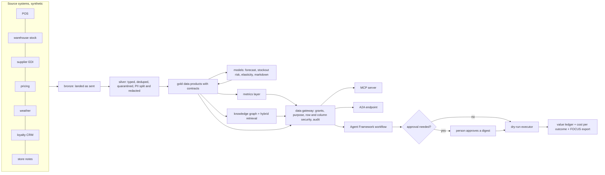

# Jagadish agentic data layer

An agent-ready data layer for one business decision, built end to end and measured: data contracts,
a bronze/silver/gold lakehouse, governed metrics, forecasting and risk models, a knowledge graph, a
data gateway that AI agents must go through (exposed over MCP and A2A), a Microsoft Agent Framework
workflow with human approval, and a value ledger that says what the agents are worth after their own
cost. The first domain is retail, for **Wrenfield Grocers**, a fictional eight-store grocer.

The structure follows the MIT Sloan article
[What leaders still get wrong about AI](https://mitsloan.mit.edu/ideas-made-to-matter/what-leaders-still-get-wrong-about-ai)
by Beth Stackpole, which summarises MIT CISR research: start from a result, not from AI; follow a
path from data to insight to action to value to money; build platforms and data that let pilots scale;
and do not confuse productivity with value. The article is credited by link and paraphrased only;
[docs/mit-article-mapping.md](docs/mit-article-mapping.md) shows where each idea lives in the code.

Everything runs offline on synthetic data with one command per step. **Nothing is deployed**: the
Terraform (Azure, Google Cloud, AWS) and Bicep are validated and tested in CI, and the deploy workflow
is gated off.

## At a glance (for recruiters)

* **What it is:** a portfolio project by Jagadish Meduri showing data engineering, data governance,
  ML, agentic AI and cloud infrastructure working together on one business problem, with honest
  numbers.
* **The business problem:** shelves run empty (lost sales) while near-date food is thrown away or
  marked down too deeply (lost margin). Agents propose purchase orders and markdowns every morning; a
  store manager approves anything above a threshold.
* **The result, from a simulation:** over 30 replications of the next 28 days the agents add
  **$9,678 net value** per 28 days across eight stores (95% interval $9,531 to $9,830), cut lost
  sales 37.6%, markdown spend 44.2% and waste 53.7%. They **miss** the stockout-rate target (-1.2%
  against -20%), and that miss is reported, not hidden. Estimated AI and platform cost is $76 per 28
  days at assumed rates.
* **Safety:** 14 of 14 access attacks stopped, 0 personal-data rows in anything an agent can read, a
  hash-chained audit log that detects tampering, and no injected instruction ever executed in any of
  4 defence configurations.
* **Quality:** **390 automated tests**, a 15-check release gate, ruff, CodeQL, gitleaks, an SBOM,
  checkov, tflint and Terraform tests on every push.
* **Stack:** Python 3.13, DuckDB, Delta Lake, Microsoft Agent Framework, MCP, A2A, Terraform, Bicep,
  GitHub Actions with OIDC.

## Built vs planned

| Area | Status | Where |
|---|---|---|
| Retail domain (Wrenfield Grocers): 25 contracts, pipeline, models, agents, value ledger | **Built**, runs offline | `src/adl/domains/retail/` |
| Mortgage (Quillmere Home Loans), insurance (Ferrowind Insurance), healthcare (Halsey Vale Health) | **Planned**: use case, KPIs, levers and 3 contracts each; no pipeline | `domains/<name>/` |
| Local storage (Delta Lake + DuckDB) | **Built**, the only adapter run end to end | `src/adl/storage/local.py` |
| Fabric OneLake, Azure Databricks, BigQuery, S3 + Glue + Athena adapters | **Written, not run** against a real account; tested with fake clients | `src/adl/storage/` |
| Azure AI Search knowledge adapter, Foundry model client, Prompt Shields request | **Written, not run**; the offline index, mock model and regex screen are used | `src/adl/knowledge/`, `src/adl/core/` |
| MCP server and A2A endpoint | **Built**, exercised in-memory; not hosted | `src/adl/serve/` |
| Terraform (Azure, GCP, AWS) and Bicep | **Written, not run**: validate, test, lint and checkov in CI; never applied | `infra/` |
| Deploy and teardown workflows with OIDC | **Written, not run**: gated by `DEPLOY_ENABLED`, which is off | `.github/workflows/` |
| Live executor (ERP orders, shelf prices), Microsoft Purview registration | **Planned** | [docs/roadmap.md](docs/roadmap.md) |

The four organisations are fictional; any resemblance to a real company is accidental. No real
employer or client data or name is used anywhere.

## Architecture



Details: [docs/architecture.md](docs/architecture.md).

## The five steps from data to money

| Step (MIT CISR) | In this repository | Real number |
|---|---|---|
| Collect the right data | 14 source feeds landed as bronze, conformed to 15 silver tables under contract | 176,844 bronze rows; 48 duplicates removed; 19 rows quarantined |
| Generate insights | Demand forecast, stockout risk, price elasticity, markdown response, hybrid retrieval | forecast WAPE 31.9% vs 35.8% for the best baseline; stockout AUC 0.791 |
| Take action | Agents propose orders and markdowns; a person approves anything above a threshold | 185 actions, 41 sent to a person, 4 rejected, 181 dry-run executions |
| Create value | Forward simulation on identical randomness, paired bootstrap intervals | +$9,678 net value per 28 days, interval [$9,531, $9,830] |
| Monetise | Value after AI and platform cost; FOCUS cost rows for FinOps tooling | $7.82 of cost per $1,000 of value; 112 FOCUS rows |

The FOCUS file is designed to be loaded by
[Jagadish-azure-finops](https://github.com/jagadishmazure-jpg/Jagadish-azure-finops), so cost and value
sit side by side.

## Quick start

```bash
python -m venv .venv && source .venv/bin/activate
pip install -e ".[dev]"
adl domains        # four domains, one built
adl run            # bronze -> silver -> gold, quality per product
adl value          # the value ledger with intervals, KPI targets, cost per outcome
adl gate           # the 15-check release gate
pytest -q          # the full test suite
```

No cloud account, API key or network access is needed. A full `adl value` run took under ten seconds on the build machine.

## Real output

<!-- output: gate -->
```text
check                                                     result  detail
--------------------------------------------------------  ------  ------------------------
contracts valid (all domains)                             pass    34 contracts
every built product passes its contract                   pass    25/25
lineage events valid                                      pass    78 events
forecast beats both naive baselines                       pass    WAPE 31.9%
stockout model beats the cover rule on F1                 pass    F1 39.8% vs 25.8%
hybrid retrieval recall@5 >= 0.90                         pass    0.972
every access attack stopped                               pass    14/14
no PII in agent-exposed products                          pass    0 rows
audit chain verifies and detects tampering                pass    14 records verified
no injected action ever executed                          pass    4 configurations
with both defences nothing injected reaches the approver  pass    quoting on, validator on
nothing above a threshold executed without a person       pass    0 violations
net value interval above zero                             pass    [$9,531, $9,830]
KPI targets reported (hit or miss)                        pass    4/5 met
cloud adapters secretless                                 pass    4 adapters

release gate: PASS (15/15)
```
<!-- /output -->

Every block like this in the docs is produced by `python scripts/render_docs.py` from the real CLI, and
CI fails if any block is stale, so a number in the docs changes only when the code that produces it
changes. All numbers: [docs/metrics.md](docs/metrics.md).

## What is honest about the numbers

* The world is synthetic, so the value is a simulation result, not a measured business result. The
  simulator's ground truth (true demand, true elasticities) is used only to score; the pipeline, models
  and agents never read it.
* The agents miss the stockout-rate target. They recover lost sales by ordering from a better forecast,
  but the number of days a shelf is empty at close barely moves (5.79% to 5.72%).
* The stockout model ranks risk well (AUC 0.791) but its probabilities are not calibrated (Brier 0.186
  against 0.111 for always predicting the base rate).
* Elasticity estimates from the price tests are 0.20 to 0.63 away from the truth, and bakery is
  under-estimated (-1.17 against -1.80).
* Inter-store transfers are implemented but none were proposed on the as-of day.
* Cost uses assumed unit rates in `config/pricing.yaml`, not quotes.

## Documentation

| For | Start here |
|---|---|
| Recruiters and hiring managers | This page, then [docs/interview-guide.md](docs/interview-guide.md) |
| Engineers adopting the pattern | [docs/implementation-guide.md](docs/implementation-guide.md) and [docs/adding-a-domain.md](docs/adding-a-domain.md) |
| Architects and security reviewers | [docs/architecture.md](docs/architecture.md), [docs/threat-model.md](docs/threat-model.md), [docs/data-governance.md](docs/data-governance.md) |
| Business and value | [docs/value-case.md](docs/value-case.md), [docs/mit-article-mapping.md](docs/mit-article-mapping.md), [docs/ai-business-models.md](docs/ai-business-models.md), [docs/operating-model.md](docs/operating-model.md) |
| Every component in depth | [docs/components/README.md](docs/components/README.md) and [docs/infra/README.md](docs/infra/README.md) |
| Decisions | [docs/adr/README.md](docs/adr/README.md) |

## Repository layout

| Folder | What it holds |
|---|---|
| `src/adl/core/` | Domain-neutral platform: contracts, quality, lineage, metrics layer, guardrails, gateway, audit |
| `src/adl/domains/retail/` | The built domain: simulator, pipeline, models, agents, value |
| `src/adl/knowledge/` | Embeddings, knowledge graph, retrieval, Azure AI Search adapter |
| `src/adl/serve/` | MCP server and A2A endpoint |
| `src/adl/storage/` | Local Delta Lake adapter and the four cloud adapters |
| `domains/` | Contracts, metrics and knowledge per domain |
| `config/` | Agent identities, decision policy, value case, assumed prices |
| `infra/` | Terraform for Azure, Google Cloud and AWS, and Bicep for Azure |
| `docs/` | Everything above in depth |
| `tests/` | The test suite |

## Licence and contact

MIT licence. Security issues: see [SECURITY.md](SECURITY.md). Contributions: [CONTRIBUTING.md](CONTRIBUTING.md).
