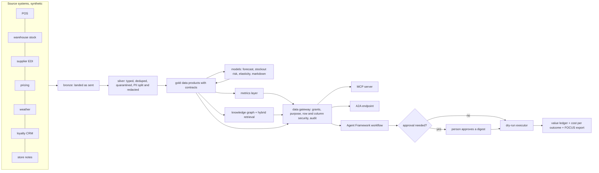

# Jagadish agentic data layer

An agent-ready data layer for one business decision, built end to end and measured: data contracts,
a bronze/silver/gold lakehouse, governed metrics, forecasting and risk models, a knowledge graph, a
data gateway that AI agents must go through (exposed over MCP and A2A), a Microsoft Agent Framework
workflow with human approval, and a value ledger that says what the agents are worth after their own
cost. The first domain is retail, for **Wrenfield Grocers**, a fictional eight-store grocer. The second
is mortgage, for **Quillmere Home Loans**, a fictional six-branch lender, and the third is insurance,
for **Ferrowind Insurance**, a fictional six-office claims operation, both built on the same platform.

The structure follows the MIT Sloan article
[What leaders still get wrong about AI](https://mitsloan.mit.edu/ideas-made-to-matter/what-leaders-still-get-wrong-about-ai)
by Beth Stackpole, which summarises MIT CISR research: start from a result, not from AI; follow a
path from data to insight to action to value to money; build platforms and data that let pilots scale;
and do not confuse productivity with value. The article is credited by link and paraphrased only;
[docs/mit-article-mapping.md](docs/mit-article-mapping.md) shows where each idea lives in the code.

Everything runs offline on synthetic data with one command per step. **Nothing is deployed**: the
Terraform (Azure, Google Cloud, AWS) and Bicep are validated and tested in CI, and the deploy workflow
is gated off.

## At a glance (for recruiters)

* **What it is:** a portfolio project by Jagadish Meduri showing data engineering, data governance,
  ML, agentic AI and cloud infrastructure working together on one business problem, with honest
  numbers.
* **The business problem:** shelves run empty (lost sales) while near-date food is thrown away or
  marked down too deeply (lost margin). Agents propose purchase orders and markdowns every morning; a
  store manager approves anything above a threshold.
* **The result, from a simulation:** over 30 replications of the next 28 days the agents add
  **$9,678 net value** per 28 days across eight stores (95% interval $9,531 to $9,830), cut lost
  sales 37.6%, markdown spend 44.2% and waste 53.7%. They **miss** the stockout-rate target (-1.2%
  against -20%), and that miss is reported, not hidden. Estimated AI and platform cost is $76 per 28
  days at assumed rates.
* **Second domain, mortgage (also simulated):** a rate-lock fallout model that beats today's "call
  whoever is closest to expiry" rule (AUC 0.730 against 0.462) and an assistant that adds **$193,003
  net value** per 28 days (95% interval $171,585 to $214,486). It meets **1 of 4** KPI targets
  (fallout -14.9% against -12%) and misses pull-through, extension cost and cycle time; see
  [docs/mortgage](docs/mortgage/README.md).
* **Third domain, insurance (also simulated):** claims triage, leakage review and subrogation referral.
  The assistant adds **$274,527 net value** per 28 days (95% interval $249,068 to $299,963), almost all
  from a subrogation model that beats the intake flag (AUC 0.962 against 0.708). It meets **1 of 4**
  KPI targets (leakage -30.4% against -25%); cycle time, reopen rate (which got worse) and backlog
  spread are missed, and the triage lever adds nothing measurable. An unfair-discrimination screen
  across synthetic postcode groups finds every ratio inside the 0.80 to 1.25 band; see
  [docs/insurance](docs/insurance/README.md).
* **Safety:** in each domain 14 of 14 access attacks stopped, 0 personal-data rows in anything an agent can read, a
  hash-chained audit log that detects tampering, and no injected instruction ever executed in any of
  4 defence configurations.
* **Quality:** **566 automated tests**, a 38-check release gate (15 retail, 11 mortgage, 12 insurance), ruff, CodeQL, gitleaks, an SBOM,
  checkov, tflint and Terraform tests on every push.
* **Stack:** Python 3.13, DuckDB, Delta Lake, Microsoft Agent Framework, MCP, A2A, Terraform, Bicep,
  GitHub Actions with OIDC.

## Built vs planned

| Area | Status | Where |
|---|---|---|
| Retail domain (Wrenfield Grocers): 25 contracts, pipeline, models, agents, value ledger | **Built**, runs offline | `src/adl/domains/retail/` |
| Mortgage domain (Quillmere Home Loans): 15 contracts, pipeline, fallout model, agents, value ledger | **Built**, runs offline; in-process gateway only (no MCP or A2A yet) | `src/adl/domains/mortgage/`, [docs/mortgage](docs/mortgage/README.md) |
| Insurance domain (Ferrowind Insurance): 18 contracts, pipeline, claim models, agents, value ledger, fairness screen | **Built**, runs offline; in-process gateway only (no MCP or A2A yet) | `src/adl/domains/insurance/`, [docs/insurance](docs/insurance/README.md) |
| Shared approval workflow, FOCUS cost module and logistic model used by mortgage and insurance | **Built** | `src/adl/core/agentflow.py`, `src/adl/core/finops.py`, `src/adl/core/logit.py` |
| Healthcare (Halsey Vale Health) | **Planned**: use case, KPIs, levers and 3 contracts; no pipeline | `domains/healthcare/` |
| Local storage (Delta Lake + DuckDB) | **Built**, the only adapter run end to end | `src/adl/storage/local.py` |
| Fabric OneLake, Azure Databricks, BigQuery, S3 + Glue + Athena adapters | **Written, not run** against a real account; tested with fake clients | `src/adl/storage/` |
| Azure AI Search knowledge adapter, Foundry model client, Prompt Shields request | **Written, not run**; the offline index, mock model and regex screen are used | `src/adl/knowledge/`, `src/adl/core/` |
| MCP server and A2A endpoint | **Built**, exercised in-memory; not hosted | `src/adl/serve/` |
| Terraform (Azure, GCP, AWS) and Bicep | **Written, not run**: validate, test, lint and checkov in CI; never applied | `infra/` |
| Deploy and teardown workflows with OIDC | **Written, not run**: gated by `DEPLOY_ENABLED`, which is off | `.github/workflows/` |
| Live executor (ERP orders, shelf prices, loan origination system, claims system), Microsoft Purview registration | **Planned** | [docs/roadmap.md](docs/roadmap.md) |

The four organisations are fictional; any resemblance to a real company is accidental. No real
employer or client data or name is used anywhere.

## Architecture



Details: [docs/architecture.md](docs/architecture.md).

## The five steps from data to money

| Step (MIT CISR) | In this repository | Real number |
|---|---|---|
| Collect the right data | 14 source feeds landed as bronze, conformed to 15 silver tables under contract | 176,844 bronze rows; 48 duplicates removed; 19 rows quarantined |
| Generate insights | Demand forecast, stockout risk, price elasticity, markdown response, hybrid retrieval | forecast WAPE 31.9% vs 35.8% for the best baseline; stockout AUC 0.791 |
| Take action | Agents propose orders and markdowns; a person approves anything above a threshold | 185 actions, 41 sent to a person, 4 rejected, 181 dry-run executions |
| Create value | Forward simulation on identical randomness, paired bootstrap intervals | +$9,678 net value per 28 days, interval [$9,531, $9,830] |
| Monetise | Value after AI and platform cost; FOCUS cost rows for FinOps tooling | $7.82 of cost per $1,000 of value; 112 FOCUS rows |

The FOCUS file is designed to be loaded by
[Jagadish-azure-finops](https://github.com/jagadishmazure-jpg/Jagadish-azure-finops), so cost and value
sit side by side.

## Quick start

```bash
python -m venv .venv && source .venv/bin/activate
pip install -e ".[dev]"
adl domains        # four domains, three built
adl run            # bronze -> silver -> gold, quality per product
adl value          # the value ledger with intervals, KPI targets, cost per outcome
adl mortgage value # the mortgage value ledger (adl mortgage --help lists every step)
adl insurance value     # the insurance value ledger
adl insurance fairness  # the unfair-discrimination screen across synthetic proxy groups
adl gate           # the 38-check release gate for the three built domains
pytest -q          # the full test suite
```

No cloud account, API key or network access is needed. A full `adl value` run took under ten seconds on the build machine.

## Real output

<!-- output: gate -->
```text
check                                                                 result  detail
--------------------------------------------------------------------  ------  --------------------------------------------------
retail: contracts valid (all domains)                                 pass    61 contracts
retail: every built product passes its contract                       pass    25/25
retail: lineage events valid                                          pass    78 events
retail: forecast beats both naive baselines                           pass    WAPE 31.9%
retail: stockout model beats the cover rule on F1                     pass    F1 39.8% vs 25.8%
retail: hybrid retrieval recall@5 >= 0.90                             pass    0.972
retail: every access attack stopped                                   pass    14/14
retail: no PII in agent-exposed products                              pass    0 rows
retail: audit chain verifies and detects tampering                    pass    14 records verified
retail: no injected action ever executed                              pass    4 configurations
retail: with both defences nothing injected reaches the approver      pass    quoting on, validator on
retail: nothing above a threshold executed without a person           pass    0 violations
retail: net value interval above zero                                 pass    [$9,531, $9,830]
retail: KPI targets reported (hit or miss)                            pass    4/5 met
retail: cloud adapters secretless                                     pass    4 adapters
mortgage: every built product passes its contract                     pass    15/15
mortgage: lineage events valid                                        pass    50 events
mortgage: fallout model beats the expiry rule (AUC and precision@60)  pass    AUC 0.730 vs 0.462
mortgage: hybrid retrieval recall@5 >= 0.90                           pass    0.979
mortgage: every access attack stopped                                 pass    14/14
mortgage: no borrower PII in agent-exposed products                   pass    0 rows
mortgage: audit chain verifies and detects tampering                  pass    14 records verified
mortgage: no injected action ever executed                            pass    4 configurations
mortgage: nothing above a threshold executed without a person         pass    0 violations
mortgage: net value interval above zero                               pass    [$171,585, $214,486]
mortgage: KPI targets reported (hit or miss)                          pass    1/4 met
insurance: every built product passes its contract                    pass    18/18
insurance: lineage events valid                                       pass    60 events
insurance: leakage and subrogation models beat their rules (AUC)      pass    leakage 0.762 vs 0.527; subrogation 0.962 vs 0.708
insurance: hybrid retrieval recall@5 >= 0.90                          pass    0.979
insurance: every access attack stopped                                pass    14/14
insurance: no claimant PII in agent-exposed products                  pass    0 rows
insurance: audit chain verifies and detects tampering                 pass    14 records verified
insurance: no injected action ever executed                           pass    4 configurations
insurance: nothing above a threshold executed without a person        pass    0 violations
insurance: net value interval above zero                              pass    [$249,068, $299,963]
insurance: KPI targets reported (hit or miss)                         pass    1/4 met
insurance: fairness results reported (hit or miss)                    pass    history 4/4, forward 8/8 within limits

release gate: PASS (38/38)
```
<!-- /output -->

Every block like this in the docs is produced by `python scripts/render_docs.py` from the real CLI, and
CI fails if any block is stale, so a number in the docs changes only when the code that produces it
changes. All numbers: [docs/metrics.md](docs/metrics.md).

## Mortgage in five steps

| Step (MIT CISR) | In this repository | Real number |
|---|---|---|
| Collect the right data | 10 source feeds landed as bronze, conformed to 10 silver tables under contract | 51,006 bronze rows; 85 resent stage events removed; 20 rows quarantined |
| Generate insights | 14-day fallout risk from process signals only; hybrid retrieval | AUC 0.730 vs 0.462 for the expiry rule; 51.6% vs 6.9% of value at risk covered |
| Take action | Calls, document chases and lock extensions; extensions above $400 wait for the pipeline manager | 133 actions, 7 sent to a person, 2 rejected, 131 dry-run executions |
| Create value | Paired forward simulation from the real end-of-history pipeline | +$193,003 net value per 28 days, interval [$171,585, $214,486] |
| Monetise | Value after AI and platform cost; FOCUS cost rows | $0.39 of cost per $1,000 of value; 112 FOCUS rows |

## Insurance in five steps

| Step (MIT CISR) | In this repository | Real number |
|---|---|---|
| Collect the right data | 12 source feeds landed as bronze, conformed to 11 silver tables under contract | 77,711 bronze rows; 30 intake retries removed; 16 rows quarantined |
| Generate insights | Complexity at first notice; leakage and subrogation learned from random audits; hybrid retrieval | subrogation AUC 0.962 vs 0.708 for the intake flag; leakage AUC 0.762 vs 0.527 for largest-first |
| Take action | Queue assignments, leakage reviews and subrogation referrals; larger fast-track and referral proposals wait for a team lead | 70 actions, 6 sent to a person, 2 rejected, 68 dry-run executions |
| Create value | Paired forward simulation from the real end-of-history claims state | +$274,527 net value per 28 days, interval [$249,068, $299,963] |
| Monetise | Value after AI and platform cost; FOCUS cost rows | $0.28 of cost per $1,000 of value; 112 FOCUS rows |

## What is honest about the numbers

* The world is synthetic, so the value is a simulation result, not a measured business result. The
  simulator's ground truth (true demand, true elasticities) is used only to score; the pipeline, models
  and agents never read it.
* The agents miss the stockout-rate target. They recover lost sales by ordering from a better forecast,
  but the number of days a shelf is empty at close barely moves (5.79% to 5.72%).
* The stockout model ranks risk well (AUC 0.791) but its probabilities are not calibrated (Brier 0.186
  against 0.111 for always predicting the base rate).
* Elasticity estimates from the price tests are 0.20 to 0.63 away from the truth, and bakery is
  under-estimated (-1.17 against -1.80).
* Inter-store transfers are implemented but none were proposed on the as-of day.
* Mortgage misses three of four KPI targets: pull-through +2.4% (target +3%), extension cost -6.6%
  (target -20%) and cycle time -0.6% (target -5%). The targets were written before the results.
* Mortgage borrower behaviour is a hand-written hazard model; the value is only as good as those
  assumptions, and no fair-lending outcome test exists yet.
* Insurance misses three of four KPI targets: cycle time -1.1% (target -10%), reopen rate +3.3%
  (target -15%, so it got worse) and backlog spread -13.0% (target -20%). The queue-assignment lever
  adds nothing measurable (-$2,193, interval -$25,070 to $21,877), and the complexity model is barely
  better than today's routing rule at equal queue sizes.
* The insurance fairness check is a screening heuristic on synthetic groups, not a legal test. Every
  ratio is inside the band, but the agent fast-tracks one group measurably less than today's rules do
  (ratio 0.931 against 0.984).
* Cost uses assumed unit rates in `config/pricing.yaml`, not quotes.

## Documentation

| For | Start here |
|---|---|
| Recruiters and hiring managers | This page, then [docs/interview-guide.md](docs/interview-guide.md) |
| Engineers adopting the pattern | [docs/implementation-guide.md](docs/implementation-guide.md) and [docs/adding-a-domain.md](docs/adding-a-domain.md) |
| Architects and security reviewers | [docs/architecture.md](docs/architecture.md), [docs/threat-model.md](docs/threat-model.md), [docs/data-governance.md](docs/data-governance.md) |
| Business and value | [docs/value-case.md](docs/value-case.md), [docs/mit-article-mapping.md](docs/mit-article-mapping.md), [docs/ai-business-models.md](docs/ai-business-models.md), [docs/operating-model.md](docs/operating-model.md) |
| Every component in depth | [docs/components/README.md](docs/components/README.md) and [docs/infra/README.md](docs/infra/README.md) |
| The mortgage domain | [docs/mortgage/README.md](docs/mortgage/README.md) |
| The insurance domain | [docs/insurance/README.md](docs/insurance/README.md) |
| Decisions | [docs/adr/README.md](docs/adr/README.md) |

## Repository layout

| Folder | What it holds |
|---|---|
| `src/adl/core/` | Domain-neutral platform: contracts, quality, lineage, metrics layer, guardrails, gateway, audit, approval workflow, FinOps |
| `src/adl/domains/retail/` | Retail (built): simulator, pipeline, models, agents, value |
| `src/adl/domains/mortgage/` | Mortgage (built): simulator, pipeline, fallout model, agents, value |
| `src/adl/domains/insurance/` | Insurance (built): simulator, pipeline, claim models, agents, value, fairness screen |
| `src/adl/knowledge/` | Embeddings, knowledge graph, retrieval, Azure AI Search adapter |
| `src/adl/serve/` | MCP server and A2A endpoint |
| `src/adl/storage/` | Local Delta Lake adapter and the four cloud adapters |
| `domains/` | Contracts, metrics and knowledge per domain |
| `config/` | Agent identities, decision policy, value case, assumed prices |
| `infra/` | Terraform for Azure, Google Cloud and AWS, and Bicep for Azure |
| `docs/` | Everything above in depth |
| `tests/` | The test suite |

## Licence and contact

MIT licence. Security issues: see [SECURITY.md](SECURITY.md). Contributions: [CONTRIBUTING.md](CONTRIBUTING.md).
