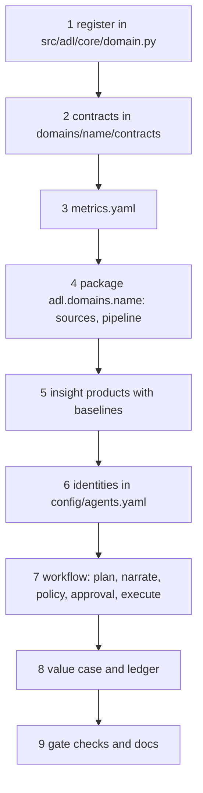

# Adding a domain

How mortgage, insurance or healthcare (or your own domain) is added on top of the shared core. Retail
is the worked example; the three planned domains already have steps 1 and 2 done.

## What you reuse unchanged

| Shared piece | Module |
|---|---|
| Contract model and validation, quarantine predicates | `adl.core.contracts` |
| Quality checks and SLOs | `adl.core.quality` |
| OpenLineage events | `adl.core.lineage` |
| Metrics layer | `adl.core.semantic` (driven by `domains/<name>/metrics.yaml`) |
| Gateway, identities, audit chain, guardrails | `adl.core.access`, `adl.core.audit`, `adl.core.guardrails` |
| Model client selection | `adl.core.llm` |
| Embeddings, graph, hybrid retrieval | `adl.knowledge` |
| MCP and A2A | `adl.serve` |
| Storage adapters | `adl.storage` |
| Terraform and Bicep | `infra/` (the `domain` variable names resources) |

## Steps

1. **Register.** Add a `Domain` to `REGISTRY` with the fictional organisation, use case, decision, KPIs
   and levers, status `planned`. `adl domains` lists it.
2. **Contracts.** Add `domains/<name>/contracts/*.yaml` with `status: planned`. Keep identifiers in a
   restricted silver table and expose only pseudonymous or aggregate gold products. Write prohibited
   purposes that matter in the industry (for example credit decisioning in mortgage, claim denial
   without human review in insurance, insurance eligibility in healthcare). `adl contracts` validates
   them.
3. **Metrics.** Write `domains/<name>/metrics.yaml` for the KPIs.
4. **Pipeline.** Create `src/adl/domains/<name>/` with a synthetic source generator that has known
   ground truth and realistic faults, then bronze, silver and gold built with `write_gold`.
5. **Insight.** Each model gets a backtest against today's rule and a gate check.
6. **Identities.** Add agent identities with products, purposes, row scope and denied columns.
7. **Workflow.** Reuse the retail workflow shape: code plans, the model narrates, the brief is
   validated, thresholds route to a person, the approval names a digest, the executor is a dry run.
8. **Value.** Write `config/value-case.yaml` entries for the domain and a ledger with intervals.
9. **Gate and docs.** Add gate checks, flip the registry status to `built` and the contract status to
   `built`, and add component docs with all 16 sections.

## The planned domains

| Domain | Decision | Restricted silver | Agent-exposed gold | Prohibited purposes |
|---|---|---|---|---|
| Mortgage (Quillmere Home Loans) | Which locked applications need a call before the lock expires | applications (applicant name) | pipeline_daily, fallout_risk | credit decisioning, pricing by protected characteristic, sale of data |
| Insurance (Ferrowind Insurance) | Which queue each claim goes to; which closed claims to review for leakage | claims (claimant name) | claims_triage, leakage_signals | claim denial without human review, underwriting by protected characteristic, sale of data |
| Healthcare (Halsey Vale Health) | Which patients the nurse in charge checks first each shift | inpatient_encounters (patient name) | fall_risk_worklist, ward_fall_rates | insurance eligibility, employee performance management, sale of data |

Each domain's README has its plan: [mortgage](../domains/mortgage/README.md),
[insurance](../domains/insurance/README.md), [healthcare](../domains/healthcare/README.md).

## Tests that keep a planned domain honest

`tests/test_contracts.py` checks that planned domains have only planned contracts and that exactly one
domain is built; `tests/test_repo_hygiene.py` checks each planned README says it is planned and not
built.
