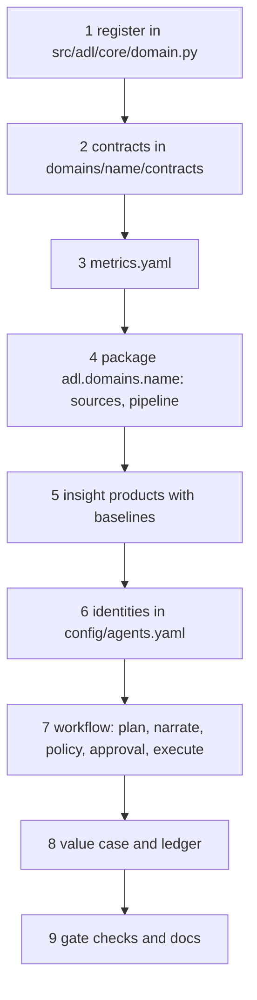

# Adding a domain

How a domain (healthcare or your own) is added on top of the shared core. Retail was the first worked
example, mortgage the second and insurance the third: both followed these steps and are built;
healthcare has steps 1 and 2 done. Insurance added two things a new domain can reuse: the shared
logistic model (`adl.core.logit`) and a fairness screen whose limits are committed, like the value case,
before any result.

## What you reuse unchanged

| Shared piece | Module |
|---|---|
| Contract model and validation, quarantine predicates | `adl.core.contracts` |
| Quality checks and SLOs | `adl.core.quality` |
| OpenLineage events | `adl.core.lineage` |
| Metrics layer | `adl.core.semantic` (driven by `domains/<name>/metrics.yaml`) |
| Gateway, identities, audit chain, guardrails | `adl.core.access` (row scope via `scope_table`), `adl.core.audit`, `adl.core.guardrails` |
| Model client selection | `adl.core.llm` |
| Approval workflow: plan, narrate, validate, digest-bound approval, dry run | `adl.core.agentflow` (a domain supplies a `Spec` and a planner) |
| Cost estimate and FOCUS rows | `adl.core.finops` |
| Embeddings, graph, hybrid retrieval | `adl.knowledge` |
| MCP and A2A | `adl.serve` |
| Storage adapters | `adl.storage` |
| Terraform and Bicep | `infra/` (the `domain` variable names resources) |

## Steps

1. **Register.** Add a `Domain` to `REGISTRY` with the fictional organisation, use case, decision, KPIs
   and levers, status `planned`. `adl domains` lists it.
2. **Contracts.** Add `domains/<name>/contracts/*.yaml` with `status: planned`. Keep identifiers in a
   restricted silver table and expose only pseudonymous or aggregate gold products. Write prohibited
   purposes that matter in the industry (for example credit decisioning in mortgage, claim denial
   without human review in insurance, insurance eligibility in healthcare). `adl contracts` validates
   them.
3. **Metrics.** Write `domains/<name>/metrics.yaml` for the KPIs.
4. **Pipeline.** Create `src/adl/domains/<name>/` with a synthetic source generator that has known
   ground truth and realistic faults, then bronze, silver and gold built with `write_gold`.
5. **Insight.** Each model gets a backtest against today's rule and a gate check.
6. **Identities.** Add `config/<name>/agents.yaml` with products, purposes, row scope and denied
   columns, and pass the domain's scope table to `DataGateway(scope_table=...)`.
7. **Workflow.** Build an `adl.core.agentflow.Spec` and a planner that reads only through the gateway:
   code plans, the model narrates, the brief is validated, thresholds route to a person, the approval
   names a digest, the executor is a dry run. Test that the plan equals the policy the value
   simulation credits.
8. **Value.** Write `config/<name>/value-case.yaml` with targets before any result, a paired forward
   simulation and a ledger with intervals, and report misses.
9. **Gate and docs.** Add gate checks (combined in `adl gate` by `all_gate_checks`), flip the registry
   status to `built` and the contract status to `built`, and add `docs/<name>/` with all 16 sections per
   document and a business-model mapping.

## What mortgage needed beyond the shared core

| Need | Where it went |
|---|---|
| A daily simulator with hidden borrower traits | `src/adl/domains/mortgage/world.py` |
| The same morning view from silver as from the simulator | `pipeline.observe`, tested field by field |
| A row-scope table other than stores | `DataGateway(scope_table=("branches", "branch_id"))` |
| A workflow without copying retail's | `adl.core.agentflow`, which retail can move to later |
| Its own `adl mortgage STEP` reports and 11 gate checks | `src/adl/domains/mortgage/report.py` |

## The domains after retail

| Domain | Decision | Restricted silver | Agent-exposed gold | Prohibited purposes |
|---|---|---|---|---|
| Mortgage (Quillmere Home Loans), **built** | Which locks get a call, a document chase or an extension | applications (applicant name, e-mail, phone) | pipeline_daily, lock_position, fallout_risk, pipeline_notes, value_ledger | credit decisioning, pricing by protected characteristic, sale of data |
| Insurance (Ferrowind Insurance), **built** | Which queue each claim goes to; which payments to review; which claims to refer for recovery | claims (claimant name, e-mail, phone), postcode_groups (synthetic proxy group) | claims_daily, workload_daily, claims_triage, leakage_signals, claim_notes, fairness_monitor, value_ledger | claim denial without human review, underwriting by protected characteristic, sale of data |
| Healthcare (Halsey Vale Health) | Which patients the nurse in charge checks first each shift | inpatient_encounters (patient name) | fall_risk_worklist, ward_fall_rates | insurance eligibility, employee performance management, sale of data |

Each domain's README has its plan or, for built domains, its results: [mortgage](../domains/mortgage/README.md),
[insurance](../domains/insurance/README.md), [healthcare](../domains/healthcare/README.md).

## Tests that keep a planned domain honest

`tests/test_contracts.py` checks that planned domains have only planned contracts and that exactly
retail, mortgage and insurance are built; `tests/test_repo_hygiene.py` checks each planned README says it is planned and not
built.
