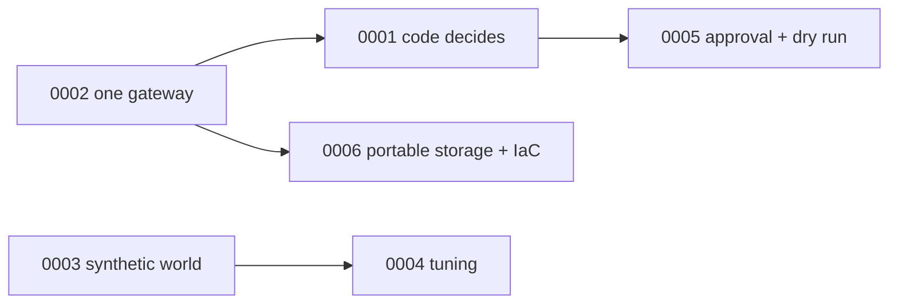

# Architecture decision records

| File | What it does |
|---|---|
| `0001-code-decides-model-narrates.md` | Actions come from code; the model writes a validated brief |
| `0002-data-products-through-one-gateway.md` | One gateway for agents, MCP and A2A |
| `0003-synthetic-world-with-ground-truth.md` | Seeded simulator, ground truth kept from product code |
| `0004-policy-tuning.md` | Settings chosen on separate seeds; lost sales over a little net value |
| `0005-approval-bound-to-digest-dry-run-only.md` | Digest-bound person approval; dry-run executor |
| `0006-portable-storage-and-multi-cloud-iac.md` | Storage interface, three clouds in IaC, deploy gated off |

