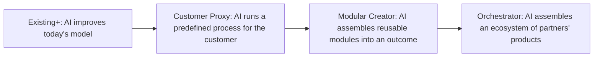

# AI business models

MIT CISR's research, as summarised in the
[MIT Sloan article](https://mitsloan.mit.edu/ideas-made-to-matter/what-leaders-still-get-wrong-about-ai),
describes four business models for the AI era, from adding AI to today's model to orchestrating an
ecosystem. The descriptions below are my paraphrase; the mapping to this repository is my own.

| Model (paraphrased) | Wrenfield Grocers example | What the data layer provides | Status |
|---|---|---|---|
| Existing+: augment the current model with AI | Better orders and markdowns inside today's stores | Data products, forecast, risk, agents with approval, value ledger | Built |
| Customer Proxy: AI achieves an outcome for a customer through a set process | A "never run out" basket that re-orders a household's staples within limits the customer sets | The same forecast and stockout risk per customer segment; acceptable-use purposes would need a customer-consented purpose added to contracts | Planned (design only) |
| Modular Creator: reusable modules combined per customer goal | Meal-plan bundles assembled from products, promotions and near-date stock | Data products are already modules with contracts; the knowledge graph links products, categories and suppliers | Planned (design only) |
| Orchestrator: an ecosystem of partners' products assembled by AI | Suppliers, delivery partners and recipe services coordinated around a household's needs | The A2A endpoint lets partner agents ask for data products under their own identity and purpose | Partly built (A2A endpoint), ecosystem planned |

## What changes in the data layer for each step up

| Need | Existing+ | Customer Proxy | Modular Creator | Orchestrator |
|---|---|---|---|---|
| Identity of the consumer | Internal agents | The customer's agent | Internal and partner agents | Partner agents and platforms |
| Purpose control | Operations purposes | Customer-consented purposes | Bundling purposes | Contracted partner purposes |
| Interface | In-process gateway, MCP | API per customer | Product catalogue of data products | A2A with signed agent cards |
| Value measure | Margin per store | Retention and basket value | Attach rate of bundles | Ecosystem revenue share |

The gateway's model (identity, product grant, purpose, row and column scope, audit) is the same for
all four; what changes is who the identities are and which purposes the contracts allow. That is why
acceptable use lives in the contract and not in each agent.

## Why retail starts at Existing+

The article's point is that the business model matters, not that every firm should jump to the last
model. Existing+ is where the measured value is today, and it builds the assets (governed data
products, an agent-safe gateway, a value ledger) the other three models need.
