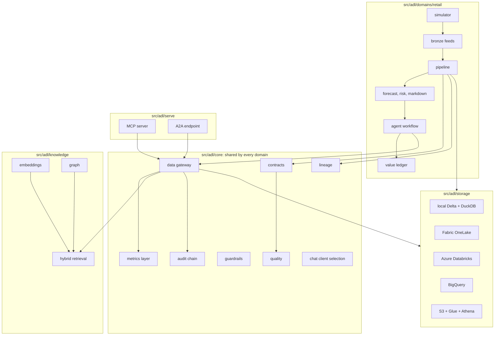
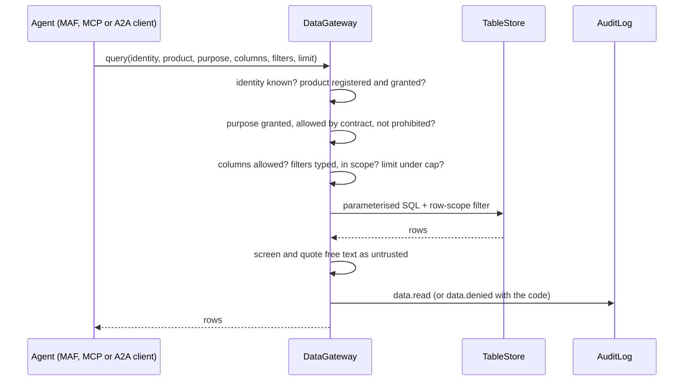
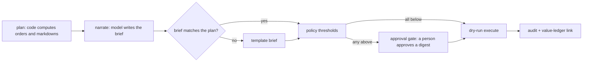

# Architecture

How the pieces fit together, why they are split the way they are, and which parts are shared by every
domain. Component-level detail is in [components/](components/README.md); infrastructure in
[infra/](infra/README.md).

## Layers

The rule that shapes everything: **agents only see data products, and only through the gateway**. A
data product is a gold table with a contract that sets `agent_exposed: true`. Bronze, silver and the
restricted PII table are not reachable by any agent identity, by construction rather than by
convention.

## Request path for an agent read

## Action path

The model never decides an action ([ADR 0001](adr/0001-code-decides-model-narrates.md)). It writes the
brief; if the brief adds, drops or resizes an action, the brief is replaced by a template. Execution is
a dry run that writes what it would do to the audit chain.

## Design choices

| Choice | Why | ADR |
|---|---|---|
| Code decides, model narrates | Decisions stay testable and the model cannot be talked into an order | [0001](adr/0001-code-decides-model-narrates.md) |
| One gateway for agents, MCP and A2A | Every rule is enforced once and audited once | [0002](adr/0002-data-products-through-one-gateway.md) |
| Synthetic world with ground truth | Value can be measured against truth; nothing real leaks | [0003](adr/0003-synthetic-world-with-ground-truth.md) |
| Policy settings chosen on separate seeds | The reported numbers are not tuned on themselves | [0004](adr/0004-policy-tuning.md) |
| Approval bound to a digest; dry-run only | A stale or forged approval cannot execute a different action | [0005](adr/0005-approval-bound-to-digest-dry-run-only.md) |
| Storage behind one interface; three clouds in IaC | The data layer is portable; the controls are the same everywhere | [0006](adr/0006-portable-storage-and-multi-cloud-iac.md) |

## What is domain-neutral and what is retail

| Shared (`src/adl/core`, `storage`, `knowledge`, `serve`) | Per domain (`src/adl/domains/retail`, `src/adl/domains/mortgage`, `src/adl/domains/insurance`) |
|---|---|
| Contract model and validation, quality checks, quarantine predicates | The simulator and the bronze feeds |
| OpenLineage events | The silver and gold SQL |
| Metrics layer (driven by `domains/<x>/metrics.yaml`) | Forecast, stockout risk, elasticity, markdown |
| Data gateway, identities, audit chain, guardrails | The agent workflow nodes and policy |
| MCP and A2A serving | Value ledger, cost estimate, FOCUS rows |
| Storage adapters, embeddings, graph, retrieval | Knowledge corpus and aliases |
| Approval workflow core (`agentflow`), FOCUS cost rows (`finops`) and logistic model (`logit`), used by mortgage and insurance | Retail keeps its original workflow module unchanged |

Mortgage and then insurance were added on the left column without changing retail's behaviour;
healthcare will follow the same path. See [adding-a-domain.md](adding-a-domain.md),
[mortgage/README.md](mortgage/README.md) and [insurance/README.md](insurance/README.md).

## Determinism

DuckDB runs single-threaded, the simulator and bootstrap use fixed seeds, lineage run ids are UUIDv5
and event times are synthetic, so every number in the docs is identical on every machine. That is what
lets `scripts/render_docs.py --check` fail CI when a documented number drifts.
