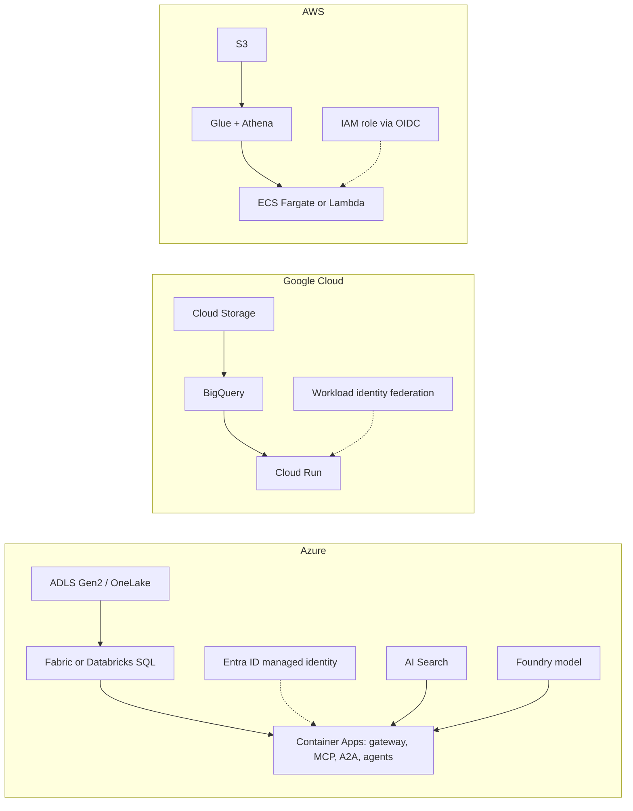

# Cloud mapping

The same design on Azure, Google Cloud and AWS. Azure is the primary target (Microsoft Fabric,
Foundry, Agent Framework, Purview); the other two show the design is portable. Status column: what
exists in this repository for each row.

| Capability | Here (offline) | Azure | Google Cloud | AWS | Status |
|---|---|---|---|---|---|
| Lake storage | Delta Lake files | ADLS Gen2 (HNS) or Microsoft Fabric OneLake | Cloud Storage | S3 | IaC written; adapters written |
| Table format | Delta | Delta (Fabric, Databricks) | BigQuery native or BigLake | Glue tables over Parquet (Iceberg possible) | Written, not run |
| SQL engine | DuckDB | Fabric SQL endpoint or Databricks SQL warehouse | BigQuery | Athena | Adapters written, fake-tested |
| Contracts and catalogue | YAML + validator | Microsoft Purview Unified Catalog | Dataplex | DataZone | Planned |
| Lineage | OpenLineage JSON | Purview | Dataplex lineage | DataZone | Events built; registration planned |
| Identity for jobs and agents | names in `config/agents.yaml` | Entra ID managed identities, agent identities | Service accounts + workload identity federation | IAM roles via OIDC | IaC written |
| Secrets | none needed | Key Vault (RBAC) for the pseudonym key | Secret Manager | Secrets Manager or KMS | Key Vault in IaC |
| Vector and hybrid search | hashed TF-IDF + graph + RRF | Azure AI Search (key auth off) | Vertex AI Vector Search | OpenSearch Serverless | Azure adapter written |
| Model | mock client | Foundry Models (`ADL_LLM=foundry`) | Vertex AI Gemini | Bedrock | Foundry client written |
| Agent runtime | in-process MAF workflow | Microsoft Agent Framework on Container Apps or Foundry Agent Service | Cloud Run | ECS Fargate | Planned hosting |
| Tool protocol | MCP and A2A in memory | Same, behind API Management | Same, behind API Gateway | Same, behind API Gateway | Built, not hosted |
| Injection detection | regex screen | Azure AI Content Safety Prompt Shields | Model Armor | Bedrock Guardrails | Azure request written |
| Logs and audit | in-memory hash chain | Log Analytics + immutable blob | Cloud Logging + locked bucket | CloudWatch + S3 Object Lock | Diagnostics in IaC |
| Cost | assumed rates, FOCUS rows | Cost Management FOCUS export | Billing export | CUR FOCUS | FOCUS rows built |
| IaC | | Terraform (azurerm) and Bicep | Terraform (google) | Terraform (aws) | Validated, never applied |
| CI/CD identity | | GitHub OIDC to Entra ID | GitHub OIDC to workload identity pool | GitHub OIDC to IAM role | Workflows written, gated off |

Details per stack: [infra/terraform-azure.md](infra/terraform-azure.md),
[infra/terraform-gcp.md](infra/terraform-gcp.md), [infra/terraform-aws.md](infra/terraform-aws.md),
[infra/bicep.md](infra/bicep.md). Adapters: [components/cloud-adapters.md](components/cloud-adapters.md).
