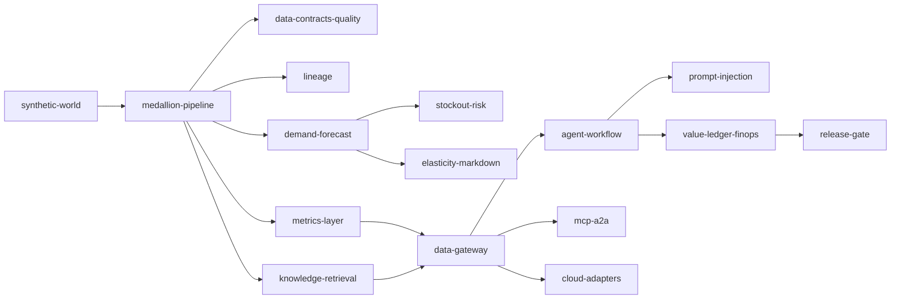

# Components

One document per component, each with the same 16 sections: purpose, architecture, how it works, key
files, code excerpts, configuration, commands, real output, tests and gates, guardrails, security and
governance, observability, failure modes, mapping to cloud services, limitations and interview talking
points. Code excerpts and outputs are generated from the repository.

| File | What it does |
|---|---|
| `synthetic-world.md` | The seeded simulator of Wrenfield Grocers and its bronze feeds |
| `medallion-pipeline.md` | Bronze, silver and gold on Delta Lake with quarantine and PII split |
| `data-contracts-quality.md` | Contracts, validation rules, quality checks and SLOs |
| `lineage.md` | OpenLineage events and upstream tracing |
| `metrics-layer.md` | Governed KPI definitions and the value-case baselines |
| `demand-forecast.md` | Global ridge forecast and its backtest |
| `stockout-risk.md` | Three-day sell-out probability against the cover rule |
| `elasticity-markdown.md` | Price-test elasticities and minimum-clearing markdowns |
| `knowledge-retrieval.md` | Knowledge graph, embeddings and hybrid retrieval |
| `data-gateway.md` | The data gateway, access control, attack suite and audit chain |
| `agent-workflow.md` | Agent Framework workflow with human approval and dry-run execution |
| `prompt-injection.md` | Layered injection defences and their measured effect |
| `value-ledger-finops.md` | Forward simulation, value ledger, cost per outcome, FOCUS export |
| `mcp-a2a.md` | MCP server and A2A endpoint over the gateway |
| `cloud-adapters.md` | Local and four cloud storage adapters |
| `release-gate.md` | The 26-check release gate (15 retail, 11 mortgage) |

