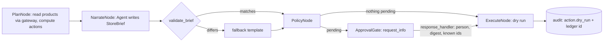

# Component: agent workflow with human approval

A Microsoft Agent Framework workflow, one run per store: code plans purchase orders, transfers and
markdowns; a model writes the store brief; policy thresholds decide what waits for a person; a person
approves a digest; a dry-run executor records what it would do.

## 1. Purpose

* Turn insight into action without giving the model authority over actions.
* Put a named person in front of anything expensive or unusual, with an approval that cannot be
  replayed or stretched to other actions.
* Link every executed action to the value it is supposed to create.

## 2. Architecture



## 3. How it works

1. **Plan.** `plan_chain` reads `inventory_position`, `demand_forecast`, `supplier_performance`,
   and `markdown_candidates` through the gateway as `agent:replenishment` and
   `agent:markdown`, then calls the same policy functions the value simulation uses: order up to the
   forecast over the supplier's p90 lead time plus a review day, plus safety stock; transfers within a
   region; minimum-clearing markdowns.
2. **Narrate.** An Agent Framework `Agent` with structured output (`StoreBrief`) writes a headline,
   summary, the action list and flagged notes. Store notes arrive quoted as untrusted data. The
   default chat client is an offline mock; `ADL_LLM=foundry` selects the Foundry client.
3. **Validate.** `validate_brief` compares the brief's actions with the plan: any added, changed or
   dropped action, or the wrong store, replaces the brief with a template that lists the plan exactly.
4. **Policy.** Thresholds in `config/policy.yaml`: purchase order lines above $250 at cost, markdowns
   deeper than 20%, transfers above 24 units and any cross-region transfer wait for a person.
5. **Approval.** The gate pauses the workflow with `ctx.request_info`. The response must come from a
   `person:` approver, carry the SHA-256 digest of exactly the pending actions, and approve only ids
   that were requested; otherwise nothing pending executes.
6. **Execute.** Below-threshold actions and properly approved ones are written to the audit chain as
   `action.dry_run` with their value-ledger id. The live executor is not implemented.

The simulated store manager rejects purchase orders above $600 (asks for a split) and markdowns giving
away more than $40 on one line.

## 4. Key files

| File | Role |
|---|---|
| `src/adl/domains/retail/agents.py` | Nodes, workflow, brief model, validator, approval, summary |
| `src/adl/domains/retail/policy.py` | Order quantity, transfers, the agent policy |
| `src/adl/core/llm.py` | Mock or Foundry chat client |
| `config/policy.yaml` | Service levels, caps, thresholds, dry-run mode |

## 5. Code excerpts

<!-- code: src/adl/domains/retail/agents.py::build -->
```python
def build(deps: Deps):
    plan, narrate, pol, gate, ex = PlanNode(deps), NarrateNode(deps), PolicyNode(deps), ApprovalGate(deps), ExecuteNode(deps)
    return (
        WorkflowBuilder(start_executor=plan, name="adl-store-actions", max_iterations=20)
        .add_edge(plan, narrate)
        .add_edge(narrate, pol)
        .add_edge(pol, gate, condition=lambda c: bool(c.pending))
        .add_edge(pol, ex, condition=lambda c: not c.pending)
        .add_edge(gate, ex)
        .build()
    )
```
<!-- /code -->

<!-- code: src/adl/domains/retail/agents.py::validate_brief -->
```python
def validate_brief(brief: StoreBrief, case: Case) -> list[str]:
    issues = []
    planned = {a.id: a for a in case.actions}
    seen = set()
    for a in brief.actions:
        p = planned.get(a.id)
        if p is None:
            issues.append(f"adds action {a.kind} {a.sku} x{a.quantity:g} that code did not plan")
        elif (a.kind, a.sku, a.quantity) != (p.kind, p.sku, p.quantity):
            issues.append(f"changes {a.id} to {a.kind} {a.sku} x{a.quantity:g}")
        seen.add(a.id)
    missing = set(planned) - seen
    if missing:
        issues.append(f"drops {len(missing)} planned action(s)")
    if brief.store_id != case.store_id:
        issues.append("wrong store")
    return issues
```
<!-- /code -->

<!-- code: src/adl/domains/retail/policy.py::order_quantity -->
```python
def order_quantity(
    fc: np.ndarray,
    lead: np.ndarray,
    cv: np.ndarray,
    z: np.ndarray,
    position: np.ndarray,
    perishable: np.ndarray,
    shelf: np.ndarray,
    pack: np.ndarray,
    cfg: dict,
) -> np.ndarray:
    """Units to order tonight per series. Shared by the simulation and today's proposals."""
    horizon = fc.shape[1]
    cover = np.minimum(lead + cfg["replenishment"]["review_days"], horizon)
    h = np.arange(horizon)[None, :]
    in_cover = h < cover[:, None]
    mu = (fc * in_cover).sum(1)
    sd = np.sqrt((((cv[:, None] * fc) ** 2) * in_cover).sum(1) + mu)
    q = mu + z * sd - position
    if cfg["replenishment"]["cap_perishable_to_shelf_life"]:
        life = (h >= lead[:, None]) & (h < (lead + shelf - 1)[:, None])
        q = np.where(perishable, np.minimum(q, (fc * life).sum(1)), q)
    mode = np.where(perishable, "round", "up")
    return np.where(q > 0, round_to_pack(q, pack, mode), 0.0)
```
<!-- /code -->

## 6. Configuration

<!-- code: config/policy.yaml -->
```yaml
# Decision policy for the replenishment and markdown agents. Code reads this file; agents cannot change it.
replenishment:
  service_z:            # safety stock in standard deviations of demand over lead time + review
    perishable: 0.0     # chosen on the tuning seeds (adl tune), never on the reported seeds
    non_perishable: 1.65
  review_days: 1        # orders are placed every evening
  lead_time: p90        # plan with the supplier's realised 90th-percentile lead time (gold.supplier_performance)
  cap_perishable_to_shelf_life: true
markdown:
  max_discount: 0.3     # deeper markdowns lost margin on the tuning seeds (adl tune)
  grid_step: 0.1
transfers:
  enabled: true
  min_units: 2
  same_region_only: true
approval:               # anything above a threshold waits for a named person; everything is dry-run
  po_value_usd: 250     # purchase order line value at cost
  markdown_discount: 0.20  # deeper than 20% waits for the store manager
  transfer_units: 24
  cross_region_transfer: always
execution:
  mode: dry-run         # the live executor is not implemented
```
<!-- /code -->

## 7. Commands

```bash
adl agents
ADL_LLM=foundry adl agents   # needs the foundry extra and an endpoint; written, not run here
```

## 8. Real output

<!-- output: agents -->
```text
workflow: plan -> narrate -> policy -> approval gate (when needed) -> execute (dry run); 8 stores
store  POs  transfers  markdowns  for approval  rejected  dry-run  flagged notes
-----  ---  ---------  ---------  ------------  --------  -------  -------------
S01    20   0          4          4             1         23       -
S02    18   0          3          2             2         19       -
S03    17   0          6          4             0         23       NOTE-006
S04    16   0          4          4             0         20       -
S05    15   0          7          6             0         22       NOTE-010
S06    19   0          7          7             1         25       -
S07    17   0          7          6             0         24       NOTE-014
S08    16   0          9          8             0         25       -

actions 185: below threshold 144, sent to a person 41, rejected 4, executed as dry run 181; PO value at cost $7,223; fallback briefs 0

example brief (S03): S03: 6 markdowns, 17 purchase orders proposed. 4 need your approval. Top stockout risks: SKU-BA01, SKU-BA02, SKU-BA08, SKU-FR03, SKU-FR06.
audit: 250 records verified
```
<!-- /output -->

No transfers were proposed on the as-of day: no store had a shortfall that a same-region neighbour
could cover from more than 1.2 times its own cover. The transfer path is implemented and tested.

## 9. Tests and gates

`tests/test_agents.py`: every store runs through the workflow; nothing above a threshold runs without
a person; rejected lines are not executed; the executor is dry-run and links the ledger; thresholds
come from policy; injected notes are flagged; an agent cannot approve; a stale digest approves
nothing; approving unrequested actions is refused; the validator accepts a faithful brief and rejects
unfaithful ones; the fallback lists the plan exactly; the digest changes with any action; the default
client is the offline mock. Gate: "nothing above a threshold executed without a person".

## 10. Guardrails

* The model has no tools and no write path; its output is text that must match the plan.
* Approval is bound to a digest and a person; the executor ignores everything else.
* Execution mode is `dry-run` in config and there is no live executor in code.

## 11. Security and governance

Every step is an audit record with an actor: `agent:replenishment` (plan), `agent:narrator` (brief),
`policy` (checks and requests), `person:manager-sNN` (decisions), `executor:dry-run` (actions).

## 12. Observability

Per store: actions by kind, pending, rejected, executed, flagged notes, fallback briefs; tokens per
brief feed the cost estimate. Agent Framework emits OpenTelemetry traces when configured.

## 13. Failure modes

| Failure | Effect | Handling |
|---|---|---|
| Model invents or resizes an action | Wrong order | Validator replaces the brief |
| Approval for a different set of actions | Unapproved execution | Digest mismatch, nothing pending executes |
| Approver is an agent | Self-approval | `person:` prefix required |
| Manager rejects lines | Value lower than simulated | Rejections recorded; not executed |

## 14. Mapping to cloud services

| Here | Azure | Google Cloud | AWS |
|---|---|---|---|
| MAF workflow in-process | Microsoft Agent Framework on Container Apps, or Foundry Agent Service | Cloud Run with Vertex AI Agent Engine | ECS or Bedrock AgentCore |
| Mock model | Foundry Models via `FoundryChatClient` with Entra ID | Gemini on Vertex AI | Claude or Nova on Bedrock |
| Approval request | Teams adaptive card or Power Automate approval | Google Chat card | Slack or SES approval with Step Functions callback |
| Reads | Gateway over Microsoft Fabric or Databricks | Gateway over BigQuery | Gateway over S3 + Athena |
| Audit | Log Analytics | Cloud Logging | CloudWatch |

## 15. Limitations

* The executor is a dry run; no ERP or pricing system is called.
* The store manager is simulated with a fixed rule.
* The Foundry path is written but has not been run from this repository.

## 16. Interview talking points

* "Code decides, the model narrates. If the model disagrees with the plan, the plan wins and the
  manager sees a template."
* "An approval is a digest of exact actions signed by a person; a stale approval approves nothing."
* "41 of 185 actions went to a person and 4 were rejected; the rest ran as dry runs with a ledger id."
