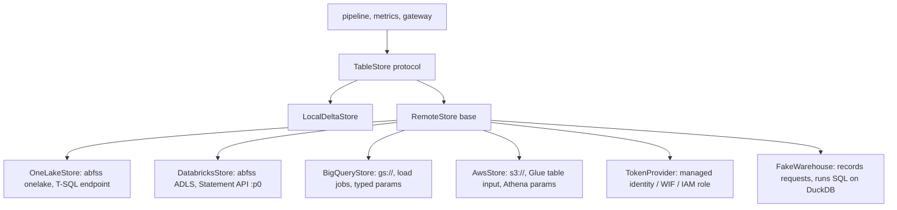

# Component: cloud storage adapters

One `TableStore` interface with five implementations: local Delta Lake + DuckDB (run end to end), and
Microsoft Fabric OneLake, Azure Databricks on ADLS Gen2, BigQuery on Cloud Storage, and S3 + Glue +
Athena (written and tested against fake clients; never run against a real account).

## 1. Purpose

* Keep the pipeline, metrics layer and gateway independent of the platform.
* Show each platform's real URI, table naming, SQL parameter style and secretless authentication.
* Prove the adapters agree with the local store on the same query.

## 2. Architecture



## 3. How it works

1. Every adapter implements `write`, `read`, `sql`, `uri`, `qualified` and `auth`.
2. A remote adapter never holds a secret: each call asks a `TokenProvider` for a short-lived token for
   the platform scope (storage, SQL, BigQuery, STS).
3. Each builds its platform's request: OneLake `abfss://<workspace>@onelake.dfs.fabric.microsoft.com/...`
   with `[lakehouse].[layer].[table]` names over the SQL analytics endpoint; Databricks named
   parameters (`:p0`) for the Statement Execution API; BigQuery load jobs and positional typed
   parameters; Glue table inputs and Athena execution parameters as escaped SQL literals.
4. `FakeWarehouse` records each request and runs the SQL on DuckDB, so the same conformance test runs
   against every adapter: the high-risk stockout query must return the same rows as the local store.

## 4. Key files

| File | Role |
|---|---|
| `src/adl/storage/base.py` | `TableStore` protocol, name and layer checks |
| `src/adl/storage/local.py` | Delta Lake + DuckDB |
| `src/adl/storage/remote.py` | Base class, token provider, fake warehouse, parameter conversion |
| `src/adl/storage/onelake.py` | Microsoft Fabric OneLake |
| `src/adl/storage/databricks.py` | Azure Databricks on ADLS Gen2 |
| `src/adl/storage/bigquery.py` | BigQuery on Cloud Storage |
| `src/adl/storage/aws.py` | S3 + Glue + Athena |

## 5. Code excerpts

<!-- code: src/adl/storage/onelake.py::OneLakeStore -->
```python
class OneLakeStore(RemoteStore):
    name = "fabric-onelake"
    table_format = "delta"
    scope = "https://storage.azure.com/.default"
    sql_scope = "https://database.windows.net/.default"

    def __init__(self, workspace: str, lakehouse: str, client, tokens) -> None:
        super().__init__(client, tokens)
        self.workspace, self.lakehouse = workspace, lakehouse

    def uri(self, layer: str, table: str) -> str:
        self._check(layer, table)
        return f"abfss://{self.workspace}@onelake.dfs.fabric.microsoft.com/{self.lakehouse}.Lakehouse/Tables/{layer}/{table}"

    def qualified(self, layer: str, table: str) -> str:
        self._check(layer, table)
        return f"[{self.lakehouse}].[{layer}].[{table}]"

    def _write_request(self, layer, table, data, mode):
        req = super()._write_request(layer, table, data, mode)
        req["storage_options"] = {"bearer_token": "<from managed identity>", "use_fabric_endpoint": "true"}
        return req

    @property
    def query_scope(self) -> str:
        return self.sql_scope

    def _query_request(self, sql, params):
        return (
            {"op": "query", "endpoint": "sql-analytics", "dialect": "tsql", "sql": sql, "parameters": params, "token_scope": self.sql_scope},
            sql,
            params,
        )

    def auth(self) -> AuthSpec:
        return AuthSpec(
            "managed identity (Entra ID)",
            "user-assigned managed identity with Contributor on the Fabric workspace",
            (self.scope, self.sql_scope),
            notes="GitHub Actions uses workload identity federation (azure/login with OIDC); no client secret.",
        )
```
<!-- /code -->

<!-- code: src/adl/storage/aws.py::_athena_literal -->
```python
def _athena_literal(v) -> str:
    """Athena execution parameters are SQL literals: strings quoted with embedded quotes doubled."""
    if isinstance(v, str):
        return "'" + v.replace("'", "''") + "'"
    return str(v).lower() if isinstance(v, bool) else str(v)
```
<!-- /code -->

## 6. Configuration

Constructor arguments per adapter (workspace and lakehouse; storage account and catalog; project and
bucket; bucket, database prefix and workgroup). Real clients are imported lazily from the `azure`,
`gcp` and `aws` extras in `pyproject.toml`.

## 7. Commands

```bash
adl adapters
```

## 8. Real output

<!-- output: adapters -->
```text
adapter             uri                                                                                          table                                    auth                                                           high-risk rows
------------------  -------------------------------------------------------------------------------------------  ---------------------------------------  -------------------------------------------------------------  --------------
fabric-onelake      abfss://wf-data@onelake.dfs.fabric.microsoft.com/retail.Lakehouse/Tables/gold/stockout_risk  [retail].[gold].[stockout_risk]          managed identity (Entra ID)                                    117
azure-databricks    abfss://lake@stwfadl.dfs.core.windows.net/gold/stockout_risk                                 `wrenfield`.`gold`.`stockout_risk`       managed identity (Entra ID) as a Databricks service principal  117
gcp-bigquery        gs://wf-adl-lake/gold/stockout_risk/                                                         `wf-adl-demo.retail_gold.stockout_risk`  workload identity federation                                   117
aws-s3-glue-athena  s3://wf-adl-lake/gold/stockout_risk/                                                         "retail_gold"."stockout_risk"            IAM role via OIDC                                              117

local adapter high-risk rows: 117; every adapter secretless: True
cloud adapters run against fake clients only; none has been run against a real account
```
<!-- /output -->

## 9. Tests and gates

`tests/test_adapters.py` (run for every adapter): implements the interface; write-read round trip;
parameterised SQL; a value cannot become SQL; illegal names rejected; secretless; every call asks for a
token; OneLake URI and SQL endpoint; Databricks named parameters; question marks inside quotes are not
parameters; BigQuery load job and typed parameters; Glue table and Athena literals; bad write mode
rejected. Gate: "cloud adapters secretless".

## 10. Guardrails

* Layer and table names are validated before any URI or SQL is built.
* Values always travel as parameters, in each platform's own style.

## 11. Security and governance

Authentication per platform: Entra ID managed identity (OneLake, Databricks as a service principal
with the first-party Azure Databricks audience), workload identity federation (BigQuery), an IAM role
via OIDC (AWS). No adapter accepts a key or password.

## 12. Observability

The fake warehouse keeps every request for assertions; real clients would log request ids to the
platform's audit log.

## 13. Failure modes

| Failure | Effect | Handling |
|---|---|---|
| Wrong parameter style | Query fails or, worse, string-pastes values | Per-adapter conversion and tests |
| Quote characters in a value | SQL injection on Athena | Literals escaped; tested |
| Real SDK behaves differently from the fake | Surprise on first run | Stated limitation: never run against a real account |

## 14. Mapping to cloud services

| Here | Azure | Google Cloud | AWS |
|---|---|---|---|
| `OneLakeStore`, `DatabricksStore` | Microsoft Fabric OneLake; Azure Databricks on ADLS Gen2; Entra ID tokens | | |
| `BigQueryStore` | | BigQuery on Cloud Storage; workload identity federation | |
| `AwsStore` | | | S3, Glue Data Catalog, Athena; IAM role via OIDC |

## 15. Limitations

* None of the cloud adapters has been run against a real account.
* Writes are whole-table; no merge or partitioning.

## 16. Interview talking points

* "Four cloud adapters, one conformance test: each returns the same 117 high-risk rows as the local
  store."
* "None of them can take a key. Tokens come from managed identity, federation or an assumed role."
