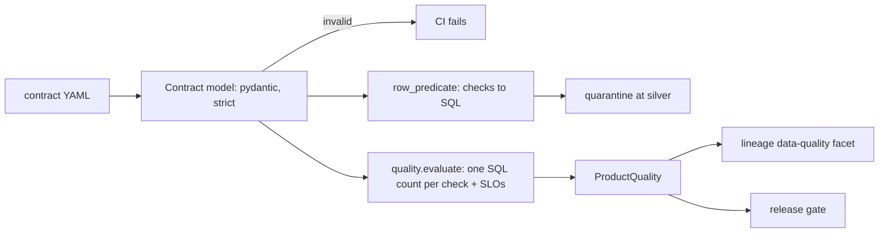

# Component: data contracts and quality

YAML contracts for every silver and gold table, validated as files in CI and enforced against the data
on every build. The contract is the single place where ownership, schema, PII, quality, service levels
and acceptable use are written down.

## 1. Purpose

* Make the promise of each table explicit and machine-checked: who owns it, what it contains, how good
  it must be and what it may be used for.
* Turn the same checks into the SQL that quarantines bad rows, so the rule and its enforcement cannot
  drift apart.
* Stop unsafe contracts at review time (PII in an internal table, a gold product without acceptable
  use).

## 2. Architecture



## 3. How it works

1. `load_all` parses every YAML in a domain's `contracts/` folder into the strict `Contract` model
   (unknown fields rejected). Validators enforce: id matches layer and table; the primary key and every
   check reference real columns; PII columns are never in a table classified below confidential; an
   agent-exposed product holds no PII and is not restricted; gold products state acceptable use and
   consumers; a purpose cannot be both allowed and prohibited; every input has a contract.
2. Row-level checks (`not_null`, `range`, `accepted_values`, `referential`, `regex`) compile into one
   SQL predicate. Table-level checks (`unique`, `row_count_min`, `freshness`) run after the write.
3. `evaluate` runs each check as a SQL count of failing rows, then the SLOs: completeness (rows kept
   after quarantine) and freshness (newest day within the SLA of the as-of day).

## 4. Key files

| File | Role |
|---|---|
| `src/adl/core/contracts.py` | Contract model, validation, SQL predicate |
| `src/adl/core/quality.py` | Checks and SLOs evaluated with SQL |
| `domains/retail/contracts/*.yaml` | 25 retail contracts (15 silver, 10 gold) |
| `domains/<planned>/contracts/*.yaml` | 3 planned contracts per planned domain |

## 5. Code excerpts

<!-- code: src/adl/core/contracts.py::row_predicate -->
```python
def row_predicate(c: Contract, contracts: dict[str, Contract], qualified) -> str:
    """SQL boolean expression that is true for rows passing every row-level check (used for quarantine)."""
    parts: list[str] = []
    for col in c.schema_:
        if not col.nullable:
            parts.append(f'"{col.name}" IS NOT NULL')
    for chk in c.quality:
        if chk.check == "not_null":
            parts += [f'"{x}" IS NOT NULL' for x in chk.targets]
        elif chk.check == "range":
            col = f'"{chk.column}"'
            if chk.min is not None:
                parts.append(f"({col} IS NULL OR {col} >= {chk.min})")
            if chk.max is not None:
                parts.append(f"({col} IS NULL OR {col} <= {chk.max})")
        elif chk.check == "accepted_values":
            vals = ", ".join("'" + v.replace("'", "''") + "'" for v in chk.values)
            parts.append(f'("{chk.column}" IS NULL OR CAST("{chk.column}" AS VARCHAR) IN ({vals}))')
        elif chk.check == "regex":
            parts.append(f'("{chk.column}" IS NULL OR regexp_full_match("{chk.column}", \'{chk.pattern}\'))')
        elif chk.check == "referential":
            ref_id, _, ref_col = chk.ref.rpartition(".")
            ref = contracts[ref_id]
            parts.append(f'("{chk.column}" IS NULL OR "{chk.column}" IN (SELECT "{ref_col}" FROM {qualified(ref.layer, ref.table)}))')
    return " AND ".join(parts) or "TRUE"
```
<!-- /code -->

A full gold contract:

<!-- code: domains/retail/contracts/gold.stockout_risk.yaml -->
```yaml
# Data contract: retail.gold.stockout_risk (owner: supply-chain-data). Validated by adl.core.contracts in CI.
id: retail.gold.stockout_risk
version: 1.0.0
domain: retail
layer: gold
table: stockout_risk
kind: insight_product
status: built
description: Probability that each store-product sells out within the next three days given stock, inbound orders and the forecast.
owner: {team: supply-chain-data, steward: Supply chain data steward, contact: supply-data@wrenfield.example}
classification: internal
schema:
- {name: store_id, type: string, nullable: false}
- {name: region, type: string, nullable: false}
- {name: sku, type: string, nullable: false}
- {name: horizon_days, type: int, nullable: false}
- {name: available_units, type: float, nullable: false}
- {name: expected_demand, type: float, nullable: false}
- {name: probability, type: float, nullable: false}
- {name: risk_band, type: string, nullable: false}
primary_key: [store_id, sku]
quality:
- check: unique
  columns: [store_id, sku]
- {check: range, column: probability, min: 0, max: 1}
- check: accepted_values
  column: risk_band
  values: [low, medium, high]
- {check: referential, column: store_id, ref: retail.silver.stores.store_id}
- {check: referential, column: sku, ref: retail.silver.products.sku}
slo: {completeness_pct: 100, freshness_days: 9999, max_quarantine_pct: 1.0}
acceptable_use:
  allowed_purposes: [replenishment, store_operations]
  prohibited_purposes: [individual_customer_profiling, employee_performance_management, sale_of_data_to_third_parties]
consumers: ['agent:replenishment', 'agent:store-copilot-north', 'agent:store-copilot-south']
inputs: [retail.gold.demand_forecast, retail.gold.inventory_position]
agent_exposed: true
```
<!-- /code -->

## 6. Configuration

Contracts are the configuration. Classification order is public < internal < confidential <
restricted. Severity `error` fails the product; `warn` is reported only.

## 7. Commands

```bash
adl contracts
adl quality
```

## 8. Real output

<!-- output: contracts -->
```text
domain      status  contracts  silver  gold  agent-exposed  with PII  quality checks
----------  ------  ---------  ------  ----  -------------  --------  --------------
retail      built   25         15      10    10             1         93
mortgage    built   15         10      5     5              1         55
insurance   built   18         11      7     7              1         68
healthcare  built   15         9       6     6              1         58

all contracts valid: True
```
<!-- /output -->

<!-- output: quality -->
```text
product                    rows   quarantined  complete  checks passed  checks  passed
-------------------------  -----  -----------  --------  -------------  ------  ------
gold.customer_segments     24     0            100.000%  10             10      yes
gold.demand_forecast       5376   0            100.000%  11             11      yes
gold.inventory_position    384    0            100.000%  22             22      yes
gold.markdown_candidates   68     0            100.000%  14             14      yes
gold.promo_plan            144    0            100.000%  9              9       yes
gold.sales_daily           53741  0            100.000%  29             29      yes
gold.stockout_risk         384    0            100.000%  14             14      yes
gold.store_notes           16     0            100.000%  10             10      yes
gold.supplier_performance  6      0            100.000%  12             12      yes
gold.value_ledger          12     0            100.000%  12             12      yes
silver.inventory           53760  0            100.000%  13             13      yes
silver.loyalty_customers   1200   0            100.000%  8              8       yes
silver.loyalty_pii         1200   0            100.000%  7              7       yes
silver.loyalty_visits      27039  0            100.000%  9              9       yes
silver.pos_sales           53741  19           99.965%   18             18      yes
silver.price_tests         576    0            100.000%  10             10      yes
silver.prices              8736   0            100.000%  7              7       yes
silver.products            48     0            100.000%  14             14      yes
silver.promotions          144    0            100.000%  9              9       yes
silver.purchase_orders     39704  0            100.000%  20             20      yes
silver.store_events        75     0            100.000%  6              6       yes
silver.store_notes         16     0            100.000%  10             10      yes
silver.stores              8      0            100.000%  7              7       yes
silver.suppliers           6      0            100.000%  7              7       yes
silver.weather             364    0            100.000%  7              7       yes
```
<!-- /output -->

## 9. Tests and gates

`tests/test_contracts.py` has one test per contract file plus one per validation rule (PII
classification, acceptable use, consumers, exposed PII, restricted exposure, unknown columns, primary
key, id, duplicates, unknown fields, range bounds, referential targets, inputs, predicate SQL).
`tests/test_quality_lineage_semantic.py` checks a broken table fails and a stale product fails its
freshness SLO. Gate: "contracts valid (all domains)" and "every built product passes its contract".

## 10. Guardrails

* A contract that would expose PII to an agent cannot be loaded, so it cannot be deployed.
* Prohibited purposes are part of the contract, not of an agent's configuration, so a new agent
  inherits them.

## 11. Security and governance

The `owner` block names a team, a steward and a contact address for every table. The contract is the
artefact a catalogue such as Microsoft Purview would register ([purview-mapping.md](../purview-mapping.md)).

## 12. Observability

Quality results are written into each lineage event as a data-quality facet and summarised by
`adl quality`.

## 13. Failure modes

| Failure | Effect | Handling |
|---|---|---|
| A contract references a column that was renamed | Check silently skipped | Validation fails the contract |
| Freshness breach | Stale decisions | SLO fails the product, gate fails |
| Too many rows quarantined | Biased data | `max_quarantine_pct` in the SLO |

## 14. Mapping to cloud services

| Here | Azure | Google Cloud | AWS |
|---|---|---|---|
| Contract YAML | Microsoft Purview data products, or Microsoft Fabric lakehouse table descriptions | Dataplex catalog entries | DataZone assets |
| Quality checks | Purview data quality rules | Dataplex data quality scans on BigQuery | Glue Data Quality over S3 tables |
| Owners and stewards | Entra ID groups as owners | Google groups | IAM Identity Center groups |

## 15. Limitations

* Checks are the common set; statistical checks (distribution drift) are not implemented.
* Contract versions are recorded but no compatibility check runs between versions.

## 16. Interview talking points

* "The same YAML check is the documentation, the CI rule and the SQL that quarantines rows."
* "You cannot write a contract that exposes PII to an agent: the model refuses to load it."
