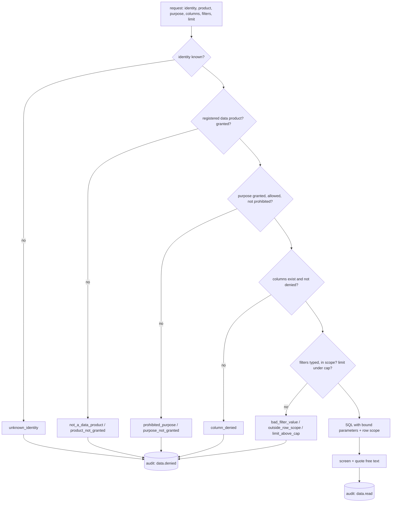

# Component: data gateway, access control and audit

The only way an agent reads data. It checks identity, product grant, purpose, columns, filters and row
caps before any SQL runs, adds the identity's row scope, quotes free text as untrusted, and writes
every call, allowed or denied, to a hash-chained audit log.

## 1. Purpose

* Make data products, not tables, the unit agents can ask for.
* Enforce acceptable use, row-level and column-level security in one place for in-process agents,
  MCP clients and A2A callers.
* Leave tamper-evident evidence of every read and denial.

## 2. Architecture



## 3. How it works

1. The registry of data products is every gold contract with `agent_exposed: true`; bronze, silver and
   the restricted PII table are not in it, so they are unreachable by construction.
2. Purposes are checked three ways: granted to the identity, allowed by the contract, not prohibited.
3. Columns denied to the identity cannot be selected; by default they are left out.
4. Filters are `[column, operator, value]` with declared columns, allowed operators, typed values and
   plain-identifier strings. A filter asking for rows outside the identity's scope is refused rather
   than returning nothing.
5. The scope (region, and the region's stores) is added to the SQL; values are bound parameters.
6. Free-text fields are screened and wrapped as untrusted data, and an `injection_flag` is set.
7. `metric` and `search_knowledge` follow the same checks.
8. The audit log stores each record with the SHA-256 of the previous one; `verify` detects edits,
   deletions and reordering.

## 4. Key files

| File | Role |
|---|---|
| `src/adl/core/access.py` | `DataGateway`, `Identity`, checks |
| `src/adl/core/audit.py` | Hash-chained audit log |
| `src/adl/core/guardrails.py` | Screening, redaction, quoting |
| `src/adl/domains/retail/attacks.py` | The 14-attempt attack suite, PII scan, tamper check |
| `config/agents.yaml` | Identities, grants, purposes, scopes, denied columns, caps |

## 5. Code excerpts

<!-- code: src/adl/core/access.py::Identity -->
```python
@dataclass(frozen=True)
class Identity:
    id: str
    description: str
    products: tuple[str, ...]
    purposes: tuple[str, ...]
    rows: dict[str, tuple[str, ...]] = field(default_factory=dict)
    deny_columns: dict[str, tuple[str, ...]] = field(default_factory=dict)
    max_rows: int = 100
```
<!-- /code -->

<!-- code: src/adl/core/audit.py::AuditLog -->
```python
@dataclass
class AuditLog:
    domain: str
    records: list[dict] = field(default_factory=list)

    def append(self, actor: str, event: str, data: dict[str, Any]) -> dict:
        prev = self.records[-1]["hash"] if self.records else GENESIS
        rec = {"seq": len(self.records) + 1, "domain": self.domain, "actor": actor, "event": event, "data": data, "prev": prev}
        rec["hash"] = hashlib.sha256(_canon(rec).encode()).hexdigest()
        self.records.append(rec)
        return rec

    def verify(self) -> tuple[bool, str]:
        prev = GENESIS
        for i, rec in enumerate(self.records, 1):
            body = {k: v for k, v in rec.items() if k != "hash"}
            if rec["seq"] != i:
                return False, f"record {i}: sequence {rec['seq']}"
            if rec["prev"] != prev:
                return False, f"record {i}: broken link"
            if hashlib.sha256(_canon(body).encode()).hexdigest() != rec["hash"]:
                return False, f"record {i}: hash mismatch"
            prev = rec["hash"]
        return True, f"{len(self.records)} records verified"

    def events(self, event: str) -> list[dict]:
        return [r for r in self.records if r["event"] == event]
```
<!-- /code -->

## 6. Configuration

<!-- code: config/agents.yaml -->
```yaml
# Agent identities and what each may read through the data gateway (adl.core.access).
# In Azure each identity is a Microsoft Entra ID agent identity / managed identity; here they are names.
# products: data products (gold, agent_exposed contracts) plus "knowledge" for the knowledge layer.
# purposes: must also be allowed by the product's contract; prohibited purposes are always refused.
# rows: row-level scope. region limits rows to that region's stores; omitted means every store.
# deny_columns: column-level security per product.
identities:
  agent:replenishment:
    description: Proposes purchase orders and transfers for every store.
    products: [sales_daily, inventory_position, supplier_performance, promo_plan, demand_forecast, stockout_risk, store_notes, knowledge]
    purposes: [replenishment]
    max_rows: 500
  agent:markdown:
    description: Proposes markdowns on near-date stock for every store.
    products: [sales_daily, inventory_position, markdown_candidates, demand_forecast, promo_plan, knowledge]
    purposes: [markdown_optimisation]
    max_rows: 500
  agent:store-copilot-north:
    description: Answers store managers in the north region.
    products: [sales_daily, inventory_position, stockout_risk, store_notes, knowledge]
    purposes: [store_operations]
    rows: {region: [north]}
    deny_columns: {sales_daily: [cogs_usd], inventory_position: [unit_cost]}
    max_rows: 200
  agent:store-copilot-south:
    description: Answers store managers in the south region.
    products: [sales_daily, inventory_position, stockout_risk, store_notes, knowledge]
    purposes: [store_operations]
    rows: {region: [south]}
    deny_columns: {sales_daily: [cogs_usd], inventory_position: [unit_cost]}
    max_rows: 200
  agent:insights:
    description: Produces aggregate performance and loyalty-segment reports.
    products: [customer_segments, sales_daily]
    purposes: [performance_reporting, customer_insight_aggregate]
    max_rows: 500
  agent:finance:
    description: Reports business value from the value ledger.
    products: [value_ledger, sales_daily]
    purposes: [value_reporting, performance_reporting]
    max_rows: 500
knowledge:
  allowed_purposes: [replenishment, markdown_optimisation, store_operations, performance_reporting, supplier_management]
```
<!-- /code -->

## 7. Commands

```bash
adl access
```

## 8. Real output

<!-- output: access -->
```text
attempt                             identity                   denial               stopped
----------------------------------  -------------------------  -------------------  -------
unknown identity                    agent:intruder             unknown_identity     yes
raw silver table                    agent:replenishment        not_a_data_product   yes
restricted PII table                agent:insights             not_a_data_product   yes
SQL in the product name             agent:replenishment        not_a_data_product   yes
product not granted                 agent:markdown             product_not_granted  yes
prohibited purpose                  agent:insights             prohibited_purpose   yes
purpose not granted                 agent:store-copilot-north  purpose_not_granted  yes
denied column                       agent:store-copilot-north  column_denied        yes
other region's store                agent:store-copilot-north  outside_row_scope    yes
injection in a filter value         agent:replenishment        bad_filter_value     yes
row cap                             agent:store-copilot-south  limit_above_cap      yes
unknown filter operator             agent:replenishment        bad_operator         yes
knowledge for a prohibited purpose  agent:insights             product_not_granted  yes
metric on another region            agent:store-copilot-south  bad_filter_value     yes

stopped: 14/14
PII scan of 10 agent-exposed products: 0 rows with an email, phone or member name
audit log: 14 records verified; denials recorded 14
tampered copy detected: True (record 8: hash mismatch)
```
<!-- /output -->

## 9. Tests and gates

`tests/test_gateway.py`: each of the 14 attacks is stopped with the right code and audited; no PII in
any exposed product; tampering breaks the chain; row-level security limits a regional copilot;
column-level security hides denied columns; an unscoped agent sees every store; free text is quoted
and flagged; filters and limits; bad filters refused; metrics row scoped; product lists show only
grants; reads are audited with their row scope. Gate: "every access attack stopped", "no PII in
agent-exposed products", "audit chain verifies and detects tampering".

## 10. Guardrails

* Global row cap of 500 regardless of configuration.
* No caller-supplied SQL anywhere; table names come from contracts.
* Denials are explicit codes, which makes misconfiguration visible instead of silently empty.

## 11. Security and governance

Each identity maps to a workload identity in the cloud (Entra ID agent or managed identity, a Google
service account, an IAM role). The gateway is where acceptable use is enforced at run time; the
catalogue documents it.

## 12. Observability

`data.read`, `data.denied`, `metric.*` and `knowledge.*` audit records with identity, request and
row counts; denial spikes per identity are the alert.

## 13. Failure modes

| Failure | Effect | Handling |
|---|---|---|
| Filter on a store outside the scope | Empty result hides misconfiguration | Refused with `outside_row_scope` |
| New gold table added without a contract | Exposed by accident | Not in the registry unless its contract says `agent_exposed: true` |
| Audit file edited | Lost evidence | Chain verification fails at the edited record |

## 14. Mapping to cloud services

| Here | Azure | Google Cloud | AWS |
|---|---|---|---|
| Identities | Entra ID agent identities and managed identities | Service accounts with workload identity federation | IAM roles |
| Product grants | Microsoft Fabric item permissions / OneLake data access roles, Unity Catalog grants | BigQuery dataset IAM | Lake Formation permissions on S3 tables |
| Row and column security | Fabric RLS and CLS, Unity Catalog row filters and column masks | BigQuery row access policies and policy tags | Lake Formation data filters |
| Audit | Log Analytics plus immutable blob | Cloud Logging plus locked bucket | CloudWatch Logs plus S3 Object Lock |
| Gateway hosting | Container Apps behind API Management | Cloud Run behind API Gateway | ECS behind API Gateway |

## 15. Limitations

* Identities are names in YAML; token validation is shown in the A2A endpoint with demo tokens only.
* The audit log is per run in memory; production needs append-only storage.

## 16. Interview talking points

* "Bronze and silver are not hidden from agents by a rule; they are not in the registry at all."
* "I caught a real bug with the attack suite: a north copilot filtering on a south store got an empty
  result instead of a denial. Now both region and store scope apply."
