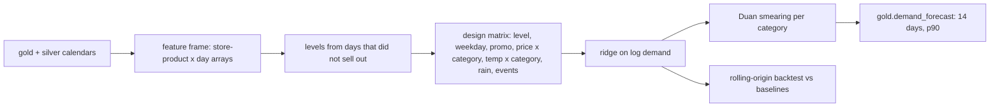

# Component: demand forecast

A global ridge regression on log demand for all 384 store-product series, backtested against the two
naive forecasts a store team would use.

## 1. Purpose

* Forecast the next 14 days per store and product for ordering.
* Beat "same day last week" and "28-day mean" honestly, on days the model has not seen.
* Provide an upper bound for safety stock and an error estimate per category for stockout risk.

## 2. Architecture



## 3. How it works

1. `build_frame` assembles dense arrays (series x day) for units, sold-out flags, prices, promotions,
   weather and events from gold and the conformed silver calendars.
2. The level of each series is the mean of recent days that did not sell out; a sold-out day records
   sales, not demand, and training on it teaches the model to under-forecast.
3. Features are known in advance: level, weekday, promotion, log price by category (its coefficient is
   a price elasticity), temperature by category, rain, local events by category, and markdown days.
4. Ridge regression on log demand, converted back with Duan's smearing factor per category.
5. The backtest uses four origins (days 111, 118, 125, 132), forecasts seven days from each with
   information up to the origin, and scores on days that did not sell out.
6. `insights.build` writes `gold.demand_forecast` with p90 = forecast x (1 + 1.2816 x category error).

## 4. Key files

| File | Role |
|---|---|
| `src/adl/domains/retail/features.py` | Feature frame from the lake |
| `src/adl/domains/retail/forecast.py` | Levels, design matrix, ridge, smearing, backtest |
| `src/adl/domains/retail/insights.py` | The forecast data product |

## 5. Code excerpts

<!-- code: src/adl/domains/retail/forecast.py::FEATURES -->
```python
FEATURES = (
    ["intercept", "log_level"]
    + [f"dow_{d}" for d in range(1, 7)]
    + ["promo"]
    + [f"log_price_x_{c}" for c in CATS]
    + [f"temp_x_{c}" for c in CATS]
    + ["rain"]
    + [f"event_x_{c}" for c in CATS]
    + ["markdown_day"]
)
```
<!-- /code -->

<!-- code: src/adl/domains/retail/forecast.py::levels -->
```python
def levels(units: np.ndarray, soldout: np.ndarray) -> np.ndarray:
    """level[o, s]: mean of unconstrained units over days o-27..o (NaN-safe; 0 if none)."""
    ok = ~np.isnan(units) & ~soldout
    u = np.where(ok, units, 0.0)
    cs_u = np.vstack([np.zeros(units.shape[1]), np.cumsum(u, 0)])
    cs_n = np.vstack([np.zeros(units.shape[1]), np.cumsum(ok, 0)])
    o = np.arange(units.shape[0])
    lo = np.maximum(o - LEVEL_DAYS + 1, 0)
    tot = cs_u[o + 1] - cs_u[lo]
    cnt = cs_n[o + 1] - cs_n[lo]
    return np.where(cnt > 0, tot / np.maximum(cnt, 1), 0.0)
```
<!-- /code -->

## 6. Configuration

`LEVEL_DAYS` (28), `RIDGE` (1.0), `ORIGINS`, `MAX_H` (10) in `forecast.py`; `FORECAST_DAYS` (14) in
`insights.py`.

## 7. Commands

```bash
adl forecast
```

## 8. Real output

<!-- output: forecast -->
```text
rolling-origin backtest: 4 origins x 7 days, 10,166 store-product-days (sold-out days excluded)
model               WAPE   bias
------------------  -----  -----
ridge model         31.9%  -2.7%
same day last week  48.2%  +0.2%
28-day mean         35.8%  -1.3%

category  ridge  last week  28-day mean
--------  -----  ---------  -----------
bakery    30.3%  46.5%      34.6%
dairy     32.4%  50.0%      36.1%
frozen    32.5%  48.6%      36.7%
meat      32.1%  46.1%      34.9%
pantry    32.7%  51.1%      36.6%
produce   31.8%  47.4%      36.4%
```
<!-- /output -->

The model wins in every category. A WAPE around 32% is expected for daily store-product grocery
demand with a 0.41 coefficient of variation per store-day; the comparison with baselines matters more
than the level.

## 9. Tests and gates

`tests/test_models.py`: the forecast beats both naive baselines; bias is small; it wins in every
category; forecasts are non-negative and bounded. Gate: "forecast beats both naive baselines".

## 10. Guardrails

* Nothing is tuned on the backtest window; origins are fixed in code.
* The training job reads gold and silver calendars under a job identity; agents never call the model
  directly, they read `gold.demand_forecast` through the gateway.

## 11. Security and governance

The forecast product has a contract with acceptable use (replenishment, markdown, forecasting, store
operations) and is lineage-linked to the model run (`model.ridge_forecaster`).

## 12. Observability

WAPE and bias per category per origin; in production the same calculation on realised sales is the
drift signal.

## 13. Failure modes

| Failure | Effect | Handling |
|---|---|---|
| Training on sold-out days | Under-forecast, more stockouts | Excluded from levels, training and scoring |
| A promotion not in the calendar | Under-forecast that week | Promotions come from the pricing feed 14 days ahead |
| Drift after a format change | Accuracy falls | Gate requires beating baselines; monitoring on realised sales |

## 14. Mapping to cloud services

| Here | Azure | Google Cloud | AWS |
|---|---|---|---|
| NumPy ridge in-process | Azure Machine Learning or a Microsoft Fabric notebook; model registry | Vertex AI training, BigQuery ML | SageMaker training |
| Feature frame | Fabric lakehouse tables, Databricks feature tables | BigQuery feature tables | SageMaker Feature Store over S3 |
| Job identity | Entra ID managed identity | Service account | IAM role |

## 15. Limitations

* No hierarchy reconciliation between store, region and category forecasts.
* Prediction intervals come from a per-category error, not per series.

## 16. Interview talking points

* "The single most important line is excluding sold-out days: they are censored demand."
* "One global model with category interactions learns from all 384 series at once, which helps when
  there are only 140 days of history."
