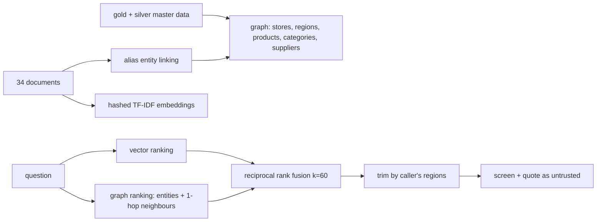

# Component: knowledge graph and hybrid retrieval

Supplier reviews, store policies and operating notes made searchable for agents, with a knowledge
graph built from the master data so retrieval can follow relationships a question never states.

## 1. Purpose

* Give agents grounded context (which supplier is late, what the store policy says) through the same
  gateway as data, trimmed by region.
* Show measurably that graph plus vector retrieval beats either alone on this corpus.
* Treat every document as untrusted text.

## 2. Architecture



## 3. How it works

1. **Graph.** Nodes are entities from the master data plus documents. Edges come from the data (a
   product belongs to a category and is supplied by a supplier; a store is in a region) and from
   entity linking (a document mentions an entity). Aliases map everyday words ("spinach", "milk") to
   products and categories.
2. **Vector.** Deterministic hashed TF-IDF embeddings over words and word pairs (2,048 dimensions),
   a stand-in for a hosted embedding model so the evaluation runs offline.
3. **Graph search.** Link the question to entities, add one-hop neighbours at half weight, score each
   document by the weight of the entities it mentions, damped by how many it mentions (divided by
   1 + 0.15 per entity).
4. **Hybrid.** Reciprocal rank fusion of the two rankings; with no linked entity it is the vector
   ranking.
5. **Trimming and quoting.** Documents scoped to a region are removed for callers outside it before
   ranking; text is screened for injection and returned quoted.

## 4. Key files

| File | Role |
|---|---|
| `src/adl/knowledge/embed.py` | Hashed TF-IDF embeddings |
| `src/adl/knowledge/graph.py` | Entities, edges, alias linking |
| `src/adl/knowledge/retrieve.py` | Vector, graph and hybrid ranking; metrics |
| `src/adl/knowledge/azure_search.py` | Azure AI Search index, upload and hybrid query (written, not run) |
| `src/adl/domains/retail/knowledge.py` | Retail aliases, corpus and evaluation loading |
| `domains/retail/knowledge/corpus.yaml` | 34 documents |
| `domains/retail/knowledge/eval.yaml` | 30 questions with relevant documents |

## 5. Code excerpts

<!-- code: src/adl/knowledge/retrieve.py::KnowledgeIndex -->
```python
class KnowledgeIndex:
    def __init__(self, docs: list[Doc], graph: KnowledgeGraph) -> None:
        self.docs = {d.id: d for d in docs}
        self.ids = [d.id for d in docs]
        self.embed = HashedTfidf([f"{d.title}. {d.text}" for d in docs])
        self.matrix = np.vstack([self.embed(f"{d.title}. {d.text}") for d in docs])
        self.graph = graph
        for d in docs:
            graph.add_document(d.id, f"{d.title}. {d.text}")

    def _allowed(self, regions: tuple[str, ...] | None) -> np.ndarray:
        if regions is None:
            return np.ones(len(self.ids), bool)
        return np.array([not self.docs[i].regions or bool(set(self.docs[i].regions) & set(regions)) for i in self.ids])

    def vector_scores(self, q: str) -> np.ndarray:
        return self.matrix @ self.embed(q)

    def rank(self, q: str, method: str = "hybrid", regions: tuple[str, ...] | None = None) -> list[tuple[str, float]]:
        allowed = self._allowed(regions)
        vec = self.vector_scores(q)
        vec_rank = [(self.ids[i], float(vec[i])) for i in np.argsort(-vec, kind="stable") if allowed[i]]
        if method == "vector":
            return vec_rank
        seeds = self.graph.link(q)
        weight: dict[str, float] = {}
        for s in seeds:
            weight[s] = 1.0
            for nb in self.graph.neighbours(s):
                weight[nb] = max(weight.get(nb, 0.0), 0.5)
        g = []
        for i, doc_id in enumerate(self.ids):
            ents = self.graph.mentions.get(doc_id, set())
            sc = sum(weight.get(e, 0.0) for e in ents) / (1 + 0.15 * len(ents))
            if allowed[i] and sc > 0:
                g.append((doc_id, sc + 1e-3 * vec[i]))
        g.sort(key=lambda x: -x[1])
        if method == "graph":
            return g
        if not g:
            return vec_rank
        fused: dict[str, float] = {}
        for ranking in (vec_rank, g):
            for r, (doc_id, _) in enumerate(ranking, 1):
                fused[doc_id] = fused.get(doc_id, 0.0) + 1.0 / (RRF_K + r)
        return sorted(fused.items(), key=lambda x: (-x[1], self.ids.index(x[0])))

    def search(self, q: str, k: int = 5, method: str = "hybrid", regions: tuple[str, ...] | None = None) -> list[Hit]:
        hits = []
        for doc_id, score in self.rank(q, method, regions)[:k]:
            d = self.docs[doc_id]
            flagged = guardrails.screen(d.text).flagged
            hits.append(Hit(doc_id, d.title, round(score, 4), guardrails.quote_untrusted(d.text), flagged, method))
        return hits
```
<!-- /code -->

## 6. Configuration

`RRF_K` (60), `DIM` (2,048), the alias tables in `src/adl/domains/retail/knowledge.py`, and the
knowledge purposes in `config/agents.yaml`.

## 7. Commands

```bash
adl retrieval
```

## 8. Real output

<!-- output: retrieval -->
```text
corpus: 34 documents; questions: 30; graph: {'category nodes': 6, 'product nodes': 48, 'region nodes': 2, 'store nodes': 8, 'supplier nodes': 6, 'document nodes': 34, 'entity-entity edges': 111, 'document-entity edges': 99}
method  recall@3  recall@5  MRR@10  nDCG@5  hit@5
------  --------  --------  ------  ------  -----
vector  0.794     0.856     0.817   0.793   0.933
graph   0.583     0.667     0.597   0.598   0.700
hybrid  0.911     0.972     0.886   0.886   1.000
```
<!-- /output -->

Graph search alone is weak because many questions name no entity; vector search misses questions
whose answer sits one relationship away (spinach, its supplier, that supplier's late deliveries).
Fusion gets the best of both: every question has a relevant document in the top five.

## 9. Tests and gates

`tests/test_knowledge.py`: hybrid beats vector and graph; metric functions; embeddings are deterministic
and normalised; aliases link to entities; a north copilot never sees south-store documents; untrusted
documents come back quoted and flagged; the Azure AI Search adapter uses a bearer token, never a key;
the index definition validates; search through the gateway is trimmed. Gate: "hybrid retrieval
recall@5 >= 0.90".

## 10. Guardrails

* Region trimming happens before ranking, so an out-of-scope document cannot even influence the order.
* Document text always comes back inside untrusted-data tags with an injection flag.

## 11. Security and governance

Knowledge is a grant in `config/agents.yaml` with its own allowed purposes; every search is audited
with the returned document ids.

## 12. Observability

Recall, MRR and nDCG on the evaluation set; in production, the share of answers citing a document and
the injection-flag rate.

## 13. Failure modes

| Failure | Effect | Handling |
|---|---|---|
| A policy document mentions every entity | Wins every graph query | Score divided by the number of entities mentioned |
| No entity in the question | Graph ranking empty | Hybrid falls back to vector |
| Injected instruction in a review | Agent misled | Screen, quote, and actions come only from code |

## 14. Mapping to cloud services

| Here | Azure | Google Cloud | AWS |
|---|---|---|---|
| Hashed TF-IDF | Foundry embedding deployment | Vertex AI text embeddings | Bedrock Titan embeddings |
| In-memory index + RRF | Azure AI Search hybrid query (BM25 + vector, RRF), key auth off, Entra ID tokens | Vertex AI Vector Search or BigQuery vector search | OpenSearch Serverless with S3 source |
| Graph | Microsoft Fabric graph, or Cosmos DB for Apache Gremlin | Spanner Graph | Neptune |
| Region trimming | Security filter on a `regions` field | Filter restricts | Document-level security |

## 15. Limitations

* Offline embeddings are lexical; a hosted model would handle synonyms the alias table does not.
* 34 documents and 30 questions is a small evaluation; numbers will move on a larger corpus.

## 16. Interview talking points

* "Graph alone 0.667, vector 0.856, fused 0.972 recall@5: the relationship hop is what vector search
  misses."
* "Security trimming happens before ranking, not after, so the top-k is never padded with things you
  were not allowed to see."
