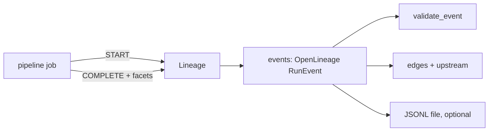

# Component: lineage

OpenLineage run events for every pipeline job, model training and the value simulation, so any number
can be traced back to the source system that produced it.

## 1. Purpose

* Answer "where did this come from" for every data product, including the value ledger.
* Carry schema, row counts and quality results with each output, in a standard format catalogues
  accept.

## 2. Architecture



## 3. How it works

1. Each job calls `Lineage.run(job, inputs, outputs)`, which emits a START and a COMPLETE (or FAIL)
   event with the input and output datasets.
2. Output datasets carry a schema facet, an output-statistics facet (row count) and a data-quality
   facet from the contract checks.
3. Run ids are UUIDv5 of the job and sequence, and event times are synthetic, so the events are
   identical on every run.
4. `edges()` and `upstream()` walk COMPLETE events to give the full upstream of any dataset.

## 4. Key files

| File | Role |
|---|---|
| `src/adl/core/lineage.py` | Event builder, validator, graph walk, JSONL writer |
| `src/adl/domains/retail/pipeline.py` | Calls `run` for each bronze, silver and gold job |
| `src/adl/domains/retail/runtime.py` | Lineage for the model and the value simulation |

## 5. Code excerpts

<!-- code: src/adl/core/lineage.py::validate_event -->
```python
def validate_event(e: dict[str, Any]) -> list[str]:
    """Structural check against the required RunEvent fields (a subset of the JSON schema)."""
    problems = []
    for k in ("eventType", "eventTime", "producer", "schemaURL", "run", "job", "inputs", "outputs"):
        if k not in e:
            problems.append(f"missing {k}")
    if e.get("eventType") not in {"START", "RUNNING", "COMPLETE", "ABORT", "FAIL", "OTHER"}:
        problems.append("bad eventType")
    try:
        uuid.UUID(e.get("run", {}).get("runId", ""))
    except ValueError:
        problems.append("runId is not a UUID")
    if not {"namespace", "name"} <= set(e.get("job", {})):
        problems.append("job needs namespace and name")
    for ds in e.get("inputs", []) + e.get("outputs", []):
        if not {"namespace", "name"} <= set(ds):
            problems.append("dataset needs namespace and name")
    return problems
```
<!-- /code -->

## 6. Configuration

`NAMESPACE` (`wrenfield-adl`), `PRODUCER` (this repository's URL) and the OpenLineage schema URL.

## 7. Commands

```bash
adl lineage
adl lineage --dataset gold.stockout_risk --out out/lineage/events.jsonl
```

## 8. Real output

<!-- output: lineage -->
```text
events: 78; schema problems: 0; edges: 66
upstream of gold.value_ledger (36):
  bronze.inventory_snapshots
  bronze.pos_sales
  bronze.price_changes
  bronze.products
  bronze.promotions
  bronze.purchase_orders
  bronze.store_events
  bronze.stores
  bronze.suppliers
  bronze.weather
  gold.demand_forecast
  gold.promo_plan
  gold.sales_daily
  gold.supplier_performance
  model.ridge_forecaster
  model.value_simulation
  silver.inventory
  silver.pos_sales
  silver.prices
  silver.products
  silver.promotions
  silver.purchase_orders
  silver.store_events
  silver.stores
  silver.suppliers
  silver.weather
  source://merchandising/products
  source://pos/pos_sales
  source://pricing/price_changes
  source://pricing/promotions
  source://store-app/store_events
  source://store-master/stores
  source://supplier-edi/purchase_orders
  source://supplier-master/suppliers
  source://warehouse/inventory_snapshots
  source://weather-feed/weather
```
<!-- /output -->

The value ledger traces back through the simulation model, the forecaster and the gold and silver
products to ten source datasets from nine source systems.

## 9. Tests and gates

`tests/test_quality_lineage_semantic.py`: events are valid OpenLineage with paired START and
COMPLETE; the value ledger's lineage reaches the POS source; run ids are deterministic; the validator
reports missing fields. Gate: "lineage events valid".

## 10. Guardrails

Events carry dataset names, schemas and counts, never row values, so lineage cannot leak data.

## 11. Security and governance

Lineage is the evidence a reviewer needs to approve a data product for a new purpose: which sources,
which personal data, which transformations.

## 12. Observability

A START without a COMPLETE, or a FAIL, is the signal that a job broke. Row counts per output make
sudden volume changes visible.

## 13. Failure modes

| Failure | Effect | Handling |
|---|---|---|
| Job emits no event | Gap in lineage | Every write goes through `_conform` or `write_gold`, which always emit |
| Event shape drifts from the spec | Catalogue rejects it | `validate_event` in tests and the gate |

## 14. Mapping to cloud services

| Here | Azure | Google Cloud | AWS |
|---|---|---|---|
| OpenLineage events | Microsoft Purview lineage; Microsoft Fabric item lineage | Dataplex data lineage API (BigQuery lineage) | DataZone lineage over S3 and Glue |
| Producer identity | Entra ID managed identity of the job | Service account | IAM role |

## 15. Limitations

* Dataset-level lineage only; column-level lineage facets are not emitted.
* Events are not posted to any endpoint from this repository.

## 16. Interview talking points

* "I can trace the $9,678 back to the POS feed and the supplier EDI feed in one command."
* "The events are deterministic, so lineage itself is regression-tested."
