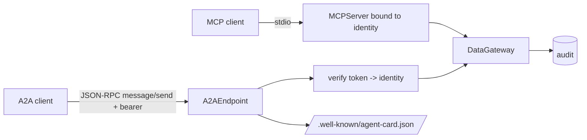

# Component: MCP server and A2A endpoint

The data layer served to other agents: five read-only MCP tools bound to one identity, and an A2A
JSON-RPC endpoint with an agent card. Both go through the same data gateway as the in-process agents.

## 1. Purpose

* Let any MCP client (an IDE assistant, Copilot Studio, a custom agent) use the data products under a
  named identity, with no write path.
* Let partner agents ask for data products over A2A with a bearer token mapped to an identity.
* Keep one enforcement point: the gateway.

## 2. Architecture



## 3. How it works

1. **MCP.** `build_server(gateway, identity)` creates an `MCPServer` with five tools, all annotated
   read-only, idempotent and closed-world: `list_data_products`, `describe_data_product`,
   `query_data_product`, `get_metric`, `search_knowledge`. The identity is fixed when the server
   starts; an unknown identity fails at start-up. Denials come back as tool errors.
2. **A2A.** The agent card advertises the skills and the bearer auth scheme. `message/send` carries a
   `data` part `{skill, args}`. The token is mapped to an identity by an injected verifier (Entra ID
   token validation in Azure; a fixed demo map here). Errors use JSON-RPC codes: -32600 invalid
   request, -32601 unknown method, -32602 bad params, -32001 unauthenticated, -32003 access denied,
   -32700 parse error over HTTP.
3. `app()` wraps the endpoint in a Starlette ASGI app; tests call it through Starlette's test client.
   Nothing is hosted.

## 4. Key files

| File | Role |
|---|---|
| `src/adl/serve/mcp_server.py` | MCP tools and the scripted demo |
| `src/adl/serve/a2a.py` | Agent card, JSON-RPC handler, ASGI app, demo |

## 5. Code excerpts

<!-- code: src/adl/serve/mcp_server.py::build_server -->
```python
def build_server(gateway: DataGateway, identity: str) -> MCPServer:
    gateway._identity(identity)  # fail fast on an unknown identity
    server = MCPServer(f"adl-data-products-{identity.split(':')[-1]}")

    @server.tool(annotations=RO)
    def list_data_products() -> list[dict[str, Any]]:
        """Data products this caller is granted, with owner, classification and allowed purposes."""
        return gateway.list_products(identity)

    @server.tool(annotations=RO)
    def describe_data_product(product: str) -> dict[str, Any]:
        """Columns (minus any denied to this caller), primary key, purposes, freshness and row scope of one product."""
        return gateway.describe(identity, product)

    @server.tool(annotations=RO)
    def query_data_product(
        product: str, purpose: str, columns: list[str] | None = None, filters: list[list[Any]] | None = None, limit: int = 50
    ) -> list[dict[str, Any]]:
        """Rows from a data product. filters are [column, op, value] with op in eq, ne, lt, le, gt, ge, in. Free text comes back quoted as untrusted data."""
        return gateway.query(identity, product, purpose, columns, filters, limit)

    @server.tool(annotations=RO)
    def get_metric(metrics: list[str], purpose: str, by: list[str] | None = None, filters: list[list[Any]] | None = None) -> list[dict[str, Any]]:
        """Governed metrics from the semantic layer (domains/<domain>/metrics.yaml), grouped by declared dimensions."""
        return gateway.metric(identity, metrics, purpose, by, filters)

    @server.tool(annotations=RO)
    def search_knowledge(question: str, purpose: str, k: int = 5) -> list[dict[str, Any]]:
        """Hybrid (vector + knowledge graph) search over SOPs, supplier terms and store notes, trimmed to this caller's region."""
        return gateway.search_knowledge(identity, question, purpose, k)

    server.gateway = gateway  # type: ignore[attr-defined]
    return server
```
<!-- /code -->

<!-- code: src/adl/serve/a2a.py::A2AEndpoint -->
```python
class A2AEndpoint:
    def __init__(self, gateway: DataGateway, verify: Callable[[str], str | None] | None = None) -> None:
        self.gateway = gateway
        self.verify = verify or DEMO_TOKENS.get

    def handle(self, request: Any, token: str | None) -> dict[str, Any]:
        if not isinstance(request, dict) or request.get("jsonrpc") != "2.0" or "method" not in request:
            return _error(None, INVALID_REQUEST, "not a JSON-RPC 2.0 request")
        rid = request.get("id")
        if request["method"] != "message/send":
            return _error(rid, METHOD_NOT_FOUND, f"method {request['method']!r} is not supported")
        identity = self.verify(token or "")
        if not identity:
            return _error(rid, UNAUTHENTICATED, "missing or invalid bearer token")
        try:
            parts = request["params"]["message"]["parts"]
            data = next(p["data"] for p in parts if p.get("kind") == "data")
            skill, args = data["skill"], dict(data.get("args") or {})
        except (KeyError, TypeError, StopIteration):
            return _error(rid, INVALID_PARAMS, "message needs one data part {skill, args}")
        if skill not in SKILLS:
            return _error(rid, INVALID_PARAMS, f"unknown skill {skill!r}")
        gw = self.gateway
        try:
            if skill == "list_data_products":
                result: Any = gw.list_products(identity)
            elif skill == "query_data_product":
                result = gw.query(identity, args["product"], args["purpose"], args.get("columns"), args.get("filters"), args.get("limit", 50))
            elif skill == "get_metric":
                result = gw.metric(identity, args["metrics"], args["purpose"], args.get("by"), args.get("filters"))
            else:
                result = gw.search_knowledge(identity, args["question"], args["purpose"], args.get("k", 5))
        except AccessDenied as e:
            return _error(rid, ACCESS_DENIED, f"{e.code}: {e.detail}")
        except (KeyError, TypeError) as e:
            return _error(rid, INVALID_PARAMS, f"missing argument {e}")
        return {
            "jsonrpc": "2.0",
            "id": rid,
            "result": {
                "kind": "message",
                "role": "agent",
                "messageId": str(uuid.uuid5(uuid.NAMESPACE_URL, f"adl:{rid}:{skill}")),
                "parts": [{"kind": "data", "data": {"skill": skill, "result": result}}],
            },
        }
```
<!-- /code -->

## 6. Configuration

The identity for MCP is a command-line argument; A2A token-to-identity mapping is injected
(`DEMO_TOKENS` in the demo). Grants and scopes come from `config/agents.yaml`.

## 7. Commands

```bash
adl mcp --identity agent:store-copilot-north   # stdio server for an MCP client
adl mcp-demo
adl a2a-demo
```

## 8. Real output

<!-- output: mcp-demo -->
```text
tools: describe_data_product, get_metric, list_data_products, query_data_product, search_knowledge
all read-only: True
products granted: inventory_position, sales_daily, stockout_risk, store_notes
high stockout risk rows: 67; stores seen: ['S01', 'S02', 'S03', 'S04']
metric by region: north revenue $1,024,235, stockout 5.45%
knowledge hits: ['SUP-CP', 'REV-COPPERLEAF-LATE', 'STORE-S03']
south store: is_error=True
denied column: is_error=True
raw PII table: is_error=True
audit: 6 records verified; denied reads 3
```
<!-- /output -->

<!-- output: a2a-demo -->
```text
agent card: Wrenfield Grocers data layer, skills query_data_product, get_metric, search_knowledge, list_data_products
insights metric: north $1,024,235; south $1,046,054
customer segments rows: 5 (aggregates only, groups under 10 suppressed)
no token: error -32001
targeting purpose: error -32003
unknown method: error -32601
```
<!-- /output -->

## 9. Tests and gates

`tests/test_serve.py`: the MCP tools are exactly the read-only five; a query returns rows; denials are
errors; an unknown identity is refused; the demo runs; the agent card describes skills and auth;
`message/send` returns data; A2A error codes; A2A over HTTP.

## 10. Guardrails

* No write tool exists on either interface; actions only happen in the approval workflow.
* The identity is bound server-side, never taken from the tool arguments.

## 11. Security and governance

Every call is audited by the gateway with the bound identity. In a deployment both would sit behind
API Management (or an API gateway) with Entra ID token validation and rate limits.

## 12. Observability

Audit records per call; MCP and A2A request counts and error codes at the API gateway.

## 13. Failure modes

| Failure | Effect | Handling |
|---|---|---|
| Client passes another identity in arguments | Privilege escalation | Identity fixed at server start; not a tool argument |
| Missing token | Anonymous access | -32001 |
| Prohibited purpose | Misuse | -32003 from the gateway denial |

## 14. Mapping to cloud services

| Here | Azure | Google Cloud | AWS |
|---|---|---|---|
| MCP stdio server | Container Apps behind Azure API Management (MCP server support), Entra ID auth | Cloud Run behind API Gateway | ECS or Lambda behind API Gateway, or Bedrock AgentCore Gateway |
| A2A endpoint | Container Apps with Entra ID token validation; Foundry Agent Service A2A | Cloud Run; Vertex AI Agent Engine | ECS; AgentCore |
| Data behind it | Microsoft Fabric or Databricks through the gateway | BigQuery through the gateway | S3 + Athena through the gateway |

## 15. Limitations

* A2A auth uses demo tokens; production must validate real tokens.
* No streaming or task lifecycle in A2A; only synchronous `message/send`.

## 16. Interview talking points

* "MCP and A2A are just two more doors into the same gateway, so every rule and every audit record is
  identical."
* "The identity is bound when the server starts. A tool argument can never change who you are."
