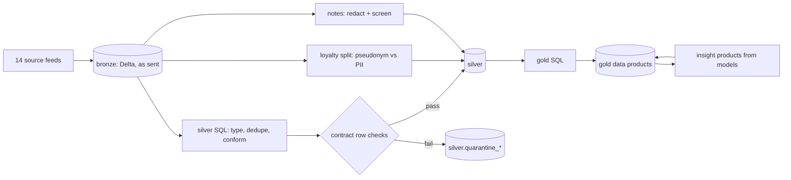

# Component: medallion pipeline

Bronze, silver and gold for the retail domain on Delta Lake, queried with DuckDB, with every silver
and gold table enforced by its contract and every job emitting lineage.

## 1. Purpose

* Land source data unchanged (bronze), conform and check it (silver), and publish data products
  (gold) that agents and dashboards share.
* Never drop a bad row silently: quarantine it with the reason visible.
* Split personal data away from everything else at the first conformed layer.

## 2. Architecture



## 3. How it works

1. `land_bronze` writes each feed as a Delta table under `<root>/bronze/<table>`.
2. `build_silver` runs one SQL statement per table (`SILVER_SQL`) that types columns and removes
   duplicates: for POS it keeps the latest copy of each store, product, day and batch by ingest
   sequence, which removes the resent batch. `_conform` then splits rows using the SQL predicate generated
   from the contract's row-level checks: passing rows go to silver, failing rows to
   `silver.quarantine_<table>`.
3. Loyalty data is split: `loyalty_pii` (restricted: name, e-mail, phone, postcode) and
   `loyalty_customers` keyed by an HMAC pseudonym with only the postcode district.
4. Store notes are redacted (phones, e-mails, card numbers and known member names) and screened for
   injection; the flag is kept as a column.
5. `build_gold` builds the ten data products from silver only; `write_gold` checks each against its
   contract and emits lineage. The insight products (forecast, stockout risk, markdown candidates) and
   the value ledger go through the same `write_gold`.

## 4. Key files

| File | Role |
|---|---|
| `src/adl/domains/retail/pipeline.py` | Bronze, silver and gold steps, SQL, pseudonymisation, k-anonymity |
| `src/adl/storage/local.py` | Delta Lake + DuckDB store |
| `src/adl/storage/base.py` | The `TableStore` interface every adapter implements |
| `src/adl/domains/retail/insights.py` | Insight products written through `write_gold` |

## 5. Code excerpts

Every silver table goes through the same conform step:

<!-- code: src/adl/domains/retail/pipeline.py::_conform -->
```python
def _conform(b: Build, table: str, data: pa.Table, inputs: list[str]) -> None:
    """Split rows by the contract's row-level checks, write valid rows and quarantine, evaluate, emit lineage."""
    c = b.contracts[f"retail.silver.{table}"]
    s = b.store
    s.stage(f"stage_{table}", data)
    pred = row_predicate(c, b.contracts, s.qualified)
    cols = ", ".join(f'"{x}"' for x in c.columns)
    good = s.arrow(f"SELECT {cols} FROM stage_{table} WHERE {pred}")
    bad = s.arrow(f"SELECT * FROM stage_{table} WHERE NOT ({pred})")
    s.write("silver", table, good)
    if bad.num_rows:
        s.write("silver", f"quarantine_{table}", bad)
    b.quarantined[c.id] = bad.num_rows
    q = evaluate(c, s, b.contracts, bad.num_rows, AS_OF)
    b.quality[c.id] = q
    outs = [{"name": f"silver.{table}", "schema": _schema(good), "rows": good.num_rows, "dq": _dq_facet(q)}]
    if bad.num_rows:
        outs.append({"name": f"silver.quarantine_{table}", "rows": bad.num_rows})
    b.lineage.run(f"silver.{table}", inputs, outs)
```
<!-- /code -->

<!-- code: src/adl/domains/retail/pipeline.py::pseudonym -->
```python
def pseudonym(customer_id: str) -> str:
    """Keyed hash (HMAC-SHA256) of a customer id. In Azure the key lives in Key Vault, held by the privacy office."""
    key = os.environ.get("ADL_PSEUDONYM_KEY", "local-demo-pseudonymisation-key").encode()
    return hmac.new(key, customer_id.encode(), hashlib.sha256).hexdigest()[:16]
```
<!-- /code -->

## 6. Configuration

`AS_OF` (the morning after day 139), `K_MIN` (10) for customer segments, and `ADL_PSEUDONYM_KEY` for
the HMAC key (a demo default keeps it offline; in Azure it would come from Key Vault). Storage root
defaults to a temporary directory.

## 7. Commands

```bash
adl run
adl quality
```

## 8. Real output

<!-- output: run -->
```text
bronze: 14 source tables, 176,844 rows
silver: 15 products, 186,617 rows, all passed: True
gold: 10 products, 60,155 rows, all passed: True
duplicate POS rows removed (a resent batch): 48
quarantined rows: 19 (pos_sales 19)
lineage events: 78
storage: local (delta); auth: local filesystem
```
<!-- /output -->

## 9. Tests and gates

`tests/test_pipeline.py`: every product passes; injected faults are quarantined; the resent batch is
removed; silver loyalty has no direct identifiers; the pseudonym is keyed; notes are redacted and
screened; segments are k-anonymous; open purchase orders have no receipt; gold tables are Delta with
history; insight products cover every store-product; the build is deterministic; bad names are
rejected. Gate: "every built product passes its contract" (25/25).

## 10. Guardrails

* Gold is built only from silver; no gold SQL reads bronze.
* Table and layer names are validated before they reach SQL (`check_name`, `check_layer`).

## 11. Security and governance

PII leaves the main flow at silver. The pseudonym key is the only secret in the design, and the code
reads it from the environment rather than from a file.

## 12. Observability

Per product: rows, quarantined rows, completeness, checks passed (`adl quality`); per job: lineage
events with schema, row counts and quality facets.

## 13. Failure modes

| Failure | Effect | Handling |
|---|---|---|
| Duplicate batch | Double-counted sales | `row_number()` per store, product, day and batch, latest ingest kept |
| Bad rows | Wrong demand | Quarantine table, completeness SLO |
| Name appears in a note | PII exposure | Matched against restricted names and masked |

## 14. Mapping to cloud services

| Here | Azure | Google Cloud | AWS |
|---|---|---|---|
| Delta tables on disk | Microsoft Fabric OneLake lakehouse or ADLS Gen2 with Azure Databricks | BigQuery tables or BigLake over Cloud Storage | S3 with Glue tables |
| DuckDB SQL | Fabric SQL endpoint, Databricks SQL warehouse | BigQuery | Athena |
| Pipeline run | Fabric pipeline or Databricks job | Dataform or Cloud Composer | Glue job or Step Functions |
| Pseudonym key | Key Vault, read by an Entra ID managed identity | Secret Manager | Secrets Manager |

## 15. Limitations

* Full rebuilds only; no incremental merge.
* Single-node DuckDB; the adapters show how to push SQL to a warehouse but are not run.

## 16. Interview talking points

* "Quarantine, not drop: 19 bad POS rows are kept with the reason, and completeness is an SLO."
* "Personal data is split out at silver, so the question 'can an agent see a phone number' has a
  structural answer, and the scan confirms it: 0 rows."
