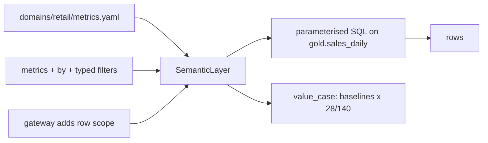

# Component: metrics layer and value-case baselines

One definition per KPI, compiled to parameterised SQL. Dashboards, agents (through the gateway), the
Phase 0 value case and the docs all use the same definitions, so "stockout rate" cannot mean two
things.

## 1. Purpose

* Define each business metric once, with an owner, a unit and a description.
* Let callers ask for metrics by name and dimension without writing SQL.
* Measure the value-case baselines from gold, not from a slide.

## 2. Architecture



## 3. How it works

1. `metrics.yaml` maps metric names to SQL aggregate expressions and dimension names to columns or
   expressions (`week` is `day // 7`).
2. `SemanticLayer.query(store, metrics, by, filters)` checks that every metric and dimension is
   declared and every operator allowed, binds filter values as parameters and returns rows.
3. Through the gateway, the caller's row scope is added as an extra filter before compiling, so a
   regional copilot sees the same definition as a dashboard but only its own rows.
4. `value.value_case` measures each KPI over the 140-day history and scales flow metrics to the
   28-day window (rates are used as they are), then applies the target change from
   `config/value-case.yaml`.

## 4. Key files

| File | Role |
|---|---|
| `src/adl/core/semantic.py` | Metric definitions to SQL, validation |
| `domains/retail/metrics.yaml` | The retail KPIs and dimensions |
| `src/adl/domains/retail/value.py` | `value_case` baselines and targets |
| `config/value-case.yaml` | KPIs, targets, value tree |

## 5. Code excerpts

<!-- code: src/adl/core/semantic.py::SemanticLayer -->
```python
@dataclass
class SemanticLayer:
    source: str
    dimensions: dict[str, str]
    metrics: dict[str, Metric] = field(default_factory=dict)

    @classmethod
    def load(cls, path: Path) -> SemanticLayer:
        spec = yaml.safe_load(path.read_text())
        ms = {k: Metric(k, v["sql"], v["description"], v["unit"], v["owner"]) for k, v in spec["metrics"].items()}
        return cls(spec["source"], spec["dimensions"], ms)

    def compile(
        self, metrics: list[str], by: list[str] | None = None, filters: list[tuple[str, str, Any]] | None = None, source: str | None = None
    ) -> tuple[str, list[Any]]:
        by = by or []
        unknown = [m for m in metrics if m not in self.metrics]
        if unknown or not metrics:
            raise ValueError(f"unknown metrics {unknown}" if unknown else "no metrics requested")
        bad = [d for d in by if d not in self.dimensions]
        if bad:
            raise ValueError(f"unknown dimensions {bad}")
        where, params = [], []
        for dim, op, value in filters or []:
            if dim not in self.dimensions:
                raise ValueError(f"cannot filter on {dim!r}")
            if op not in OPS:
                raise ValueError(f"operator {op!r} not allowed")
            expr = self.dimensions[dim]
            if op == "in":
                values = list(value)
                if not values:
                    raise ValueError("empty IN list")
                where.append(f"{expr} IN ({', '.join('?' for _ in values)})")
                params += values
            else:
                where.append(f"{expr} {OPS[op]} ?")
                params.append(value)
        sel = [f"{self.dimensions[d]} AS {d}" for d in by] + [f"{self.metrics[m].sql} AS {m}" for m in metrics]
        sql = f"SELECT {', '.join(sel)} FROM {source or self.source}"
        if where:
            sql += " WHERE " + " AND ".join(where)
        if by:
            sql += " GROUP BY " + ", ".join(self.dimensions[d] for d in by) + " ORDER BY " + ", ".join(self.dimensions[d] for d in by)
        return sql, params

    def query(
        self, store, metrics: list[str], by: list[str] | None = None, filters: list[tuple[str, str, Any]] | None = None
    ) -> list[dict[str, Any]]:
        sql, params = self.compile(metrics, by, filters)
        rows = store.sql(sql, params)
        return [{k: (round(v, 4) if isinstance(v, float) else v) for k, v in r.items()} for r in rows]
```
<!-- /code -->

## 6. Configuration

`domains/retail/metrics.yaml` (source table, dimensions, metrics with owners) and
`config/value-case.yaml` (KPIs with direction and target change, window length).

## 7. Commands

```bash
adl metrics
adl value-case
```

## 8. Real output

<!-- output: value-case -->
```text
use case: retail-stockout-markdown (retail)
problem: Wrenfield Grocers loses sales when shelves empty and gives margin away when near-date stock is thrown away or marked down too deeply. Orders follow last week's sales and markdowns are a flat 30%.

baseline per 28 days, measured from gold.sales_daily (history under the current rules):
kpi                baseline    target change  target      why
-----------------  ----------  -------------  ----------  ------------------------------------
stockout_rate_pct  5.26        -20%           4.21        fewer empty shelves at close
lost_sales_usd     7,491.04    -25%           5,618.28    demand served instead of lost
markdown_usd       14,276.48   -15%           12,135.01   margin kept on near-date stock
waste_cost_usd     9,665.49    -20%           7,732.39    less stock thrown away
gross_margin_usd   114,646.79  +3%            118,086.19  the bottom line the levers add up to

value tree (MIT CISR five steps):
  collect: POS sales, stock and waste, purchase orders and receipts, promotions, prices and price tests, weather, local events, loyalty segments, store notes
  insights: demand forecast, stockout risk, price elasticity, markdown response, supplier lead-time reliability
  actions: purchase orders, inter-store transfers, markdowns
  value: lost sales recovered, markdown dollars saved, waste reduced
  monetise: gross margin after waste, cost per outcome including AI and platform cost, FOCUS cost export to FinOps
```
<!-- /output -->

## 9. Tests and gates

`tests/test_quality_lineage_semantic.py`: metrics compile with bound parameters; bad requests
(unknown metric, unknown dimension, bad operator) are refused; metric values are consistent with a
direct SQL sum; a filter value is treated as data, not SQL. `tests/test_gateway.py`: metrics are row
scoped. `tests/test_value.py`: value-case baselines come from gold.

## 10. Guardrails

* Callers never send SQL; only declared metrics and dimensions can be used.
* Filter values are bound parameters; string values must be plain identifiers at the gateway.

## 11. Security and governance

Each metric names an owning team. Row-level security applies to metrics exactly as to table reads,
because the gateway injects the scope before compiling.

## 12. Observability

Every metric call through the gateway is audited as `metric.read` or `metric.denied` with the request.

## 13. Failure modes

| Failure | Effect | Handling |
|---|---|---|
| Two teams define a KPI differently | Conflicting numbers | One definition in one file |
| A caller groups by a sensitive column | Leak through aggregates | Only declared dimensions allowed |
| Injection through a filter value | SQL injection | Bound parameters; identifier check |

## 14. Mapping to cloud services

| Here | Azure | Google Cloud | AWS |
|---|---|---|---|
| metrics.yaml | Microsoft Fabric semantic model measures (DAX) or Databricks metric views | Looker semantic model over BigQuery | QuickSight topics or dbt metrics over Athena on S3 |
| Row scope injection | Fabric row-level security bound to Entra ID groups | BigQuery row access policies | Lake Formation data filters |

## 15. Limitations

* One source table per domain; joins across products are not modelled.
* Ratio metrics are computed per group; there is no weighted roll-up across groups.

## 16. Interview talking points

* "The value case baseline is a query against gold through the same metric definitions the agents
  use, so the 'before' number is not a guess."
* "A copilot asking for revenue by region gets only its region, because the scope is added before the
  SQL is compiled."
