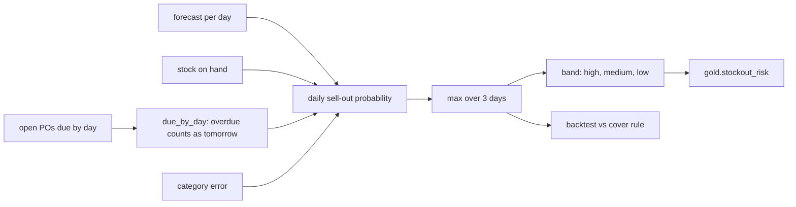

# Component: stockout risk

The probability that a store-product sells out within the next three days, given stock on hand, open
purchase orders and the forecast, compared with the days-of-cover rule store teams use.

## 1. Purpose

* Rank store-products by the risk of an empty shelf so orders, transfers and the brief focus on them.
* Account for deliveries that are due but may be late.
* Beat the rule of thumb honestly, and say where the model is weak.

## 2. Architecture



## 3. How it works

1. For each day d of the three-day window, the shelf sells out if demand over days 1..d exceeds stock
   on hand plus deliveries that have arrived by then.
2. A delivery due on a day is counted from the following day: the two least reliable suppliers deliver
   on time only about two times in three, and an afternoon delivery does not save the morning.
   Overdue orders are counted as due tomorrow.
3. Demand is treated as normal with the forecast as its mean and a per-category relative error
   measured in training. The risk is the largest of the three daily probabilities.
4. Bands: high at 0.5 or more, medium from 0.2, low below. `gold.stockout_risk` carries the region so row-level
   security applies.
5. The backtest scores 32 consecutive origins (days 105 to 136) for all 384 series against what
   happened, and compares with the rule: flag anything with fewer than three days of cover at the
   7-day average.

## 4. Key files

| File | Role |
|---|---|
| `src/adl/domains/retail/stockout.py` | Probability, delivery timing, bands, AUC, backtest |
| `src/adl/domains/retail/insights.py` | The stockout-risk data product |

## 5. Code excerpts

<!-- code: src/adl/domains/retail/stockout.py::window_probability -->
```python
def window_probability(fc: np.ndarray, cv: np.ndarray, on_hand: np.ndarray, due: np.ndarray) -> tuple[np.ndarray, np.ndarray]:
    """Largest daily sell-out probability over the window. due is (S, H): units due on each day."""
    ps = []
    for d in range(1, fc.shape[1] + 1):
        arrived = due[:, : d - 1].sum(1)
        p, _ = probability(fc[:, :d], cv, on_hand + arrived)
        ps.append(p)
    return np.max(ps, 0), fc.sum(1)
```
<!-- /code -->

<!-- code: src/adl/domains/retail/stockout.py::due_by_day -->
```python
def due_by_day(po_rows: list[dict], keys: list[tuple[str, str]], origin: int, horizon: int = HORIZON) -> np.ndarray:
    """Units on open orders due on each day of the window (an overdue order counts as due tomorrow)."""
    idx = {k: i for i, k in enumerate(keys)}
    out = np.zeros((len(keys), horizon))
    for r in po_rows:
        if r["order_day"] > origin or (r["received_day"] is not None and r["received_day"] <= origin):
            continue
        due = max(r["expected_day"], origin + 1)
        if due <= origin + horizon:
            out[idx[(r["store_id"], r["sku"])], due - origin - 1] += r["qty_ordered"]
    return out
```
<!-- /code -->

## 6. Configuration

`HORIZON` (3 days) and the band cut-offs (0.5 and 0.2) in `stockout.py`; the backtest origins are fixed in code.

## 7. Commands

```bash
adl stockout
```

## 8. Real output

<!-- output: stockout -->
```text
backtest: 32 origins x 384 store-products = 12,288 cases; sold out within 3 days: 1,560 (12.7%)
method                         flagged  precision  recall  F1     AUC
-----------------------------  -------  ---------  ------  -----  -----
risk model (p >= 0.5)          3715     28.3%      67.3%   39.8%  0.791
days-of-cover rule (< 3 days)  9208     15.1%      89.1%   25.8%  -
Brier score: model 0.186; always predicting the base rate 0.111 (the probabilities rank well but are not calibrated)
```
<!-- /output -->

The model has almost twice the precision of the rule at a lower recall, and a much better F1. Its
probabilities are too high on average (the Brier score is worse than always predicting the base
rate), so it is used for ranking and bands, not as a calibrated probability.

## 9. Tests and gates

`tests/test_models.py`: the model beats the cover rule on F1; risk falls as stock rises; a delivery
counts from the next day; overdue orders count as due tomorrow; bands; AUC handles ties. Gate:
"stockout model beats the cover rule on F1".

## 10. Guardrails

The risk feeds ordering through code and the brief through a list of SKUs; it never triggers an
action on its own.

## 11. Security and governance

Region is part of the product, so a regional copilot reads only its own stores' risk. The contract
allows replenishment and store operations purposes.

## 12. Observability

Precision, recall, F1, AUC and Brier on realised outcomes; the share of high-band items per store.

## 13. Failure modes

| Failure | Effect | Handling |
|---|---|---|
| Probabilities read as calibrated | Over-reaction | Brier reported; bands used instead |
| Supplier reliability changes | Risk under-estimated | Lead times come from gold.supplier_performance (p90) |
| Inventory snapshot late | Wrong on-hand | Freshness SLO on inventory |

## 14. Mapping to cloud services

| Here | Azure | Google Cloud | AWS |
|---|---|---|---|
| Batch scoring | Microsoft Fabric notebook or Azure Machine Learning batch endpoint | BigQuery ML or Vertex AI batch prediction | SageMaker batch transform over S3 |
| Risk product | Delta table in OneLake, exposed through the gateway with Entra ID identities | BigQuery table | Glue table queried by Athena |

## 15. Limitations

* Not calibrated (Brier 0.186 against 0.111 for the base rate); isotonic calibration is the next step.
* Normal demand approximation; low-volume items would be better served by a count distribution.

## 16. Interview talking points

* "My first version had AUC 0.618 and lost to the rule on F1. The fix was domain knowledge: a delivery
  due today does not help today, and an overdue order is not gone, it is late."
* "It ranks well and is badly calibrated, and I say so; the bands do not depend on calibration."
