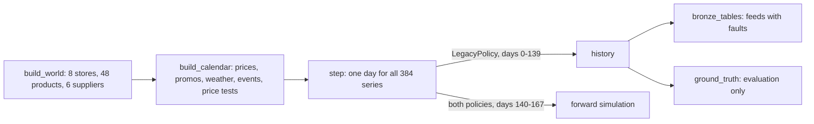

# Component: synthetic world (Wrenfield Grocers)

A seeded simulator of a fictional eight-store grocer that produces the source data and, separately,
the ground truth the evaluation needs. It is the reason the value can be measured at all: true demand
and true lost sales are known here, but only the scoring code may read them.

## 1. Purpose

* Produce realistic source feeds (POS, stock, purchase orders, prices, price tests, promotions,
  weather, events, loyalty, store notes) with the faults real feeds have.
* Run the same daily engine forward under two policies with identical randomness, so value is
  measured, not asserted.
* Keep ground truth (true demand, elasticities, lost sales) away from product code.

## 2. Architecture



## 3. How it works

1. **World.** Eight stores in two regions with size factors, 48 products in six categories
   (perishable produce, dairy, bakery, meat; non-perishable frozen and pantry) and six suppliers with
   different lead times, delay and short-ship probabilities.
2. **Calendar.** Shelf prices with small list-price changes, promotions with displays, weather with
   temperature anomalies and rain, local events, and 144 store price tests (one product, four stores,
   one week). It runs 14 days past the horizon so forecasts can see planned prices.
3. **A day.** Deliveries arrive; shopper demand is gamma-mixed (about 0.41 coefficient of variation per
   store-day); half of full-price shoppers take the oldest unit; near-date units can be marked down
   and attract a pool of bargain shoppers; perishable stock expires by age bucket; the policy places
   orders that arrive after a stochastic lead time.
4. **Current rules.** `LegacyPolicy` orders up to the trailing 7-day average times lead time plus one,
   with a 15% buffer plus four units, and marks every near-date unit down 30%.
5. **Feeds.** `synth.bronze_tables` exports what each source system would send, with a resent POS
   batch (48 duplicate rows), returns keyed as negative sales, missing and unknown product codes, a
   customer phone number in a store note and three prompt-injection attempts.

## 4. Key files

| File | Role |
|---|---|
| `src/adl/domains/retail/world.py` | World, calendar, daily engine, current rules |
| `src/adl/domains/retail/synth.py` | History, bronze feeds with faults, fictional loyalty members, ground truth |
| `src/adl/domains/retail/simulate.py` | Forward replications with common random numbers |

## 5. Code excerpts

The grocer's current rules, the baseline every model and policy is compared with:

<!-- code: src/adl/domains/retail/world.py::LegacyPolicy -->
```python
class LegacyPolicy:
    """The grocer's current rules: trailing 7-day average sales, a fixed buffer and a flat 30% markdown.

    Weaknesses a store manager would recognise: sales are censored by stockouts, so the average sinks
    after a stockout; promotions, events and weather are ignored; and the flat markdown gives margin away
    on near-date stock that would have sold anyway."""

    name = "current rules"

    def markdown(self, world, cal, st, t, near, price):
        return np.full(world.n, 0.30)

    def transfers(self, world, cal, st, t):
        z = np.zeros(world.n)
        return z, z

    def order(self, world, cal, st, t):
        avg7 = st.sales[max(0, t - 6) : t + 1].mean(0)
        target = avg7 * (world.lead + 1) * 1.15 + 4
        need = target - st.position()
        return np.where(need > 0, round_to_pack(need, world.pack, "up"), 0.0)
```
<!-- /code -->

Suppliers differ in reliability, which is what makes lead-time-aware ordering worth something:

<!-- code: src/adl/domains/retail/world.py::SUPPLIERS -->
```python
SUPPLIERS = {  # id: (name, categories, nominal lead days, delay probability, short-ship probability)
    "SUP-RF": ("Ridgeway Farms", ["produce"], 1, 0.05, 0.02),
    "SUP-CP": ("Copperleaf Produce", ["produce"], 2, 0.30, 0.10),
    "SUP-MD": ("Meadowgate Dairy", ["dairy"], 2, 0.10, 0.05),
    "SUP-HB": ("Hearthstone Bakery", ["bakery"], 1, 0.05, 0.02),
    "SUP-AR": ("Alder Ridge Meats", ["meat"], 2, 0.15, 0.05),
    "SUP-NF": ("Northpoint Foods", ["frozen", "pantry"], 4, 0.35, 0.12),
}
```
<!-- /code -->

## 6. Configuration

`SEED`, `DAYS_HISTORY` (140), `HORIZON` (28), `GAMMA_SHAPE`, `MD_POOL`, `ROTATION` and the
`CATEGORIES` table in `world.py`. These are simulator settings, not business configuration, so they
live in code and are covered by tests.

## 7. Commands

```bash
adl domains
adl metrics
```

## 8. Real output

<!-- output: domains -->
```text
domain      status   fictional organisation  use case                   contracts  levers
----------  -------  ----------------------  -------------------------  ---------  ------------------------------------------------------
retail      built    Wrenfield Grocers       stockouts and markdown     25         purchase orders, inter-store transfers, markdowns
mortgage    built    Quillmere Home Loans    loan pipeline and fallout  15         borrower outreach, lock extension, document chase
insurance   planned  Ferrowind Insurance     claims triage and leakage  3          queue assignment, leakage review, subrogation referral
healthcare  planned  Halsey Vale Health      inpatient fall risk        3          bed alarm, hourly rounding, mobility support
```
<!-- /output -->

History under the current rules, read back through the metrics layer:

<!-- output: metrics -->
```text
history under the current rules, days 0-139, by category (metrics layer):
category  revenue   stockout rate  est. lost sales  markdown  waste    gross margin
--------  --------  -------------  ---------------  --------  -------  ------------
bakery    $297,724  1.70%          $1,355           $44,173   $31,725  34.8%
dairy     $368,019  3.28%          $2,393           $1,745    $1,066   26.3%
frozen    $230,798  6.73%          $6,876           $0        $0       29.7%
meat      $562,117  6.06%          $9,709           $12,452   $8,993   21.9%
pantry    $310,197  7.35%          $11,845          $0        $0       29.3%
produce   $301,434  6.46%          $5,278           $13,012   $6,543   29.9%

total: revenue $2,070,290, stockout rate 5.26%, est. lost sales $37,455, markdown $71,382, waste $48,327
true lost sales in the simulator (evaluation only): $81,180; the same-weekday estimate in gold.sales_daily is conservative
```
<!-- /output -->

The estimated lost sales in gold ($37,455) are about half the simulator's truth ($81,180): the
same-weekday estimate cannot see demand that never showed up on an empty shelf. That gap is why the
value is scored against truth in the simulation rather than against the gold estimate.

## 9. Tests and gates

`tests/test_pipeline.py` checks the injected faults are quarantined and the resent batch removed;
`tests/test_models.py::test_product_code_never_reads_ground_truth` fails if any module other than
`synth.py` and `cli.py` references ground truth; `test_build_is_deterministic` rebuilds the lake and
compares.

## 10. Guardrails

* Ground truth is exported only by `synth.ground_truth()`; outside `synth.py` only the CLI's labelled
  evaluation line and the tests use it, and a static test enforces that.
* Loyalty members are fictional, with `.example` e-mail domains and 555-01xx phone numbers.

## 11. Security and governance

No real data is used or needed. The simulator is the only place where personal data is invented, and
it is split into a restricted table as soon as it reaches silver.

## 12. Observability

Every run is seeded and deterministic, so a changed number in the docs means changed code; the docs
check in CI catches it.

## 13. Failure modes

| Failure | Effect | Handling |
|---|---|---|
| Simulator too easy | Value overstated | Current rules are a realistic rule of thumb; models must beat it on held-out days |
| Ground truth leaks into models | Value overstated | Static test that product code never reads it |
| Simulator omits an effect (customers lost to empty shelves) | Policy tuned towards less stock | Called out in ADR 0004 and the value case |

## 14. Mapping to cloud services

| Here | Azure | Google Cloud | AWS |
|---|---|---|---|
| Source feeds | Event Hubs, Data Factory or Microsoft Fabric pipelines landing in OneLake | Pub/Sub, Datastream to BigQuery | Kinesis, DMS to S3 |
| Seeded simulation | Fabric notebook or Azure Machine Learning job | Vertex AI custom job | SageMaker processing job |
| Job identity | Entra ID managed identity | Service account | IAM role |

## 15. Limitations

* Customers do not switch stores or leave after a stockout.
* Supplier behaviour is independent per order; real suppliers have correlated bad weeks.
* One price test per product-week; real test-and-learn programmes are messier.

## 16. Interview talking points

* "I built a simulator so I could measure value against truth, and then I made sure the product code
  can never see that truth."
* "The current rules are what a store manager would do with a spreadsheet; that is the bar every model
  has to clear."
