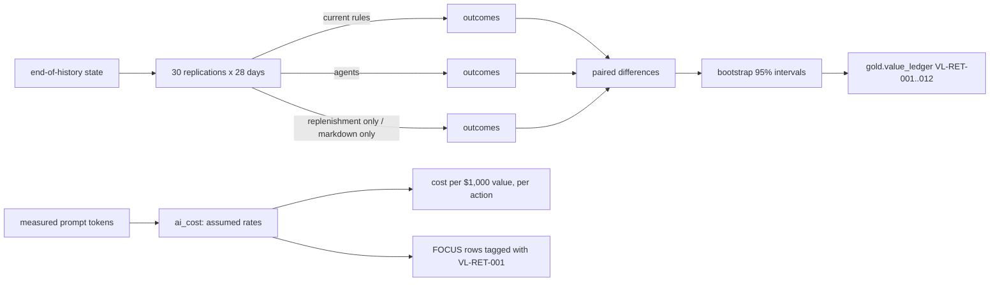

# Component: value ledger, cost per outcome and FOCUS export

A forward simulation of the next 28 days under the current rules and the agents' policy, with
identical randomness, turned into a value ledger with 95% intervals per lever; the AI and platform
cost over the same window; and FOCUS cost rows tagged with the ledger id.

## 1. Purpose

* Measure value in money, per lever, with uncertainty, and report missed targets.
* Subtract what the agents and platform cost, so value is net.
* Hand cost to FinOps tooling in a standard format next to the value it bought.

## 2. Architecture



## 3. How it works

1. Each replication starts from the real end-of-history state (stock by age, orders in transit) and
   plays days 140 to 167 for every series once per policy, with shopper demand and supplier behaviour
   keyed by the replication seed and day (common random numbers).
2. Two extra arms switch on one lever at a time to attribute value to replenishment or markdowns.
3. Net value is gross margin after waste and transfer costs, minus a 25% annual carrying charge on
   closing stock, so holding more stock is not free.
4. Differences are paired by replication; intervals are percentile bootstrap intervals (2,000
   resamples). Reported results use 30 evaluation seeds; the 10 tuning seeds (1000 to 1009) are a
   separate range and never reported.
5. `ai_cost` multiplies measured tokens per brief (from the agent run) and the configured compute,
   search and storage by the assumed rates in `config/pricing.yaml`.
6. `focus_rows` writes one row per service per day with FOCUS columns and tags (`domain`, `use-case`,
   `value-ledger`). The billing period is a synthetic placeholder.

## 4. Key files

| File | Role |
|---|---|
| `src/adl/domains/retail/simulate.py` | Replications, outcomes, bootstrap, comparison |
| `src/adl/domains/retail/value.py` | Value case, ledger, KPI results, cost estimate, FOCUS rows |
| `config/pricing.yaml` | Assumed unit rates |
| `config/value-case.yaml` | KPI targets |

## 5. Code excerpts

<!-- code: src/adl/domains/retail/simulate.py::bootstrap_ci -->
```python
def bootstrap_ci(diffs: np.ndarray, n_boot: int = 2000, seed: int = 7) -> tuple[float, float]:
    rng = np.random.default_rng(seed)
    means = diffs[rng.integers(0, len(diffs), (n_boot, len(diffs)))].mean(1)
    lo, hi = np.percentile(means, [2.5, 97.5])
    return float(lo), float(hi)
```
<!-- /code -->

<!-- code: src/adl/domains/retail/value.py::ai_cost -->
```python
def ai_cost(prompt_tokens: int, output_tokens: int, stores: int, days: int = HORIZON) -> CostEstimate:
    p = yaml.safe_load((ROOT / "config/pricing.yaml").read_text())
    briefs = stores * days * p["model"]["briefs_per_store_per_day"]
    model = briefs * (prompt_tokens * p["model"]["input_per_million_tokens"] + output_tokens * p["model"]["output_per_million_tokens"]) / 1e6
    c = p["compute"]
    compute = days * c["seconds_per_day"] * (c["vcpu"] * c["vcpu_second"] + c["gib"] * c["gib_second"])
    search = p["search"]["per_month"] * days / 30
    storage = p["storage"]["per_month"] * days / 30
    lines = [
        {
            "service": "Foundry Models",
            "category": "AI and Machine Learning",
            "what": p["model"]["name"],
            "quantity": briefs,
            "unit": "briefs",
            "cost_usd": model,
        },
        {
            "service": "Azure Container Apps",
            "category": "Compute",
            "what": c["name"],
            "quantity": days * c["seconds_per_day"],
            "unit": "vCPU-seconds",
            "cost_usd": compute,
        },
        {
            "service": "Azure AI Search",
            "category": "AI and Machine Learning",
            "what": p["search"]["name"],
            "quantity": days,
            "unit": "days",
            "cost_usd": search,
        },
        {"service": "Storage", "category": "Storage", "what": p["storage"]["name"], "quantity": days, "unit": "days", "cost_usd": storage},
    ]
    return CostEstimate(lines, sum(x["cost_usd"] for x in lines), prompt_tokens, output_tokens, briefs)
```
<!-- /code -->

## 6. Configuration

<!-- code: config/pricing.yaml -->
```yaml
# Assumed unit rates for the cost-per-outcome estimate. These are placeholders chosen to be in the
# right order of magnitude, NOT quotes: check current rates for your region with the Azure Retail Prices
# API (the Jagadish-azure-finops repository has a client for it) before using the numbers.
currency: USD
model:
  name: small chat model on Microsoft Foundry, pay-as-you-go (assumed rate)
  input_per_million_tokens: 0.40
  output_per_million_tokens: 1.60
  briefs_per_store_per_day: 1
compute:
  name: Azure Container Apps consumption for the agents and nightly jobs (assumed rate)
  vcpu_second: 0.000024
  gib_second: 0.000003
  vcpu: 1
  gib: 2
  seconds_per_day: 900
search:
  name: Azure AI Search Basic (assumed rate)
  per_month: 75.0
storage:
  name: ADLS Gen2 hot LRS plus transactions (assumed rate)
  per_month: 5.0
```
<!-- /code -->

## 7. Commands

```bash
adl value
adl focus --out out/focus.csv
adl tune
```

## 8. Real output

<!-- output: value -->
```text
forward simulation: 30 replications x 28 days, common random numbers, paired 95% bootstrap intervals
ledger      lever          metric      current rules  with agents  change   95% interval
----------  -------------  ----------  -------------  -----------  -------  ------------------
VL-RET-001  all levers     net_value   $114,046       $123,724     $9,678   [$9,531, $9,830]
VL-RET-002  all levers     lost_sales  $19,818        $12,366      -$7,452  [-$7,827, -$7,058]
VL-RET-003  all levers     markdown    $14,852        $8,292       -$6,560  [-$6,666, -$6,449]
VL-RET-004  all levers     waste_cost  $10,331        $4,778       -$5,553  [-$5,666, -$5,435]
VL-RET-005  replenishment  net_value   $114,046       $121,386     $7,340   [$7,198, $7,488]
VL-RET-006  replenishment  lost_sales  $19,818        $12,340      -$7,478  [-$7,860, -$7,075]
VL-RET-007  replenishment  markdown    $14,852        $11,348      -$3,504  [-$3,593, -$3,411]
VL-RET-008  replenishment  waste_cost  $10,331        $4,068       -$6,263  [-$6,385, -$6,141]
VL-RET-009  markdown       net_value   $114,046       $115,959     $1,913   [$1,888, $1,938]
VL-RET-010  markdown       lost_sales  $19,818        $19,860      $42      [$16, $67]
VL-RET-011  markdown       markdown    $14,852        $12,273      -$2,579  [-$2,631, -$2,530]
VL-RET-012  markdown       waste_cost  $10,331        $10,959      $628     [$601, $657]

KPI targets (config/value-case.yaml), all levers vs the current rules:
kpi                current rules  with agents  change  target  result
-----------------  -------------  -----------  ------  ------  ------
stockout_rate_pct  5.79           5.72         -1.2%   -20%    MISSED
lost_sales_usd     19,817.95      12,365.68    -37.6%  -25%    met
markdown_usd       14,852.43      8,292.38     -44.2%  -15%    met
waste_cost_usd     10,331.07      4,778.36     -53.7%  -20%    met
gross_margin_usd   114,996.18     124,722.30   +8.5%   +3%     met

estimated AI and platform cost for 28 days (assumed rates in config/pricing.yaml): $76
  Foundry Models: $0.22 (224 briefs)
  Azure Container Apps: $0.76 (25,200 vCPU-seconds)
  Azure AI Search: $70.00 (28 days)
  Storage: $4.67 (28 days)
  prompt 666 tokens and output 461 tokens per brief (measured), 224 briefs
cost per $1,000 of net value: $7.82; per action: $0.0079 (9,588 actions)
value after cost: $9,602 per 28 days (30-replication mean)
```
<!-- /output -->

<!-- output: focus -->
```text
FOCUS 1.0 rows: 112 (29 columns), services: Azure AI Search, Azure Container Apps, Foundry Models, Storage
total EffectiveCost: $75.65; tags: {"domain": "retail", "env": "simulation", "use-case": "retail-stockout-markdown", "value-ledger": "VL-RET-001"}
billing period is a synthetic placeholder; load the CSV with the Jagadish-azure-finops tooling to put cost next to value
```
<!-- /output -->

The FOCUS total ($75.65) is the daily rows summed; the $76 in the value report is the same estimate
rounded.

## 9. Tests and gates

`tests/test_value.py`: three levers by four metrics; every interval contains its estimate; all levers
add value with an interval above zero; levers reported separately; markdown alone increases waste
(reported); the ledger is a gold product; KPI results judged against targets; bootstrap deterministic;
baselines from gold; cost adds up; FOCUS rows cover every service and day, carry the FinOps columns and
link to the ledger; measured prompt size feeds the cost. `tests/test_cli.py` checks a missed target is
printed as MISSED. Gates: "net value interval above zero", "KPI targets reported (hit or miss)".

## 10. Guardrails

* Policy settings are chosen on tuning seeds only ([ADR 0004](../adr/0004-policy-tuning.md)).
* Lever rows are never summed; the interaction is reported as it is.

## 11. Security and governance

The value ledger is a gold data product readable by `agent:finance` for value reporting; it carries
lineage back to the sources and the simulation model.

## 12. Observability

Net value and its interval per period; cost per $1,000 of value; cost per action. In production the
simulation is replaced by measured outcomes from a controlled rollout.

## 13. Failure modes

| Failure | Effect | Handling |
|---|---|---|
| Tuning on reported seeds | Optimistic value | Separate seed ranges in code |
| Ignoring holding cost | Over-stocking looks free | Carrying charge on closing stock |
| Cost rates out of date | Wrong net value | Rates are labelled assumed; check with the Azure Retail Prices API |

## 14. Mapping to cloud services

| Here | Azure | Google Cloud | AWS |
|---|---|---|---|
| Simulation job | Azure Machine Learning or Microsoft Fabric notebook | Vertex AI custom job or BigQuery | SageMaker processing over S3 |
| FOCUS rows | Cost Management FOCUS export, joined in Jagadish-azure-finops; reader identity in Entra ID | Billing export to BigQuery | Cost and Usage Reports in FOCUS format |
| Value ledger | Fabric semantic model for finance | Looker | QuickSight |

## 15. Limitations

* Value is simulated; the simulator does not model customers lost after a stockout.
* Rates are assumptions, not quotes; the billing period is a placeholder.

## 16. Interview talking points

* "Same randomness for both policies, 30 replications, paired bootstrap: the interval is
  [$9,531, $9,830] and it excludes zero."
* "I report the stockout target as MISSED. Better orders recover lost sales but barely change how often
  a shelf ends empty."
* "AI and platform cost is under $8 per $1,000 of value, and the FOCUS rows let FinOps see it next to
  the ledger."
