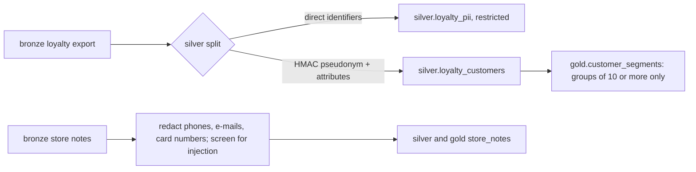

# Data governance and acceptable use

What the data layer promises, who may use which data for what, and how personal data is kept away from
agents. Every rule here is enforced in code and tested; the place is named in each row.

## Contracts

Every silver and gold table has a YAML contract in `domains/<domain>/contracts/`, validated in CI by
`adl.core.contracts`. A contract states:

| Field | Meaning | Example (gold.customer_segments) |
|---|---|---|
| `owner` | Team, steward and contact | loyalty-crm; customer data steward (privacy office) |
| `classification` | public, internal, confidential or restricted | internal |
| `schema` | Columns, types, nullability, `pii` flags | five columns, none PII |
| `primary_key` | Uniqueness promise | store_id, segment |
| `quality` | Row and table checks | unique key, `members >= 10`, accepted segment values, store exists |
| `slo` | Completeness, freshness, quarantine ceiling | 100% complete |
| `acceptable_use` | Allowed and prohibited purposes (gold only) | performance reporting; never individual profiling |
| `consumers` | Who reads it | agent:insights |
| `agent_exposed` | Whether it is a data product an agent may request | true |

Validation rules that protect privacy: a column flagged `pii` cannot sit in a table classified below
confidential; every gold product must state acceptable use and consumers; checks may only name real
columns.

## Classification and handling

| Class | Tables | Who can read | Handling |
|---|---|---|---|
| restricted | silver.loyalty_pii (names, e-mails, phones, postcodes) | No agent, no data product; the pipeline only | Split from all other loyalty data at silver; key held by the privacy office |
| confidential | Cost and margin columns, store notes (after redaction) | Granted agents; copilots are denied cost columns | Column-level security in `config/agents.yaml` |
| internal | Most gold products, aggregate segments | Granted agents within their row scope | Row-level security by region |
| public | None in retail | Anyone | None |

## Personal data

* Customer ids are replaced with an HMAC-SHA256 pseudonym. The key comes from `ADL_PSEUDONYM_KEY`
  (Key Vault in a real deployment); the default is a demo key so the repository runs offline.
* `gold.customer_segments` suppresses any group with fewer than ten members (k-anonymity, `K_MIN` in
  the pipeline), and its contract checks `members >= 10` on every build.
* Free text is redacted before it reaches silver and screened again at the gateway.
* `adl access` scans every agent-exposed product for e-mail addresses, phone numbers and member names:
  0 rows found across 9 products.
* All people in the synthetic data are fictional, with `.example` e-mail domains and 555-01xx phones.

## Acceptable use

Purposes are checked three ways on every read: the identity must be granted the purpose, the product's
contract must allow it, and the contract's prohibited list always wins.

| Purpose | Allowed on | Granted to |
|---|---|---|
| replenishment | sales, inventory, forecast, risk, supplier performance, promo plan, store notes | agent:replenishment |
| markdown_optimisation | sales, inventory, forecast, markdown candidates, promo plan | agent:markdown |
| store_operations | most operational products | the two regional copilots |
| performance_reporting, customer_insight_aggregate | sales, customer segments | agent:insights |
| value_reporting | value ledger, sales | agent:finance |

Prohibited on every gold product: individual customer profiling, employee performance management and
sale of data to third parties. Customer segments also prohibit price discrimination by customer. The
attack suite asks for a prohibited purpose and checks the refusal (`prohibited_purpose`).

## Row and column security

| Identity | Rows | Columns denied |
|---|---|---|
| agent:store-copilot-north | stores in the north region (S01 to S04) | sales_daily.cogs_usd, inventory_position.unit_cost |
| agent:store-copilot-south | stores in the south region (S05 to S08) | same |
| other agents | all stores | none |

A filter that asks for a store outside the scope is refused (`outside_row_scope`), rather than
silently returning nothing, so a mis-configured agent is visible in the audit chain.

## Lineage, quality and audit as governance evidence

| Evidence | Produced by | Where it would go in Azure |
|---|---|---|
| OpenLineage events (78 per run) | `adl.core.lineage` | Microsoft Purview lineage |
| Quality results per product | `adl.core.quality` | Purview data quality, or Fabric data quality reports |
| Hash-chained audit records | `adl.core.audit` | Immutable blob storage plus Log Analytics |

See [purview-mapping.md](purview-mapping.md) for the planned catalogue registration.

## Retention

Bronze keeps what was sent, for replay; silver and gold are rebuilt from bronze. The infrastructure
sets recovery and version limits rather than business retention: Azure keeps deleted blobs and
containers for 7 days and Log Analytics for 30; Google Cloud keeps soft-deleted objects for 7 days and
at most 5 older versions; AWS expires non-current versions after 30 days. The audit container is
separate on every cloud so it can be made immutable. Business retention periods (for example how long
loyalty data may be kept) belong in the contracts and are not set yet.
