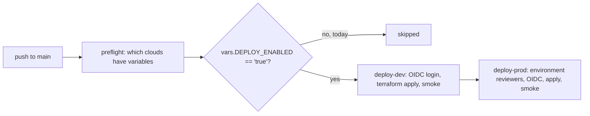

# Deployment

Status: **nothing is deployed**. This page explains how a deployment would work and what has to be
set before the gated workflows run. Do not enable it on an account you do not own.



## What the workflows do

| Workflow | Trigger | What it does | Cloud access |
|---|---|---|---|
| `ci.yml` | push, pull request | ruff, tests, release gate, docs check, FOCUS export, Bicep build, SBOM, gitleaks | none |
| `codeql.yml` | push, pull request, weekly | CodeQL for Python and GitHub Actions | none |
| `infra.yml` | push, pull request, manual | `terraform fmt/validate/test`, tflint, checkov for each stack; on pull requests a plan job per cloud whose steps run only if that cloud's variables are set | plan steps only, via OIDC |
| `deploy.yml` | push to main, manual | gated apply to dev then prod for each configured cloud | OIDC, gated |
| `teardown.yml` | manual | destroy one environment; the confirmation input must equal the environment name | OIDC, gated |

## Before enabling

1. Create a remote state location per cloud (a storage account with Entra ID auth and a `tfstate`
   container, a GCS bucket, an S3 bucket). The state key per environment is already in
   `infra/terraform/<cloud>/envs/<env>.backend.hcl`.
2. Create the federated identities: an Entra ID app or managed identity with a federated credential
   for `repo:<owner>/<repo>:environment:<env>`; a workload identity pool provider (the GCP stack
   creates one, pinned to this repository and environment); an IAM OIDC provider and role (the AWS
   stack creates them).
3. Set repository variables, never secrets: `AZURE_CLIENT_ID`, `AZURE_TENANT_ID`,
   `AZURE_SUBSCRIPTION_ID`, `TFSTATE_AZURE_RESOURCE_GROUP`, `TFSTATE_AZURE_STORAGE_ACCOUNT`,
   `GCP_WIF_PROVIDER`, `GCP_SERVICE_ACCOUNT`, `GCP_PROJECT_ID`, `TFSTATE_GCS_BUCKET`, `AWS_ROLE_ARN`,
   `AWS_REGION`, `TFSTATE_S3_BUCKET`, and optionally `DEPLOY_CLOUDS` (a JSON list, default
   `["azure"]`) and `AZURE_TOOL` (`terraform` or `bicep`).
4. Add required reviewers to the `prod` environment.
5. Set `DEPLOY_ENABLED` to `true`.

## Commands (local, against your own account)

```bash
cd infra/terraform/azure
terraform init -backend-config=envs/dev.backend.hcl
terraform plan -var-file=envs/dev.tfvars
# Bicep alternative
az deployment sub what-if --location eastus2 --template-file infra/bicep/main.bicep --parameters infra/bicep/main.parameters.json
```

## Smoke test

`.github/scripts/deploy.sh smoke` checks that the resources exist and that key-based access is off
(storage shared keys, Search local auth). It does not deploy the Python services; hosting the
gateway, MCP and A2A on Container Apps, Cloud Run or ECS is planned.
