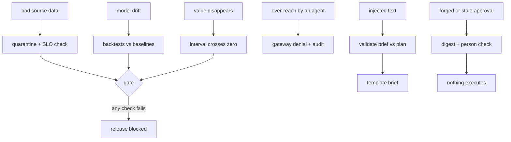

# Failure modes

What can go wrong, what the system does about it, and how each case is tested. Component docs have a
narrower table each; this is the system view.

| Failure | Effect if unhandled | Handling | Test or command |
|---|---|---|---|
| A POS batch is resent | Sales double-counted, orders inflated | Exact-duplicate removal at silver (48 rows) | `tests/test_pipeline.py`, `adl run` |
| Returns keyed as negative sales, missing or unknown SKUs | Wrong demand, broken joins | Row checks send them to `silver.quarantine_pos_sales` (19 rows) | `adl quality` |
| A feed stops arriving | Agents act on stale data | Freshness SLO per contract; product fails, gate fails | `tests/test_quality_lineage_semantic.py` |
| Sold-out days treated as demand | Forecast under-predicts, more stockouts | Sold-out days excluded from training and scoring | `adl forecast` (scored on 10,166 days that did not sell out) |
| Forecast drifts | Wrong orders | Gate requires the model to beat both naive baselines | `adl gate` |
| Stockout probabilities over-confident | Too many alerts if used as probabilities | Used for ranking and bands only; Brier score reported | `adl stockout` |
| Elasticity mis-estimated | Markdowns too shallow or too deep | Discount capped at 30%; anything above 20% needs a person | `config/policy.yaml` |
| Prompt injection in a store note | The brief recommends an unplanned order | Quoting, screening, brief validation, code-only actions | `adl injection` |
| Model returns invalid or partial JSON | Brief missing | Structured output parse; template brief on validation failure | `tests/test_agents.py` |
| Agent asks for a table, PII, another region or too many rows | Data leak | Gateway denial with a code, audit record | `adl access` |
| Approval from a non-person, wrong digest or for unrequested lines | Unapproved action executes | Gate records problems; executor runs only planned, below-threshold or properly approved lines | `tests/test_agents.py` |
| Audit record edited | Evidence lost | Hash chain verification fails | `adl access` |
| A cloud adapter builds the wrong SQL dialect | Wrong rows or an error on the platform | Conformance test: every adapter returns the same 117 high-risk rows as local | `adl adapters` |
| Terraform drifts from policy | Insecure deploy | Terraform tests, tflint, checkov and structure tests on every push | `tests/test_iac.py`, `infra.yml` |
| Docs drift from code | Wrong numbers in front of readers | `render_docs.py --check` in CI | `tests/test_repo_hygiene.py` |
| Value disappears after a change | Agents cost more than they earn | Gate requires the net-value interval above zero | `adl gate` |
