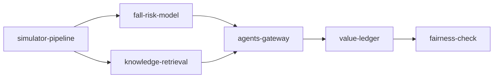

# docs/healthcare

> **Fully synthetic, PHI-free data.** Every patient, record number, nursing note, ward and outcome in
> this domain is invented by a seeded simulator. No real patient data, protected health information
> (PHI) or real hospital is used anywhere. The fall-risk model is **not a medical device** and is not
> validated for clinical use.

The healthcare domain for the fictional Halsey Vale Health (two sites, Halsey and Vale, twelve wards):
which preventive nursing measures each in-hospital patient gets each morning to reduce inpatient falls.
The assistant may only propose four nursing measures (bed alarm, hourly rounding, mobility aid, sitter
request), and the nurse in charge approves every one. It can never propose anything clinical: no
medication change, diagnosis, test, treatment or discharge. Built with the shared platform; nothing is
deployed. Each document has the same 16 sections as the other component docs, and every output block
is regenerated from the code by `scripts/render_docs.py` (CI fails if one drifts).

| File | What it does |
|---|---|
| `simulator-pipeline.md` | Simulator, bronze feeds with planted faults, silver, gold, 15 contracts, quality, lineage, metrics |
| `fall-risk-model.md` | Three-day fall-risk model backtested against the Morse rule, with model-risk notes |
| `knowledge-retrieval.md` | Corpus of 24 ward documents, graph and hybrid retrieval with its evaluation |
| `agents-gateway.md` | Fall-prevention assistant, nurse approval, dry run, minimum-necessary gateway with masking, injection |
| `value-ledger.md` | KPI targets set before results, paired forward simulation, ledger with intervals, cost, FOCUS, gate |
| `fairness-check.md` | Screening of measures and fall rates across two synthetic patient groups |

## Results in one table

All numbers are from `adl healthcare models`, `adl healthcare value`, `adl healthcare fairness` and
`adl healthcare gate`: 30 paired replications of 28 days, 95% bootstrap intervals, simulated on
synthetic data.

| Result | Value |
|---|---|
| Fall-risk model vs Morse (AUC) | 0.650 vs 0.506 for the Morse total and 0.508 for the "Morse 45 or more" rule; at 90 patients a morning the model catches 56.2% of falls in the next three days, the Morse total 32.4% |
| Net value, all measures | +$189,002 per 28 days, interval $171,462 to $205,593 |
| Where it comes from | Almost all from booking no sitter shifts (sitter lever +$155,669), which **raises** falls (+$19,033 fall cost); bed alarm +$27,983, hourly rounding +$14,741, mobility aid +$7,697 (interval spans zero) |
| Safer variant | Agent with sitters kept as today: +$36,666 (interval $21,258 to $50,542), falls 27.7 to 24.0 and falls with harm 8.2 to 7.3 per 28 days |
| KPI targets (set before results) | 1 of 4 met: sitter shifts -100% (target -10%) met; falls per 1,000 bed-days -7.5% (-20%), falls with harm -3.7% (-25%), days to first measure -5.0% (-30%) missed |
| Fairness screen (G2/G1, band 0.80 to 1.25) | history 6/6 and forward 12/12 within limits; agent falls-rate gap +0.18 per 1,000 bed-days (limit 1.5) |
| Guardrails | 14/14 access attacks stopped; 0 rows with a patient identifier; 155 measures all sent to the nurse in charge, 7 rejected; 0 injected actions executed |

## What is built and what is planned

| Piece | Status |
|---|---|
| Simulator, bronze/silver/gold, 15 contracts, quality, lineage, metrics layer | Built |
| Fall-risk model with a backtest against the Morse rule | Built (decision support on synthetic data, not a medical device) |
| Knowledge corpus, graph, hybrid retrieval and eval set | Built |
| Fall-prevention assistant on the shared approval workflow, gateway identities with masking, attack suite | Built |
| Value ledger, KPI results, cost and FOCUS export, 13 gate checks | Built |
| Fairness screening across synthetic patient groups | Built (screening heuristic, not a legal or regulatory test) |
| MCP and A2A serving for healthcare | Planned (retail only today) |
| Live execution against a nursing task list or electronic health record | Planned (dry run only) |
| Clinical validation, calibration on real data, regulatory review | Planned; out of scope for a synthetic portfolio |
| Cloud deployment | Written, not run (shared IaC; nothing is deployed) |

## Business model mapping (MIT CISR)

MIT CISR's four business models are described in the
[MIT Sloan article](https://mitsloan.mit.edu/ideas-made-to-matter/what-leaders-still-get-wrong-about-ai)
by Beth Stackpole; the descriptions below are my paraphrase and the mapping is my own. The article
itself uses predicting which hospital patients are likely to fall to illustrate the path from data to
money, which is why this use case was chosen.

| Model (paraphrased) | Halsey Vale Health example | What the data layer provides | Status |
|---|---|---|---|
| Existing+: AI improves today's model | The same alarm units, rounding rota, sitters and mobility aids go to the patients who gain the most, approved by the nurse in charge | Ward data products, the fall-risk model, the assistant with approval, value ledger, fairness monitor | Built |
| Customer Proxy: AI runs a set process for the customer | A patient- or family-side assistant that requests help to the toilet or a call-bell check within limits the patient sets | The same worklist per patient; a patient-consented purpose would be added to the contracts | Planned (design only) |
| Modular Creator: reusable modules combined per goal | Falls, pressure-injury and delirium-prevention modules combined per ward | Contracted data products as modules; the knowledge graph links wards, topics and documents | Planned (design only) |
| Orchestrator: an ecosystem assembled by AI | Physiotherapy, equipment suppliers, community care and families coordinated around discharge planning | A2A under each partner's identity and purpose (built for retail, planned for healthcare) | Planned |

Healthcare starts at Existing+ for the same reason as the other three domains: value can be measured
now, and it builds the governed products, gateway, ledger and fairness monitor the other models need.

## How healthcare differs from the other domains

* **Minimum necessary, enforced by the gateway.** The ward copilots see only their own site's rows,
  cannot read the age band, and see the patient key as a per-identity mask token they cannot filter on
  (`mask_columns`, new in `adl.core.access`, used by no other domain). Nobody sees a name or record
  number; the assistant sees a salted pseudonym (`PT-`).
* **Purpose limits.** Every contract prohibits insurance eligibility, employee performance management,
  medication or diagnosis decisions, marketing and sale of data.
* **Nursing measures only.** The workflow has four action kinds and no clinical kind; a brief that adds
  one fails validation and the executor only runs planned actions.
* **Every measure needs a person.** Unlike the other domains there is no threshold below which an
  action runs without approval.
