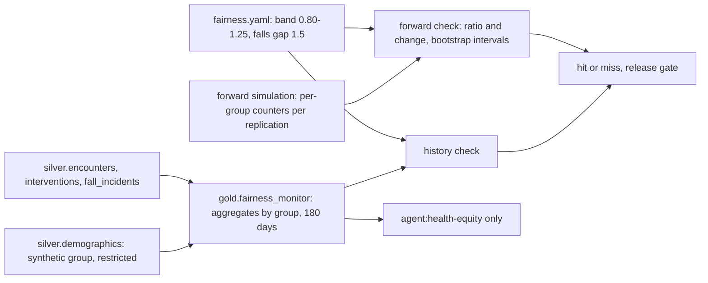

# Healthcare: fairness check across synthetic patient groups

**Fully synthetic, PHI-free data.** A screening check of who gets each preventive measure and who
falls, across two synthetic patient groups (G1 and G2), for the history under today's rule and for the
assistant in the forward simulation. The limits were committed in `config/healthcare/fairness.yaml`
before any build or result and are reported hit or miss. It is a screening heuristic, not a legal or
regulatory test.

## 1. Purpose

* Check that the assistant does not give one group fewer measures, or leave it less protected when a
  fall happens, than the other.
* Watch the one bias path built into the world: confusion is documented for 92% of confused G1 patients
  on a given day but only 70% of confused G2 patients, and documented confusion is a model feature.
* Report the result the same way as the KPIs: committed limits, intervals, hit or miss.

## 2. Architecture



## 3. How it works

1. **Group.** A synthetic attribute (G1, G2) on synthetic patients, standing in for a demographic
   attribute. It lives only in restricted `silver.demographics`; it is never a model feature and never
   reaches the assistant.
2. **Measures.** For bed alarm, hourly rounding, mobility aid and sitter request: the share of patients
   given the measure during the stay, G2 divided by G1, within 0.80 to 1.25 (the four-fifths heuristic
   used as a band).
3. **Equal opportunity.** Of the patients who fell, the share with a measure in place that day, as a
   G2/G1 ratio in the same band.
4. **Outcome gap.** Falls per 1,000 bed-days, G2 minus G1, within 1.5 in absolute terms.
5. **History** comes from `gold.fairness_monitor`. **Forward** uses the per-group counters of the 30
   paired replications: the ratio is the mean of the per-replication ratios with a 95% bootstrap
   interval, and the change against today's rule is paired by replication.
6. **A measure an arm never uses** (the assistant booked no sitters) is reported as "not used" and
   counted as within the limit, because a ratio of zero to zero says nothing about either group.

## 4. Key files

| File | Role |
|---|---|
| `config/healthcare/fairness.yaml` | Groups, band, decisions and the falls gap, committed before results |
| `src/adl/domains/healthcare/fairness.py` | History and forward checks |
| `src/adl/domains/healthcare/simulate.py` | Per-group counters in each replication |
| `domains/healthcare/contracts/gold.fairness_monitor.yaml` | The monitor's contract (`equity_monitoring`) |

## 5. Code excerpts

<!-- code: src/adl/domains/healthcare/fairness.py::_per_run -->
```python
def _per_run(runs: list[SIM.RunResult], decision: str) -> tuple[np.ndarray, np.ndarray, np.ndarray]:
    if decision == "falls_per_1000_bed_days":
        g1 = np.array([1000 * _rate(r, "falls", "bed_days", "G1") for r in runs])
        g2 = np.array([1000 * _rate(r, "falls", "bed_days", "G2") for r in runs])
    else:
        num, den = DECISIONS[decision]
        g1 = np.array([_rate(r, num, den, "G1") for r in runs])
        g2 = np.array([_rate(r, num, den, "G2") for r in runs])
    ratio = np.where((g1 > 0) & ~np.isnan(g1) & ~np.isnan(g2), g2 / np.where(g1 > 0, g1, 1), np.nan)
    return g1, g2, ratio
```
<!-- /code -->

## 6. Configuration

`config/healthcare/fairness.yaml`: `groups`, `reference_group: G1`, `selection_rate_ratio` 0.80 to
1.25, five decisions and `max_falls_per_1000_gap: 1.5`. Only `agent:health-equity` may read
`fairness_monitor` (`config/healthcare/agents.yaml`).

## 7. Commands

```bash
adl healthcare fairness
```

## 8. Real output

<!-- output: healthcare fairness -->
```text
screening heuristic on synthetic groups, not a legal or regulatory test: G2/G1 ratio within [0.8, 1.25], falls-rate gap within 1.5 per 1,000 bed-days (config/healthcare/fairness.yaml, committed before results)

history, current rules (gold.fairness_monitor, 180 days):
decision                 G1      G2      G2/G1  G2 eligible  limit
-----------------------  ------  ------  -----  -----------  ------
bed_alarm                0.2616  0.2765  1.057  3143         within
falls_per_1000_bed_days  3.1914  2.7510  0.862  19266        within
hourly_rounding          0.3902  0.3948  1.012  3143         within
mobility_aid             0.0411  0.0465  1.129  3143         within
protected_before_fall    0.3717  0.3774  1.015  53           within
sitter_request           0.0657  0.0614  0.934  3143         within

forward simulation, 30 replications (share of patients for measures, share of falls for protected_before_fall):
decision                 arm            G1      G2      G2/G1 [95%]           change vs current rules [95%]  gap    limit
-----------------------  -------------  ------  ------  --------------------  -----------------------------  -----  ------
bed_alarm                current rules  0.2502  0.2604  1.044 [1.012, 1.075]  -                              -      within
bed_alarm                agent          0.3375  0.3332  0.989 [0.961, 1.016]  -0.055 [-0.090, -0.017]        -      within
hourly_rounding          current rules  0.3758  0.3832  1.021 [0.998, 1.044]  -                              -      within
hourly_rounding          agent          0.4780  0.4768  0.998 [0.982, 1.014]  -0.023 [-0.045, +0.000]        -      within
mobility_aid             current rules  0.0366  0.0408  1.151 [1.040, 1.278]  -                              -      within
mobility_aid             agent          0.0497  0.0485  0.995 [0.909, 1.082]  -0.156 [-0.271, -0.046]        -      within
sitter_request           current rules  0.0599  0.0620  1.050 [0.988, 1.118]  -                              -      within
sitter_request           agent          0.0000  0.0000  not used              -                              -      within
protected_before_fall    current rules  0.3557  0.3346  1.020 [0.801, 1.256]  -                              -      within
protected_before_fall    agent          0.5331  0.5240  1.007 [0.890, 1.124]  -0.013 [-0.245, +0.210]        -      within
falls_per_1000_bed_days  current rules  3.2253  3.1629  1.021 [0.903, 1.151]  -                              -0.06  within
falls_per_1000_bed_days  agent          2.9048  3.0811  1.087 [0.973, 1.202]  +0.066 [-0.036, +0.170]        +0.18  within

all limits met: history True, forward True
```
<!-- /output -->

Every limit is met, in the history (6 of 6) and in the forward simulation (12 of 12). The assistant
narrows the gaps in who gets each measure: today's rule gives G2 mobility aids at 1.151 times the G1
rate, the assistant at 0.995 (change -0.156, interval -0.271 to -0.046). Falls per 1,000 bed-days are
0.18 higher for G2 under the assistant (ratio 1.087, interval 0.973 to 1.202), inside the 1.5 limit
and with an interval that includes no difference, but worth watching: the documentation gap did not
produce a breach here, and a larger gap might. Equal opportunity has wide intervals because few
patients fall (current rules 0.801 to 1.256).

## 9. Tests and gates

`tests/test_healthcare.py`: the band is the committed four-fifths band; history rows match the monitor
product; forward rows have intervals containing the ratio and stay within limits; a synthetic case with
a ratio outside the band and a falls gap of 2 is flagged. Gate: fairness results reported (hit or
miss).

## 10. Guardrails

The group never reaches a model, a policy or the assistant; only aggregates reach one identity. The
limits are committed before results and cannot be moved without a visible change to a committed file.

## 11. Security and governance

`fairness_monitor` is classified confidential and allowed only for `equity_monitoring`; the contract
prohibits using it for insurance eligibility, staff performance or medication or diagnosis decisions.

## 12. Observability

Per-measure ratios and intervals for history and forward arms, the change against today's rule and the
falls gap. A real deployment would track these monthly per ward and alert on a band breach.

## 13. Failure modes

| Failure | Effect | Handling |
|---|---|---|
| Under-documented confusion for one group | Fewer measures for that group | Forward check per measure; `confusion_not_documented` feature |
| Zero use of a measure | Meaningless ratio | Reported as "not used" |
| Few falls per group | Wide equal-opportunity intervals | Intervals printed; not over-read |
| Group leaks into a feature | Direct discrimination | Group only in restricted silver; feature-name test |

## 14. Mapping to cloud services

| Here | Azure | Google Cloud | AWS |
|---|---|---|---|
| Fairness metrics | Azure Machine Learning responsible AI dashboard, Microsoft Fabric reports | Vertex AI model evaluation (fairness) | SageMaker Clarify |
| Restricted group table | OneLake security with Entra ID groups | BigQuery column-level security | Lake Formation over S3 |
| Monitor table | OneLake Delta table | BigQuery table | S3 table in Glue |

## 15. Limitations

* Two synthetic groups and one bias path I wrote; real equity work needs real demographic data handled
  under its own governance, intersectional groups and clinical input.
* The four-fifths band is a heuristic borrowed from employment screening; in a hospital the more
  important question is equal protection against harm, which the falls gap and equal opportunity try
  to capture.
* No conditional measures (for example, the ratio among patients with the same true risk).

## 16. Interview talking points

* "I built a documentation gap into the world on purpose, because that is how bias reaches a clinical
  model in real life, and then checked whether the assistant's measures and fall rates moved."
* "When the assistant used no sitters at all, I report 'not used' instead of a meaningless ratio."
