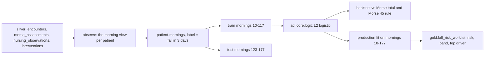

# Healthcare: fall-risk model and model-risk notes

**Fully synthetic, PHI-free data. This model is not a medical device** and is not validated for
clinical use. It ranks synthetic patients for four nursing measures on invented data, to show how a
data layer, a backtest and model-risk notes fit together. A logistic model predicts a fall in the next
three days from what a ward records each morning, and is backtested against the Morse Fall Scale, the
rule the wards use today.

## 1. Purpose

* Rank in-hospital patients each morning by the chance of a fall in the next three days, so the
  staffed bed alarms and rounding rota go where they prevent the most falls.
* Beat the naive baseline honestly: the Morse total, and the "Morse 45 or more" rule, at the same
  capacity.
* Publish the score with a readable driver as `gold.fall_risk_worklist`, and state its risks plainly.

## 2. Architecture



## 3. How it works

1. **Features (26).** Age band, admission source, ward type, days since admission and the first two
   days, each Morse item, days since the last assessment, yesterday's nursing observations (confusion
   yes, no or not documented; restless at night; toileting calls; unsteady gait; sedation) and whether
   the patient already has a walking aid. No name, record number, synthetic group or hidden trait.
2. **Label.** A fall on the morning's day or the two days after. Train on mornings 10 to 117, test on
   123 to 177, so no training label overlaps a test morning.
3. **Capacity comparison.** Each method picks the top 90 patients a morning (the rounding rota). The
   rule's own precision and recall are for every patient it flags, with no capacity limit.
4. **Production fit.** On all labelled mornings; the share of falls that caused harm (27.1%) comes from
   `silver.fall_incidents` and is the planning figure the policy uses.
5. **Bands and drivers.** Low below 3%, medium to 8%, high from 8%; the top driver is the feature
   pushing a patient's risk up the most, named in nursing language.
6. **World calibration disclosure.** The first version of the world had too few falls to learn from
   (AUC 0.54 against 0.41 for the Morse total). Before any agent policy was run I enlarged the hospital
   to twelve wards and 50 admissions a day, strengthened the delirium and sedation effects and made the
   nursing observations more informative, and lengthened the test window. The numbers below are from
   that calibrated world.

## 4. Key files

| File | Role |
|---|---|
| `src/adl/domains/healthcare/models.py` | Features, patient-mornings, backtest, production fit, bands |
| `src/adl/core/logit.py` | Shared logistic regression, top driver, AUC |
| `src/adl/domains/healthcare/runtime.py` | Writes `gold.fall_risk_worklist` |
| `domains/healthcare/contracts/gold.fall_risk_worklist.yaml` | The worklist contract and its purposes |

## 5. Code excerpts

<!-- code: src/adl/domains/healthcare/models.py::fit_production -->
```python
def fit_production(store, data: Mornings | None = None) -> FallModel:
    data = data or mornings(store, range(10, W.DAYS_HISTORY - LABEL_DAYS + 1))
    harm = store.sql("SELECT avg(CAST(harm AS DOUBLE)) AS s FROM silver.fall_incidents")[0]["s"]
    return FallModel(Logistic.fit(data.X, data.y), round(float(harm), 4))
```
<!-- /code -->

<!-- code: src/adl/domains/healthcare/models.py::_top_k_per_day -->
```python
def _top_k_per_day(score: np.ndarray, day: np.ndarray, k: int) -> np.ndarray:
    sel = np.zeros(len(score), bool)
    for t in np.unique(day):
        rows = np.flatnonzero(day == t)
        sel[rows[np.argsort(-score[rows], kind="mergesort")[:k]]] = True
    return sel
```
<!-- /code -->

## 6. Configuration

Windows, label length (3 days), capacity (90, the rounding rota) and band edges (3% and 8%) are
constants in `models.py`. The policy that consumes the score is configured in
`config/healthcare/policy.yaml` and described in [value-ledger.md](value-ledger.md).

## 7. Commands

```bash
adl healthcare models
```

## 8. Real output

<!-- output: healthcare models -->
```text
fall in the next 3 days: 28,513 training and 13,800 test patient-mornings, 105 test mornings followed by a fall (0.76%)
at capacity: each method picks the top 90 patients each morning (the rounding rota); the rule flags 41.3%
method                   AUC    precision  recall (falls caught)  Brier
-----------------------  -----  ---------  ---------------------  -------
fall-risk model          0.650  1.19%      56.2%                  0.00751
Morse total              0.506  0.69%      32.4%                  0.00755
Morse 45 or more (rule)  0.508  0.79%      42.9%                  0.00755
the rule's precision and recall are for every patient it flags (no capacity); Brier for the Morse rows is the base-rate forecast

gold.fall_risk_worklist: high 1, low 240, medium 4; top drivers: older age band 71, no single driver 44, Morse: forgets limitations 41
decision support for nursing measures on synthetic data; not a medical device and not validated for clinical use
```
<!-- /output -->

At the same 90 patients a morning the model catches 56.2% of the falls that follow within three days,
against 32.4% for the Morse total. The "Morse 45 or more" rule flags 41.3% of patients and catches
42.9%. The model's Brier score is only slightly better than forecasting the base rate (0.00751 against
0.00755): it ranks better than Morse but its probabilities are small and not sharply calibrated, so the
risk percentages on the worklist are a ranking aid, not a clinical probability.

## 9. Tests and gates

`tests/test_healthcare.py`: the model beats the Morse total and the rule on AUC, and the Morse total on
recall at capacity; training never sees a test label; no identity or group field is a feature; the
worklist has one row per in-hospital patient with risks between 0 and 1 and known bands and drivers;
band edges; this document says "not a medical device". `tests/test_models.py` fails if any product
module reads the simulator's ground truth, so hidden traits cannot become features. Gate: fall-risk
model beats the Morse total (AUC).

## 10. Guardrails

The score only ranks patients for four nursing measures; a nurse approves each one. Contracts prohibit
using it for medication or diagnosis decisions, insurance eligibility or staff performance.

## 11. Security and governance

The worklist carries a pseudonymous key, ward, bed, age band, the Morse items, yesterday's observations,
the risk and its driver: what a nurse needs for the measures and nothing more. Ward copilots cannot
read the age band and see the key masked.

## 12. Observability

Backtest table (AUC, precision, recall, Brier), band counts and the most common drivers on the as-of
morning. A real deployment would add drift on each input, calibration by ward and by group, and the
alarm burden per nurse.

## 13. Failure modes

| Failure | Effect | Handling |
|---|---|---|
| Confusion under-documented for one group | Model under-ranks that group | `confusion_not_documented` is its own feature; fairness check on outcomes |
| Missing Morse assessment | Row scored on observations only | Missing items are zero; visible in the backtest |
| Rare events | Unstable estimates | 13,800 test mornings, 105 positives; intervals in the forward simulation |
| Probabilities read as clinical risk | Over-trust | Bands and wording say "ranking aid"; not a medical device |

## 14. Mapping to cloud services

| Here | Azure | Google Cloud | AWS |
|---|---|---|---|
| Training and scoring | Microsoft Fabric notebooks or Azure Machine Learning | BigQuery ML or Vertex AI | SageMaker over S3 |
| Model registry and model card | Azure Machine Learning registry | Vertex AI Model Registry | SageMaker Model Registry and model cards |
| Gold score table | OneLake Delta table | BigQuery table | S3 table in Glue |
| Training identity | Entra ID managed identity | Service account | IAM role |

## 15. Limitations

Model-risk notes, stated plainly:

* **Not a medical device.** It is a portfolio demonstration on invented data. Software that informs
  clinical care can fall under medical-device or clinical-decision-support rules depending on the
  country and the intended use; nothing here has been reviewed against any of them, and nothing here is
  intended for use with real patients.
* **Synthetic world, my assumptions.** The Morse total is weak here partly by construction (it is
  repeated every third day and its items are coarse). That is not a statement about the Morse scale in
  real hospitals.
* **Calibrated world.** The world was tuned once for learnable signal before any agent run (section 3,
  step 6). A real model would need prospective validation on the hospital's own data.
* **Low precision.** Roughly one in 84 selected patient-mornings is followed by a fall; the measures are
  cheap and low-risk, which is the only reason a ranking this noisy can still be useful.
* **One test window**, no rolling-origin backtest, no calibration by ward or group.

## 16. Interview talking points

* "The model beats the Morse total at the same capacity, 56% of falls caught against 32%, but its
  Brier score barely beats the base rate, so I present it as a ranking aid, not a probability."
* "I disclose that I calibrated the world once for signal before running any policy, and I wrote down
  that this is not a medical device before writing the model."
