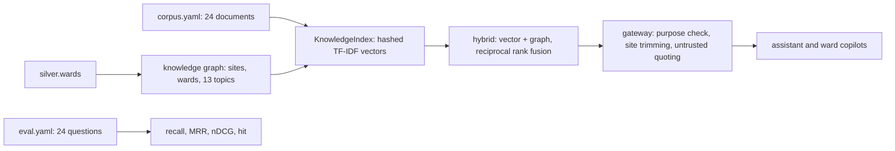

# Healthcare: knowledge and retrieval

**Fully synthetic, PHI-free data.** A corpus of 24 invented ward documents (nursing policies, practice
guides, ward profiles, incident reviews and messages) is indexed with the shared knowledge graph and
hybrid retrieval, evaluated on 24 questions, trimmed by site and served only through the gateway. No
document contains patient information.

## 1. Purpose

* Let the assistant and the ward copilots cite the hospital's own rules (who approves, what the
  assistant may never propose, how the alarms and rota are shared) instead of inventing them.
* Measure retrieval quality before an agent depends on it.
* Keep site-specific documents inside their site and treat messages as untrusted.

## 2. Architecture



## 3. How it works

1. **Corpus.** Ten policies (Morse assessment, bed alarm, rounding, mobility aid, sitter, approval,
   scope, privacy, equity, incident reporting), three practice guides (delirium, toileting, sedation),
   six ward profiles, three incident reviews and two messages, one of which (`MSG-INJECT-01`) carries an
   injected instruction.
2. **Scope document.** `POL-SCOPE` states that the assistant proposes nursing measures only, that it is
   not a medical device, and that medication, diagnosis, tests, treatment and discharge stay with
   clinicians.
3. **Graph.** Sites and wards come from `silver.wards`; thirteen topics with aliases (for example
   delirium, toileting, sedation, harm) link documents that use different words for the same thing.
4. **Site trimming.** Ward profiles for W01, W03 and W05 carry `regions: [north]`; W08, W10 and W12
   carry `regions: [south]`. A copilot scoped to one site never retrieves the other site's profiles.
5. **Untrusted quoting.** Messages are returned inside `<untrusted_data>` tags with an injection flag.

## 4. Key files

| File | Role |
|---|---|
| `domains/healthcare/knowledge/corpus.yaml` | The 24 documents |
| `domains/healthcare/knowledge/eval.yaml` | 24 questions with the documents that answer them |
| `src/adl/domains/healthcare/knowledge.py` | Topics, graph and index builders |
| `src/adl/knowledge/` | Shared embeddings, graph, retrieval and evaluation |

## 5. Code excerpts

<!-- code: src/adl/domains/healthcare/knowledge.py::build_graph -->
```python
def build_graph(store) -> KnowledgeGraph:
    g = KnowledgeGraph()
    for r in store.sql("SELECT DISTINCT region FROM silver.wards ORDER BY region"):
        g.add_entity(Entity(f"region:{r['region']}", "region", r["region"], (W.SITES[r["region"]].lower(),)))
    for r in store.sql("SELECT ward_id, name, region FROM silver.wards ORDER BY ward_id"):
        g.add_entity(Entity(f"ward:{r['ward_id']}", "ward", r["name"], (r["name"].replace(" ward", "").lower(),)))
        g.relate(f"ward:{r['ward_id']}", f"region:{r['region']}")
    for t, aliases in TOPICS.items():
        g.add_entity(Entity(f"topic:{t}", "topic", t, aliases))
    g.relate("topic:delirium", "topic:bed alarm")
    g.relate("topic:toileting", "topic:rounding")
    g.relate("topic:sedation", "topic:scope")
    g.relate("topic:sitter", "topic:approval")
    return g
```
<!-- /code -->

## 6. Configuration

Topic aliases are in `knowledge.py`; per-document site scopes in `corpus.yaml`; which purposes may
search knowledge in `config/healthcare/agents.yaml` (`fall_prevention`, `quality_improvement`).

## 7. Commands

```bash
adl healthcare retrieval
```

## 8. Real output

<!-- output: healthcare retrieval -->
```text
corpus: 24 documents; questions: 24; graph: {'region nodes': 2, 'topic nodes': 13, 'ward nodes': 12, 'document nodes': 24, 'entity-entity edges': 16, 'document-entity edges': 56}
method  recall@3  recall@5  MRR@10  nDCG@5  hit@5
------  --------  --------  ------  ------  -----
vector  0.917     0.958     0.941   0.917   1.000
graph   0.771     0.875     0.734   0.742   0.917
hybrid  0.917     0.979     0.899   0.903   1.000
```
<!-- /output -->

Hybrid retrieval finds a correct document in the top five for every question (hit@5 1.000) and 97.9%
of the expected documents in the top five. The graph alone is weaker (recall@5 0.875) but adds the
documents that use a synonym, which is why hybrid beats vector on recall@5.

## 9. Tests and gates

`tests/test_healthcare.py`: hybrid recall@5 at least 0.90 and vector hit@5 of 1.0; a north copilot
never retrieves a south ward profile and a south copilot does; the injected message is flagged and
quoted; 24 documents and 24 questions. Gate: hybrid retrieval recall@5 at least 0.90.

## 10. Guardrails

Messages are untrusted and quoted; the brief writer is told to list flagged ids rather than follow
them. Knowledge can be searched only for the purposes allowed in `agents.yaml`.

## 11. Security and governance

Site trimming is enforced in the gateway, not in the prompt. The finance identity has no knowledge
grant (one of the 14 access attacks checks this).

## 12. Observability

Retrieval metrics per method; every search is written to the hash-chained audit log with identity,
purpose and the document ids returned.

## 13. Failure modes

| Failure | Effect | Handling |
|---|---|---|
| A site's document leaks to the other site | Wrong ward rules quoted | Region scope on the document, enforced in the gateway |
| Injected message retrieved | Model follows it | Quoted, flagged, brief validated against the plan |
| Synonyms missed ("one-to-one" for sitter) | Low recall | Topic aliases in the graph |

## 14. Mapping to cloud services

| Here | Azure | Google Cloud | AWS |
|---|---|---|---|
| Hybrid index | Azure AI Search with security trimming (Microsoft Fabric as source) | Vertex AI Search or BigQuery vector search | OpenSearch over S3 documents |
| Embeddings | Azure OpenAI in Foundry Models | Vertex AI embeddings | Bedrock embeddings |
| Caller identity for trimming | Entra ID groups | Cloud IAM | IAM Identity Center |

## 15. Limitations

* A small, hand-written corpus; a real hospital has thousands of policies with versions and owners.
* Hashed TF-IDF embeddings offline; the Azure AI Search adapter is written but not run.
* The eval set was written by me alongside the corpus, so it is easier than real questions.

## 16. Interview talking points

* "Site trimming is a gateway rule, not an instruction to the model, and a test proves the north
  copilot never sees a south ward profile."
* "The scope document is retrievable, so the assistant can cite why it never proposes a medication
  change."
