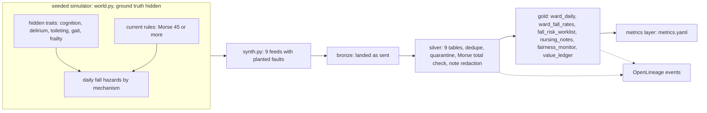

# Healthcare: simulator and pipeline

**Fully synthetic, PHI-free data.** A seeded simulator invents 180 days of a two-site, twelve-ward
hospital (Halsey Vale Health): admissions, Morse fall-scale assessments, nursing observations,
preventive measures, falls and nursing notes. Nine source feeds land as bronze with planted faults,
are conformed to nine silver tables and published as six gold data products, each under a contract
with quality checks and OpenLineage events. The simulator's hidden patient traits (cognitive
impairment, delirium, toileting need, gait problems, frailty) are never written to any table.

## 1. Purpose

* Give the healthcare domain the same data foundation as the other three: bronze as sent, silver
  typed, deduplicated and quarantined under contract, gold products an agent may read.
* Keep identity apart from care data: names, record numbers, phone numbers and e-mail addresses live
  only in `silver.patients` (restricted); gold products and agents see a salted pseudonym (`PT-`).
* Keep the synthetic patient group (G1, G2) only in `silver.demographics`, read by the fairness audit
  and never by a model, a policy or an agent.
* Publish the ward metrics (falls per 1,000 bed-days, falls with harm, days to first measure, sitter
  shifts) through the governed metrics layer.

## 2. Architecture



## 3. How it works

1. **World.** Twelve wards (W01 to W06 at Halsey, W07 to W12 at Vale) of six types; 50 admissions a day,
   about 300 patients in hospital. Each patient has hidden traits; the daily fall hazard has three
   mechanisms (getting out of bed, toileting, gait), each raised by the matching traits, sedation, age
   and frailty, and each reduced by the measures in place. A share of falls cause harm.
2. **Measures.** Bed alarm (60 units), hourly rounding (90 patients), sitter (12 shifts a day) and
   mobility aid (16 new aids a day), each with a different effect per mechanism and a cost. The history
   is played with today's rule: alarm and rounding by Morse score from 45, sitters for the highest Morse
   scores with the "forgets limitations" item, aids for impaired gait without an aid.
3. **The bias path.** Confusion is documented 92% of the time for group G1 and 70% for G2. That is how
   an unequal record can reach a model or a rule, and the fairness check looks for its effect.
4. **Feeds.** `adt_admissions`, `adt_discharges`, `demographics`, `wards`, `morse_assessments`
   (every third day of a stay), `nursing_observations` (daily), `interventions`, `fall_incidents` and 24
   `nursing_notes`. Phone numbers use the reserved 555-01xx range and e-mail addresses end in `.example`.
5. **Planted faults.** 30 resent admissions, 3 test patients from a training environment, 4 planned
   admissions dated in the future, 3 Morse assessments whose total does not equal the sum of the items,
   a resent batch of 40 observations, 6 observations for encounters never admitted and 3 negative
   toileting counts. Three notes carry an injected instruction (a medication change, removing every bed
   alarm, and a discharge).
6. **Silver.** Deduplication by latest ingest sequence; contract checks quarantine the faults; an extra
   predicate checks the Morse total. Notes are redacted (record numbers, names of known patients, phone
   numbers and e-mail addresses) and screened for injection.
7. **Gold.** Ward-day facts and rates, the morning worklist scored by the fall-risk model, redacted
   notes keyed by pseudonym, the fairness monitor (aggregates by synthetic group) and the value ledger.

## 4. Key files

| File | Role |
|---|---|
| `src/adl/domains/healthcare/world.py` | Seeded world, hidden traits, hazards, measures, today's rule |
| `src/adl/domains/healthcare/synth.py` | History run and the nine bronze feeds with planted faults |
| `src/adl/domains/healthcare/pipeline.py` | Silver and gold SQL, redaction, pseudonyms, the morning observation |
| `domains/healthcare/contracts/` | 15 contracts (9 silver, 6 gold) |
| `domains/healthcare/metrics.yaml` | Governed metrics over `gold.ward_daily` |

## 5. Code excerpts

<!-- code: src/adl/domains/healthcare/pipeline.py::redact_note -->
```python
def redact_note(text: str, names: list[str]) -> tuple[str, bool]:
    text, masked = guardrails.redact(text)
    if MRN_RE.search(text):
        text, masked = MRN_RE.sub("[MRN]", text), True
    for name in names:  # known patients' names, matched against the restricted patients table
        if name in text:
            text, masked = text.replace(name, "[NAME]"), True
    return text, masked
```
<!-- /code -->

<!-- code: src/adl/domains/healthcare/pipeline.py::pseudonym -->
```python
def pseudonym(encounter_id: str) -> str:
    """Stable pseudonymous key for an encounter (keyed hash); gold products and agents only ever see this."""
    return "PT-" + hashlib.sha256(f"{PSEUDONYM_SALT}:{encounter_id}".encode()).hexdigest()[:8].upper()
```
<!-- /code -->

## 6. Configuration

Simulator constants are in `world.py` (wards, capacity, effects, costs, documentation rates) and the
seed in `synth.py` (31). Contract purposes: `fall_prevention`, `quality_improvement`,
`value_reporting` and `equity_monitoring`; prohibited in every gold contract except the value
ledger: insurance eligibility, employee performance management, medication or diagnosis decisions,
sale of data and marketing. The pseudonym salt is a fixed demo string, which is fine for synthetic data;
a real deployment would keep it in a key vault and rotate it.

## 7. Commands

```bash
adl healthcare run
adl healthcare quality
adl healthcare lineage
adl healthcare metrics
```

## 8. Real output

<!-- output: healthcare run -->
```text
synthetic, PHI-free data: every patient, record and note is invented
bronze: 9 source tables, 131,832 rows
silver: 9 products, 131,988 rows, all passed: True
gold: 6 products, 2,777 rows, all passed: True
duplicates removed: 30 admission resends, 40 resent observations
quarantined rows: 22 (encounters 7, morse_assessments 3, nursing_observations 9, patients 3)
lineage events: 48
on the as-of morning: 245 patients in hospital on the worklist, 1 in the high band
```
<!-- /output -->

<!-- output: healthcare quality -->
```text
product                      rows   quarantined  completeness  checks  failed  result
---------------------------  -----  -----------  ------------  ------  ------  ------
gold.fairness_monitor        12     0            100.00%       11      -       pass
gold.fall_risk_worklist      245    0            100.00%       26      -       pass
gold.nursing_notes           24     0            100.00%       10      -       pass
gold.value_ledger            24     0            100.00%       12      -       pass
gold.ward_daily              2160   0            100.00%       21      -       pass
gold.ward_fall_rates         312    0            100.00%       11      -       pass
silver.demographics          9002   0            100.00%       6       -       pass
silver.encounters            9002   7            99.92%        19      -       pass
silver.fall_incidents        166    0            100.00%       9       -       pass
silver.interventions         29098  0            100.00%       7       -       pass
silver.morse_assessments     21008  3            99.99%        20      -       pass
silver.nursing_notes         24     0            100.00%       12      -       pass
silver.nursing_observations  54674  9            99.98%        13      -       pass
silver.patients              9002   3            99.97%        9       -       pass
silver.wards                 12     0            100.00%       7       -       pass
```
<!-- /output -->

<!-- output: healthcare lineage -->
```text
OpenLineage events: 48 (24 runs), validation problems: 0
upstream of gold.fall_risk_worklist (15): bronze.adt_admissions, bronze.adt_discharges, bronze.interventions, bronze.morse_assessments, bronze.nursing_observations, bronze.wards, model.fall_risk_3d, silver.encounters, silver.interventions, silver.morse_assessments, silver.nursing_observations, silver.wards, source.adt-system, source.nursing-documentation, source.ward-master
upstream of gold.fairness_monitor (16): bronze.adt_admissions, bronze.adt_discharges, bronze.demographics, bronze.fall_incidents, bronze.interventions, bronze.wards, silver.demographics, silver.encounters, silver.fall_incidents, silver.interventions, silver.patients, silver.wards, source.adt-system, source.incident-reporting, source.nursing-documentation, source.ward-master
```
<!-- /output -->

<!-- output: healthcare metrics -->
```text
region  bed-days  falls  with harm  falls per 1,000 bed-days  falls with a measure in place  days to first measure  sitter shifts
------  --------  -----  ---------  ------------------------  -----------------------------  ---------------------  -------------
north   26,855    79     19         2.94                      43.0%                          2.14                   1,085
south   27,819    87     26         3.13                      32.2%                          2.26                   1,060

compiled: SELECT ward_id AS ward_id, 1000.0 * sum(falls) / nullif(sum(bed_days), 0) AS falls_per_1000_bed_days FROM gold.ward_daily WHERE region = ? GROUP BY ward_id ORDER BY ward_id -- params ['south']
```
<!-- /output -->

Every planted fault is caught: 30 resent admissions and the 40-row resent batch are removed; 22 rows are
quarantined (3 test patients and 4 future admissions in encounters, the 3 test patients again in
patients, 3 bad Morse totals, 6 orphan and 3 negative observations). Falls run at about 3 per 1,000
bed-days, inside the range usually quoted for adult inpatient wards, by construction of the world.

## 9. Tests and gates

`tests/test_healthcare.py`: nine feeds land; every planted fault is quarantined (including the bad Morse
totals) and resends are removed; every product passes its contract; identity and group tables are
restricted and never agent-exposed; gold carries no record number, name or encounter id; pseudonyms are
stable; notes are redacted and screened; lineage reaches the sources; gold reconciles with the
simulator and the silver view equals the simulator's own view; no hidden trait reaches bronze; the
world is plausible (fall rate, harm share, census); metrics compile with bound parameters and the fall
rate equals a hand calculation. `tests/test_repo_hygiene.py` checks the reserved phone and e-mail
ranges in `synth.py`. Gate: every built product passes its contract (15/15); lineage events valid.

## 10. Guardrails

Identity is split into a restricted table at silver; notes are redacted before gold and flagged when
they carry an instruction. The ground truth is readable only by the simulator and the evaluation
harness (a test parses every product module and fails if one reads it).

## 11. Security and governance

Contracts set an owner, classification (`restricted` for patients and demographics, `confidential`
for care data), allowed and prohibited purposes and retention. The gateway serves only gold products
marked `agent_exposed`. This mirrors HIPAA's minimum-necessary idea in design only; it is not a
compliance claim, and no real PHI exists here to protect.

## 12. Observability

`adl healthcare quality` shows rows, quarantine, completeness and failed checks per product; 48
OpenLineage events with data-quality facets; upstream lineage for the worklist and the fairness monitor.

## 13. Failure modes

| Failure | Effect | Handling |
|---|---|---|
| Interface resends | Double-counted admissions | Latest ingest sequence wins |
| Test patients from a training system | Fake falls and bed-days | Quarantined by the `ENC-` id pattern |
| Morse total keyed by hand | Wrong score feeds the rule | Total must equal the sum of the items |
| Names typed into a note | Identity leaks into gold | Redaction against the restricted patients table |
| Missing assessment for a patient | Worklist row without a Morse score | Treated as zero and visible in the backtest |

## 14. Mapping to cloud services

| Here | Azure | Google Cloud | AWS |
|---|---|---|---|
| Bronze, silver, gold Delta tables | Microsoft Fabric OneLake lakehouse | BigQuery with BigLake | S3 with Glue tables |
| Contracts and quality checks | Fabric data quality or Purview data quality | Dataplex data quality | Glue Data Quality |
| Lineage | Microsoft Purview | Dataplex lineage | DataZone lineage |
| Restricted identity table | OneLake security, Entra ID groups | BigQuery column-level security | Lake Formation permissions |
| HL7 or FHIR intake (not built) | Azure Health Data Services | Cloud Healthcare API | AWS HealthLake |

## 15. Limitations

* The world is hand-written. Fall mechanisms, effects and documentation rates are my assumptions, and
  the hazard intercepts and effects were calibrated (before any agent run) so falls occur at a
  plausible rate and there is enough signal to learn from.
* Real feeds would arrive as HL7 v2 or FHIR messages with far messier coding; here they are clean tables
  with a few planted faults.
* No bed moves, ward transfers or readmissions.

## 16. Interview talking points

* "Identity lives in one restricted table. Everything an agent can read is keyed by a salted pseudonym,
  and a test fails if a record number or a name ever reaches gold."
* "I planted the faults a real hospital feed has, resends, test patients and hand-keyed totals, and each
  one is caught by a contract check, not by a special case."
