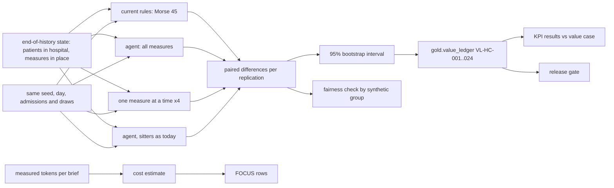

# Healthcare: value ledger, KPI results, cost and release gate

**Fully synthetic, PHI-free data.** What the fall-prevention assistant's policy is worth against
today's Morse rule, measured by a paired forward simulation from the end-of-history ward state, with
95% intervals, per-measure attribution, KPI targets committed before any result and reported hit or
miss, cost per outcome in FOCUS form, and the healthcare release gate. The headline number needs a
caveat, and this document gives it.

## 1. Purpose

* Put a number with an interval on each measure: bed alarm, hourly rounding, mobility aid, sitter request.
* Report the four KPI targets from `config/healthcare/value-case.yaml`, committed before the simulator,
  the model or any result, including the three misses.
* Show where the value really comes from, and the safer variant that keeps sitters as today.

## 2. Architecture



## 3. How it works

1. **Replications.** 30 seeds (3000 to 3029). Each starts from the end-of-history state and plays days
   180 to 207 once per arm with common random numbers: the same admissions and the same draws, so
   differences come from the policy.
2. **Arms.** Current rules; the agent with all measures; bed alarm only, rounding only, mobility aid only
   and sitter only (the other measures follow today's rule), which attribute the value; and the agent
   with sitters assigned as today.
3. **Policy.** Bed alarms and the rounding rota are already staffed and paid for, so the agent fills them
   with the patients who gain most (risk x planned effect x expected cost of a fall). Sitters ($520 a
   shift) and new mobility aids ($45) must show an expected benefit above their cost.
4. **Outcomes** come from the simulator's ground truth, allowed in the evaluation harness only: falls,
   falls with harm, their cost ($3,500 and $30,000), measure cost, days to first measure and sitter
   shifts. Net value is minus the cost of falls and measures.
5. **Tuning.** One planning knob, `risk_multiplier`, was chosen on tuning seeds 4000 to 4009 only: a grid
   of 0.5, 1.0, 1.5, 2.0 and 3.0, keeping the setting with the highest net value whose falls were not
   worse than today. 1.0 gave the most (+$201,414 on the tuning seeds, against +$191,361 at 3.0); larger
   multipliers cut a few more falls but bought more aids. Before the reported runs, the first policy
   applied a cost filter to every measure, which switched off rounding and raised falls; filling the
   staffed alarms and rota was the fix.
6. **Ledger, KPIs, cost.** Both means, the mean paired change and a 95% percentile bootstrap interval
   per lever and metric, written to `gold.value_ledger`; KPI changes compared with the committed
   targets; tokens per brief measured from the workflow and priced at the assumed rates in
   `config/pricing.yaml`, exported as FOCUS 1.0 rows.

## 4. Key files

| File | Role |
|---|---|
| `src/adl/domains/healthcare/simulate.py` | Replications, paired comparison, bootstrap, per-group counters |
| `src/adl/domains/healthcare/policy.py` | Benefit per measure, capacity filling, the agent policy |
| `src/adl/domains/healthcare/value.py` | Value case, ledger, KPI results, cost, FOCUS |
| `src/adl/domains/healthcare/report.py` | The reports and the 13 gate checks |
| `config/healthcare/value-case.yaml` | KPIs and targets, committed before any build |

## 5. Code excerpts

<!-- code: src/adl/domains/healthcare/policy.py::plan -->
```python
def plan(p3: np.ndarray, sig: dict[str, np.ndarray], has_aid: np.ndarray, ids: np.ndarray, cfg: dict, harm_share: float, use=ORDER) -> dict:
    """Positions (into the arrays) chosen for each measure, and each chosen measure's expected benefit net of its cost, USD."""
    daily = 1 - (1 - np.clip(p3 * cfg.get("risk_multiplier", 1.0), 0, 0.999)) ** (1 / 3)
    cost_fall = expected_fall_cost(cfg, harm_share)
    pl, cap = cfg["planning"], cfg["capacity"]
    out: dict[str, tuple[np.ndarray, np.ndarray]] = {}
    left = daily.copy()
    for m in ORDER:
        if m not in use:
            out[m] = (np.zeros(0, int), np.zeros(0))
            continue
        e = effect(cfg, m, sig)
        days = pl["aid_horizon_days"] if m == "mobility_aid" else 1
        gross = left * cost_fall * e * days
        value = gross if m in cfg.get("fill_capacity", ()) else gross - pl["measure_cost_usd"][m]
        if m == "mobility_aid":
            value = np.where(np.asarray(has_aid) == 1, -np.inf, value)
        order = np.lexsort((ids, -value))
        chosen = order[value[order] > 0][: cap[m]]
        out[m] = (chosen, gross[chosen] - pl["measure_cost_usd"][m])
        left[chosen] = left[chosen] * (1 - e[chosen])
    return out
```
<!-- /code -->

## 6. Configuration

`config/healthcare/value-case.yaml`: falls per 1,000 bed-days -20%, falls with harm -25%, days to first
measure -30%, sitter shifts -10%, over 28 days. `config/healthcare/policy.yaml`: capacity, planning
costs and effects by nursing signal, `fill_capacity`, `risk_multiplier` 1.0. `config/pricing.yaml`:
assumed unit rates.

## 7. Commands

```bash
adl healthcare value-case
adl healthcare value
adl healthcare focus
adl healthcare gate
```

## 8. Real output

<!-- output: healthcare value-case -->
```text
use case: healthcare-inpatient-fall-prevention; window 28 days; baseline measured over the 180-day history
kpi                        baseline  target change  target  why
-------------------------  --------  -------------  ------  ------------------------------------------------------------------
falls_per_1000_bed_days    3.04      -20%           2.43    fewer inpatient falls
harm_falls                 7.00      -25%           5.25    fewer falls that injure the patient
time_to_intervention_days  2.20      -30%           1.54    preventive measures start sooner after admission
sitter_shifts              333.67    -10%           300.30  the scarcest and most expensive measure is used only where it pays
falls with harm and sitter shifts are scaled to 28 days; targets were committed before any simulator, model or result
```
<!-- /output -->

<!-- output: healthcare value -->
```text
forward simulation: 30 replications x 28 days, common random numbers, paired 95% bootstrap intervals; synthetic, PHI-free data: every patient, record and note is invented
ledger     lever                        metric          current rules  with agents  change     95% interval
---------  ---------------------------  --------------  -------------  -----------  ---------  ----------------------
VL-HC-001  all measures                 net_value       -$582,445      -$393,442    $189,002   [$171,462, $205,593]
VL-HC-002  all measures                 fall_cost       $314,250       $299,067     -$15,183   [-$31,785, $2,335]
VL-HC-003  all measures                 harm_fall_cost  $246,000       $237,000     -$9,000    [-$26,000, $8,000]
VL-HC-004  all measures                 measure_cost    $268,195       $94,376      -$173,819  [-$174,009, -$173,641]
VL-HC-005  bed alarm                    net_value       -$582,445      -$554,461    $27,983    [$14,883, $40,119]
VL-HC-006  bed alarm                    fall_cost       $314,250       $286,267     -$27,983   [-$40,119, -$14,883]
VL-HC-007  bed alarm                    harm_fall_cost  $246,000       $227,000     -$19,000   [-$31,000, -$6,000]
VL-HC-008  bed alarm                    measure_cost    $268,195       $268,195     $0         [$0, $0]
VL-HC-009  hourly rounding              net_value       -$582,445      -$567,703    $14,741    [$5,784, $23,628]
VL-HC-010  hourly rounding              fall_cost       $314,250       $299,467     -$14,783   [-$23,650, -$5,849]
VL-HC-011  hourly rounding              harm_fall_cost  $246,000       $236,000     -$10,000   [-$18,000, -$2,000]
VL-HC-012  hourly rounding              measure_cost    $268,195       $268,237     $42        [$13, $80]
VL-HC-013  mobility aid                 net_value       -$582,445      -$574,748    $7,697     [-$347, $16,445]
VL-HC-014  mobility aid                 fall_cost       $314,250       $301,150     -$13,100   [-$21,803, -$5,100]
VL-HC-015  mobility aid                 harm_fall_cost  $246,000       $235,000     -$11,000   [-$19,000, -$3,000]
VL-HC-016  mobility aid                 measure_cost    $268,195       $273,598     $5,403     [$5,154, $5,657]
VL-HC-017  sitter request               net_value       -$582,445      -$426,775    $155,669   [$147,220, $163,621]
VL-HC-018  sitter request               fall_cost       $314,250       $333,283     $19,033    [$11,098, $27,500]
VL-HC-019  sitter request               harm_fall_cost  $246,000       $262,000     $16,000    [$9,000, $24,000]
VL-HC-020  sitter request               measure_cost    $268,195       $93,492      -$174,703  [-$174,720, -$174,668]
VL-HC-021  all measures except sitters  net_value       -$582,445      -$545,779    $36,666    [$21,258, $50,542]
VL-HC-022  all measures except sitters  fall_cost       $314,250       $276,683     -$37,567   [-$51,502, -$22,264]
VL-HC-023  all measures except sitters  harm_fall_cost  $246,000       $218,000     -$28,000   [-$42,000, -$13,000]
VL-HC-024  all measures except sitters  measure_cost    $268,195       $269,096     $901       [$711, $1,079]
net value is minus the cost of falls and measures at the stated assumptions, so its change is the saving

KPI targets (config/healthcare/value-case.yaml, committed before any build), all measures vs the current rules:
kpi                        current rules  with agents  change   95% interval of the change  target  result
-------------------------  -------------  -----------  -------  --------------------------  ------  ------
falls_per_1000_bed_days    3.21           2.97         -7.5%    [-0.37, -0.10]              -20%    MISSED
harm_falls                 8.20           7.90         -3.7%    [-0.87, +0.27]              -25%    MISSED
time_to_intervention_days  2.18           2.07         -5.0%    [-0.16, -0.06]              -30%    MISSED
sitter_shifts              335.97         0.00         -100.0%  [-336.00, -335.90]          -10%    met

activity per 28 days (mean of replications):
arm                      falls  harm_falls  bed_alarm_days  rounding_days  aid_starts  sitter_shifts
-----------------------  -----  ----------  --------------  -------------  ----------  -------------
current rules            27.7   8.2         1,680.0         2,518.5        62.5        336.0
agent                    25.6   7.9         1,680.0         2,520.0        81.2        0.0
bed alarm only           24.5   7.6         1,680.0         2,518.5        62.5        336.0
rounding only            26.0   7.9         1,680.0         2,520.0        62.5        336.0
mobility aid only        26.7   7.8         1,680.0         2,519.5        181.6       336.0
sitter only              29.1   8.7         1,680.0         2,518.5        62.5        0.0
agent, sitters as today  24.0   7.3         1,680.0         2,520.0        81.2        336.0

estimated AI and platform cost for 28 days (assumed rates in config/pricing.yaml): $76
  Foundry Models: $0.24 (336 briefs)
  Azure Container Apps: $0.76 (25,200 vCPU-seconds)
  Azure AI Search: $70.00 (28 days)
  Storage: $4.67 (28 days)
  prompt 556 tokens and output 310 tokens per brief (measured), 336 briefs
cost per $1,000 of net value: $0.40; per measure-day: $0.0177 (4,281 measure-days)
value after cost: $188,927 per 28 days (30-replication mean)
```
<!-- /output -->

<!-- output: healthcare focus -->
```text
FOCUS 1.0 rows: 112 (29 columns), services: Azure AI Search, Azure Container Apps, Foundry Models, Storage
total EffectiveCost: $75.66; tags: {"domain": "healthcare", "env": "simulation", "use-case": "healthcare-inpatient-fall-prevention", "value-ledger": "VL-HC-001"}
```
<!-- /output -->

<!-- output: healthcare gate -->
```text
check                                                  result  detail
-----------------------------------------------------  ------  -----------------------------------------------
every built product passes its contract                pass    15/15
lineage events valid                                   pass    48 events
fall-risk model beats the Morse total (AUC)            pass    0.650 vs 0.506
hybrid retrieval recall@5 >= 0.90                      pass    0.979
every access attack stopped                            pass    14/14
no patient identifiers in agent-exposed products       pass    0 rows
audit chain verifies and detects tampering             pass    14 records verified
no injected action ever executed                       pass    4 configurations
every measure approved by a person before the dry run  pass    0 violations
only nursing measures can be proposed or executed      pass    kinds: bed_alarm, hourly_rounding, mobility_aid
net value interval above zero                          pass    [$171,462, $205,593]
KPI targets reported (hit or miss)                     pass    1/4 met
fairness results reported (hit or miss)                pass    history 6/6, forward 12/12 within limits

healthcare gate: PASS (13/13)
```
<!-- /output -->

**Read this before quoting the headline.** The agent adds +$189,002 per 28 days, but almost all of it is
the sitter lever (+$155,669): at the planning costs no sitter's expected benefit beats its $520 shift, so
the agent books none and saves $174,703 of sitter cost. On its own that **raises** falls (27.7 to 29.1
per 28 days) and falls with harm (8.2 to 8.7). The alarm, rounding and aid levers each cut falls (bed
alarm -$19,000 harm-fall cost, interval -$31,000 to -$6,000). The variant that keeps sitters as today
is the one I would put in front of a nursing director: +$36,666 (interval $21,258 to $50,542), falls
27.7 to 24.0 and falls with harm 8.2 to 7.3. Whether a sitter is "worth" $520 is a value judgement the
cost figures cannot settle, so the sitter decision should stay with the nurse in charge.

**KPIs: 1 of 4 met.** Falls per 1,000 bed-days -7.5% (target -20%), falls with harm -3.7% (target -25%,
interval spans zero) and days to first measure -5.0% (target -30%) are missed. Sitter shifts -100%
(target -10%) is met, but by the mechanism above, not by using sitters "only where they pay". The
targets were committed before any build and are not changed.

## 9. Tests and gates

`tests/test_healthcare.py`: 24 ledger rows with intervals that contain the change; KPI results follow
the value case; the committed targets are unchanged; the value-ledger product is written and passes its
contract; the simulation is deterministic and leaves the start state untouched; the value-case baseline
comes from the metrics layer; FOCUS rows; sitters need a benefit above their cost; tuning and
evaluation seeds do not overlap. Gate (13 checks): net value interval above zero; KPI targets reported
hit or miss; fairness results reported hit or miss; plus the data, model, retrieval and safety checks.

## 10. Guardrails

The gate requires the net-value interval to be above zero and the KPI and fairness results to be
reported, not met, so a miss cannot be hidden by failing to print it. Ground truth is read only by the
evaluation harness.

## 11. Security and governance

`gold.value_ledger` is readable by `agent:nursing-finance` for `value_reporting`; it holds no patient
rows. Every executed action in the dry run carries the ledger row of its lever.

## 12. Observability

Ledger rows with intervals, activity per arm (falls, harm falls, alarm days, rounding days, aid starts,
sitter shifts), cost per $1,000 of net value and per measure-day, FOCUS rows tagged with the ledger id.

## 13. Failure modes

| Failure | Effect | Handling |
|---|---|---|
| Headline value from cutting a safety measure | Misleading result | Per-lever ledger, activity table and the sitters-as-today arm |
| Tuning on reported seeds | Overstated value | Separate tuning seeds, tested to be disjoint |
| Targets moved after results | Hidden misses | Targets committed first; a test compares them with the committed file |
| Cost of a fall mis-set | Wrong trade-off | Stated assumptions in `policy.yaml`, the same for both arms |

## 14. Mapping to cloud services

| Here | Azure | Google Cloud | AWS |
|---|---|---|---|
| Simulation runs | Microsoft Fabric notebooks or Azure Container Apps jobs | Cloud Run jobs writing to BigQuery | AWS Batch writing to S3 |
| Value ledger table | OneLake Delta table and a Power BI report | BigQuery table and Looker Studio | S3 table in Glue and QuickSight |
| FOCUS cost export | Microsoft Cost Management FOCUS export | Cloud Billing FOCUS export to BigQuery | AWS Data Exports (FOCUS) |
| Job identity | Entra ID managed identity | Service account | IAM role |

## 15. Limitations

* The value is a simulation on my own world; the effects of each measure are assumptions, and a real
  evaluation would be a stepped-wedge or cluster trial across wards.
* The cost of a fall is a planning figure; it ignores the patient's own harm beyond cost.
* The sitter result depends on the $520 shift cost and the assumed sitter effect; a modest change to
  either would change the sitter decision.
* One end-of-history state; 30 replications of one 28-day window.

## 16. Interview talking points

* "The headline is $189k per 28 days, and I lead with the caveat: most of it is booking no sitters,
  which raises falls. The variant I would recommend keeps sitters and is worth $37k with fewer falls."
* "Three of four KPI targets were missed, against targets committed before I wrote the simulator."
