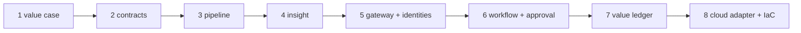

# Adopt this: implementation guide

For an engineer or architect who wants to use this pattern for their own decision. It assumes Python
and SQL; no cloud is needed until step 7.



## 1. Write the value case first

Copy `config/value-case.yaml`. Name the decision, the sponsor, the decision owners, three to five KPIs
with a direction and a target change, and the value tree. If you cannot fill the `monetise` line,
stop: the article's second mistake is starting without a path to value.

## 2. Write contracts for what you need, not for everything

Start from `domains/retail/contracts/`. One contract per silver table you will use and one per gold
product an agent or person will consume. Mark PII columns, set classification, and for every gold
product write allowed and prohibited purposes. Run:

```bash
adl contracts
pytest -q tests/test_contracts.py
```

## 3. Build the pipeline

Use `src/adl/domains/retail/pipeline.py` as the template: land bronze unchanged, conform silver with
SQL, quarantine with the predicates generated from the contracts (`row_predicate`), build gold only
from silver, and call `write_gold` so every product is checked and gets lineage. Keep PII out of
anything `agent_exposed`.

## 4. Build insight with baselines

Every model gets a backtest against the rule people use today. The release gate should fail if the
model does not beat it. Never train or tune on the window you report.

## 5. Grant agents data products, not tables

Add identities to `config/agents.yaml` with products, purposes, row scope, denied columns and a row
cap. Run the attack suite pattern from `src/adl/domains/retail/attacks.py` against your products.

## 6. Let code decide and the model narrate

Copy the workflow in `src/adl/domains/retail/agents.py`. Your plan node computes actions; the model
explains them; `validate_brief` rejects any difference; thresholds in a policy file decide what waits
for a person; the approval must name the digest; the executor starts as a dry run.

## 7. Measure value with an interval and the cost

Write a simulator or, better, an A/B or stepped rollout design. Report each lever separately, report
missed targets, and subtract the AI and platform cost. Export FOCUS rows so FinOps sees cost next to
value.

## 8. Pick a platform

Implement or reuse a `TableStore` adapter (`src/adl/storage/`). Choose the Terraform stack for your
cloud, set `private_networking = true` for production, and keep `DEPLOY_ENABLED` off until reviews are
done. See [deployment.md](deployment.md).

## Checklist before a pilot becomes a product

| Check | Command |
|---|---|
| Every contract valid, every product passes | `adl contracts`, `adl quality` |
| Models beat today's rule | `adl forecast`, `adl stockout` |
| Every attack stopped, no PII exposed | `adl access` |
| Injection cannot reach execution | `adl injection` |
| Nothing above a threshold runs without a person | `adl agents` |
| Value interval above zero after cost | `adl value` |
| All of the above | `adl gate` |

## Using a real model

```bash
pip install -e ".[foundry]"
export ADL_LLM=foundry FOUNDRY_PROJECT_ENDPOINT=<your project endpoint> FOUNDRY_MODEL=<deployment name>
adl agents
```

Authentication uses `DefaultAzureCredential` (Entra ID); no key is read. This path is written but has
not been run from this repository, and the validator still rejects any brief that differs from the
plan.
