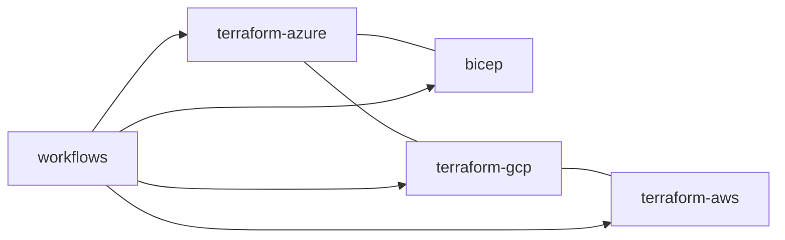

# Infrastructure documents

Each document has the same 16 sections as the component documents. The real-output block in each is
`adl iac`, a static read of the files; nothing has been applied to any cloud.

| File | What it does |
|---|---|
| `terraform-azure.md` | Azure stack: lake, Key Vault, AI Search, Log Analytics, identities, private networking, Fabric |
| `terraform-gcp.md` | Google Cloud stack: Cloud Storage, BigQuery, service accounts, workload identity federation |
| `terraform-aws.md` | AWS stack: S3, KMS, Glue, Athena, OIDC provider and roles |
| `bicep.md` | The Bicep twin of the Azure stack |
| `workflows.md` | CI, CodeQL, infrastructure checks, gated deploy and teardown |

