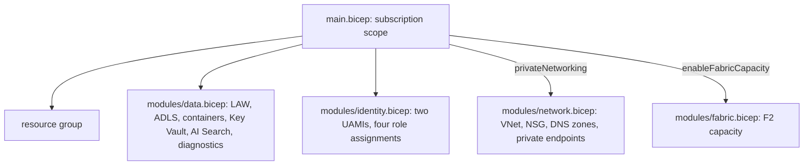

# Infrastructure: Bicep for Azure

The Bicep twin of the Azure Terraform stack, for teams that standardise on Bicep. Same resources,
same controls, same names. Built with the Bicep linter in CI (warnings fail the job); **never
deployed**.

## 1. Purpose

* Offer Azure-native IaC with the same security posture as the Terraform.
* Let `deploy.yml` choose either tool for Azure (`AZURE_TOOL`).

## 2. Architecture



## 3. How it works

1. `main.bicep` runs at subscription scope, creates the resource group and calls the modules with a
   suffix and a compact name (at most 20 characters) for storage and Key Vault.
2. `data.bicep` mirrors the Terraform: storage with shared keys off, TLS 1.2, hierarchical namespace;
   Log Analytics and AI Search with local auth off; Key Vault with RBAC and purge protection;
   diagnostics to Log Analytics.
3. `identity.bicep` creates the pipeline and agents identities and assigns built-in roles by their
   public role definition ids; the agents' Blob Data Reader is scoped to the gold container.
4. `network.bicep` and `fabric.bicep` are conditional modules.

## 4. Key files

| File | Role |
|---|---|
| `infra/bicep/main.bicep` | Entry point and module wiring |
| `infra/bicep/main.parameters.json` | dev parameters |
| `infra/bicep/modules/data.bicep` | Data and monitoring resources |
| `infra/bicep/modules/identity.bicep` | Identities and roles |
| `infra/bicep/modules/network.bicep` | Private networking |
| `infra/bicep/modules/fabric.bicep` | Optional Fabric capacity |

## 5. Code excerpts

<!-- code: infra/bicep/modules/data.bicep::resource search -->
```bicep
resource search 'Microsoft.Search/searchServices@2025-05-01' = {
  name: 'srch-adl-${suffix}'
  location: location
  tags: tags
  sku: { name: 'basic' }
  identity: { type: 'SystemAssigned' }
  properties: {
    replicaCount: environment == 'prod' ? 3 : 1
    partitionCount: 1
    disableLocalAuth: true
    publicNetworkAccess: privateNetworking ? 'disabled' : 'enabled'
  }
}
```
<!-- /code -->

<!-- code: infra/bicep/modules/identity.bicep::resource agentsGold -->
```bicep
resource agentsGold 'Microsoft.Authorization/roleAssignments@2022-04-01' = {
  name: guid(gold.id, agents.id, roles.storageBlobDataReader)
  scope: gold
  properties: {
    principalId: agents.properties.principalId
    principalType: 'ServicePrincipal'
    roleDefinitionId: subscriptionResourceId('Microsoft.Authorization/roleDefinitions', roles.storageBlobDataReader)
  }
}
```
<!-- /code -->

## 6. Configuration

`environment` (dev or prod), `location`, `domain`, `privateNetworking`, `enableFabricCapacity`,
`fabricAdminUpn`.

## 7. Commands

```bash
bicep build infra/bicep/main.bicep --stdout > /dev/null
az deployment sub what-if --location eastus2 --template-file infra/bicep/main.bicep --parameters infra/bicep/main.parameters.json
```

## 8. Real output

<!-- output: iac -->
```text
terraform stack  resources  data sources  variables  outputs  test runs
---------------  ---------  ------------  ---------  -------  ---------
azure            24         1             8          6        4
gcp              13         0             5          4        2
aws              18         6             5          4        2

stack  control                                          set
-----  -----------------------------------------------  ---
azure  storage shared keys off                          yes
azure  storage TLS 1.2 and HTTPS only                   yes
azure  AI Search and Log Analytics local auth off       yes
azure  Key Vault RBAC and purge protection              yes
azure  private endpoints when private_networking        yes
azure  agents read the gold container only              yes
gcp    public access prevention enforced                yes
gcp    uniform bucket-level access                      yes
gcp    federation pinned to repository and environment  yes
gcp    agents read the gold dataset only                yes
aws    public access block on every bucket              yes
aws    SSE-KMS with key rotation                        yes
aws    TLS-only bucket policy                           yes
aws    OIDC trust pinned to repository and environment  yes
aws    Athena workgroup configuration enforced          yes
bicep  storage shared keys off                          yes
bicep  AI Search local auth off                         yes
bicep  Log Analytics local auth off                     yes
bicep  Key Vault RBAC and purge protection              yes
bicep  storage TLS 1.2                                  yes

bicep: 5 files, 28 resource declarations, 4 modules
checkov skips with a written reason: 17

workflow      triggers                               read-only default  SHA-pinned actions  jobs  gated by DEPLOY_ENABLED  OIDC jobs
------------  -------------------------------------  -----------------  ------------------  ----  -----------------------  ---------
ci.yml        pull_request, push                     yes                8/8                 4     0                        0
codeql.yml    pull_request, push, schedule           yes                3/3                 1     0                        0
deploy.yml    push, workflow_dispatch                yes                10/10               3     2                        2
infra.yml     pull_request, push, workflow_dispatch  yes                15/15               6     0                        3
teardown.yml  workflow_dispatch                      yes                5/5                 1     1                        1

static read of the files only; nothing has been applied to any cloud
```
<!-- /output -->

`bicep build` reports 0 warnings with Bicep v0.47.16 (the version pinned in CI).

## 9. Tests and gates

CI job `bicep` fails on any linter warning. `tests/test_iac.py` checks the controls match the
Terraform and that the only GUIDs are the four built-in role ids.

## 10. Guardrails

* Role definition ids are built-in roles only; no custom roles with wildcards.
* Conditional modules keep paid or complex resources off by default.

## 11. Security and governance

Same tags as Terraform with `managed-by: bicep`, so a deployment's tool is visible in cost reports.

## 12. Observability

Diagnostic settings for storage, Search and Key Vault to Log Analytics.

## 13. Failure modes

| Failure | Effect | Handling |
|---|---|---|
| Terraform and Bicep drift | Different security posture by tool | Controls checked in both by `adl iac` and tests |
| Name longer than 24 characters | Storage deployment fails | `take(..., 20)` with `@maxLength(20)` |

## 14. Mapping to cloud services

| Here | Azure | Google Cloud | AWS |
|---|---|---|---|
| Bicep modules | ARM deployment of ADLS Gen2, AI Search, Key Vault, optional Microsoft Fabric capacity, Entra ID managed identities | Terraform only ([terraform-gcp.md](terraform-gcp.md), BigQuery) | Terraform only ([terraform-aws.md](terraform-aws.md), S3) |

## 15. Limitations

* No Bicep tests beyond build and lint; `what-if` needs a subscription.
* Never deployed.

## 16. Interview talking points

* "Two IaC tools, one posture: `adl iac` reads both and shows the same controls set."
