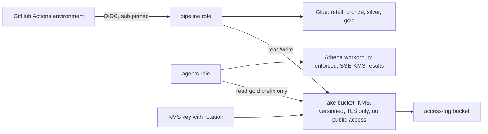

# Infrastructure: Terraform for AWS

The same design on AWS: a KMS-encrypted S3 lake with access logging and a TLS-only policy, one Glue
database per layer, an enforced Athena workgroup, a GitHub OIDC provider, a pipeline role trusted only
by this repository's environment and an agents role that reads gold only. Validated and tested
offline; **never applied**.

## 1. Purpose

* Show the same controls on a third platform.
* Provide what the S3 + Glue + Athena adapter needs.

## 2. Architecture



## 3. How it works

1. A customer-managed KMS key with rotation encrypts the lake and the Athena results.
2. Both buckets block every form of public access, enforce bucket-owner ownership, keep versions
   (non-current versions expire after 30 days), log access, and deny any request without TLS.
3. Glue databases per layer; the Athena workgroup enforces its configuration, so a client cannot turn
   off result encryption.
4. The pipeline role trusts the GitHub OIDC provider only for audience `sts.amazonaws.com` and subject
   `repo:<owner>/<name>:environment:<env>`. The OIDC provider is optional because only one may exist
   per account.
5. The agents role can read objects under `gold/` and the gold Glue tables and write Athena results;
   it cannot write or delete lake data.

## 4. Key files

| File | Role |
|---|---|
| `infra/terraform/aws/main.tf` | KMS, buckets, Glue, Athena, OIDC, roles and policies |
| `infra/terraform/aws/variables.tf` | Inputs with validation |
| `infra/terraform/aws/tests/plan.tftest.hcl` | Two offline plan tests |

## 5. Code excerpts

<!-- code: infra/terraform/aws/main.tf::data "aws_iam_policy_document" "github_trust" -->
```hcl
data "aws_iam_policy_document" "github_trust" {
  statement {
    actions = ["sts:AssumeRoleWithWebIdentity"]
    principals {
      type        = "Federated"
      identifiers = [local.oidc_provider_arn]
    }
    condition {
      test     = "StringEquals"
      variable = "token.actions.githubusercontent.com:aud"
      values   = ["sts.amazonaws.com"]
    }
    condition {
      test     = "StringEquals"
      variable = "token.actions.githubusercontent.com:sub"
      values   = ["repo:${var.github_repository}:environment:${var.environment}"]
    }
  }
}
```
<!-- /code -->

## 6. Configuration

`environment`, `region` (us-east-1), `domain`, `github_repository`, `create_github_oidc_provider`.

## 7. Commands

```bash
cd infra/terraform/aws
terraform init -backend=false && terraform validate && terraform test
tflint --init && tflint
```

## 8. Real output

<!-- output: iac -->
```text
terraform stack  resources  data sources  variables  outputs  test runs
---------------  ---------  ------------  ---------  -------  ---------
azure            24         1             8          6        4
gcp              13         0             5          4        2
aws              18         6             5          4        2

stack  control                                          set
-----  -----------------------------------------------  ---
azure  storage shared keys off                          yes
azure  storage TLS 1.2 and HTTPS only                   yes
azure  AI Search and Log Analytics local auth off       yes
azure  Key Vault RBAC and purge protection              yes
azure  private endpoints when private_networking        yes
azure  agents read the gold container only              yes
gcp    public access prevention enforced                yes
gcp    uniform bucket-level access                      yes
gcp    federation pinned to repository and environment  yes
gcp    agents read the gold dataset only                yes
aws    public access block on every bucket              yes
aws    SSE-KMS with key rotation                        yes
aws    TLS-only bucket policy                           yes
aws    OIDC trust pinned to repository and environment  yes
aws    Athena workgroup configuration enforced          yes
bicep  storage shared keys off                          yes
bicep  AI Search local auth off                         yes
bicep  Log Analytics local auth off                     yes
bicep  Key Vault RBAC and purge protection              yes
bicep  storage TLS 1.2                                  yes

bicep: 5 files, 28 resource declarations, 4 modules
checkov skips with a written reason: 17

workflow      triggers                               read-only default  SHA-pinned actions  jobs  gated by DEPLOY_ENABLED  OIDC jobs
------------  -------------------------------------  -----------------  ------------------  ----  -----------------------  ---------
ci.yml        pull_request, push                     yes                8/8                 4     0                        0
codeql.yml    pull_request, push, schedule           yes                3/3                 1     0                        0
deploy.yml    push, workflow_dispatch                yes                10/10               3     2                        2
infra.yml     pull_request, push, workflow_dispatch  yes                15/15               6     0                        3
teardown.yml  workflow_dispatch                      yes                5/5                 1     1                        1

static read of the files only; nothing has been applied to any cloud
```
<!-- /output -->

## 9. Tests and gates

Plan tests: dev defaults (no bucket can be public, key rotates, three Glue databases, workgroup
enforced) and an unknown environment rejected. `tests/test_iac.py`: public access block, KMS, TLS-only,
trust pinned to repository and environment, agents read gold only. tflint (aws ruleset) and checkov
in CI.

## 10. Guardrails

* No IAM users or access keys; roles only.
* The agents role has no `s3:PutObject` or `s3:DeleteObject` on lake data.

## 11. Security and governance

The KMS key policy delegates to IAM in this account only; tags on every resource; access logs in a
separate bucket.

## 12. Observability

S3 server access logs; CloudTrail data events can be enabled for the lake bucket.

## 13. Failure modes

| Failure | Effect | Handling |
|---|---|---|
| OIDC provider already exists | Apply fails | `create_github_oidc_provider = false` reuses it |
| Client disables result encryption | Unencrypted results | Workgroup configuration enforced |

## 14. Mapping to cloud services

| Here | Azure | Google Cloud | AWS |
|---|---|---|---|
| This stack | [terraform-azure.md](terraform-azure.md): ADLS Gen2, Microsoft Fabric, Entra ID | [terraform-gcp.md](terraform-gcp.md): BigQuery | S3, KMS, Glue, Athena, IAM roles via OIDC |

## 15. Limitations

* Never applied. No Lake Formation permissions, Bedrock or ECS resources yet.

## 16. Interview talking points

* "The trust policy has two conditions, audience and subject; without the subject any repository on
  GitHub could assume the role."
