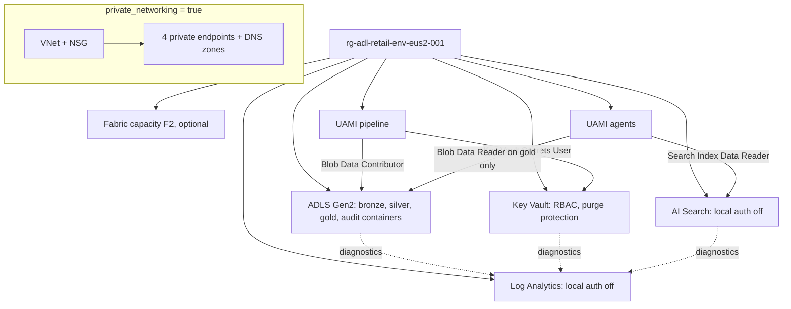

# Infrastructure: Terraform for Azure

The primary target. One resource group per domain and environment with an ADLS Gen2 lake, Log
Analytics, Key Vault, Azure AI Search, two user-assigned managed identities with least-privilege
roles, optional private networking and an optional Microsoft Fabric capacity. Validated, tested with a
mocked provider, linted and scanned in CI; **never applied**.

## 1. Purpose

* Define the Azure resources the data layer would need, with identity-only access (no keys).
* Make production differ from dev only by variables (private networking, zone-redundant storage,
  Search replicas).
* Keep it testable without an Azure subscription.

## 2. Architecture



## 3. How it works

1. `variables.tf` validates `environment` (dev or prod) and `domain`; `locals.tf` builds CAF-style
   names (`rg-adl-retail-dev-eus2-001`) and a compact name for storage and Key Vault.
2. `main.tf` creates the resources above. Storage has hierarchical namespace, shared keys off, TLS 1.2,
   HTTPS only, infrastructure encryption, soft delete for blobs and containers, and zone-redundant
   replication in prod. AI Search has local authentication off and three replicas in prod.
3. Roles: the pipeline identity writes the lake and reads the pseudonym key; the agents identity reads
   only the gold container and the search index.
4. `network.tf` adds a VNet, NSG, subnet, private DNS zones and private endpoints for blob, dfs, Search
   and Key Vault when `private_networking` is true, and public network access is then disabled.
5. `backend.tf` uses the azurerm backend with Entra ID auth (`use_azuread_auth`); `providers.tf` sets
   `storage_use_azuread`.

## 4. Key files

| File | Role |
|---|---|
| `infra/terraform/azure/main.tf` | Lake, monitoring, Key Vault, Search, Fabric, identities, roles, diagnostics |
| `infra/terraform/azure/network.tf` | Private networking |
| `infra/terraform/azure/variables.tf` | Inputs with validation |
| `infra/terraform/azure/tests/plan.tftest.hcl` | Four offline plan tests |
| `infra/terraform/azure/envs/` | dev and prod variables and backend keys |

## 5. Code excerpts

<!-- code: infra/terraform/azure/main.tf::resource "azurerm_storage_account" "lake" -->
```hcl
resource "azurerm_storage_account" "lake" {
  name                              = "st${local.compact}"
  resource_group_name               = azurerm_resource_group.this.name
  location                          = azurerm_resource_group.this.location
  account_tier                      = "Standard"
  account_replication_type          = var.environment == "prod" ? "ZRS" : "LRS"
  account_kind                      = "StorageV2"
  is_hns_enabled                    = true
  min_tls_version                   = "TLS1_2"
  https_traffic_only_enabled        = true
  shared_access_key_enabled         = false
  default_to_oauth_authentication   = true
  allow_nested_items_to_be_public   = false
  public_network_access_enabled     = !var.private_networking
  infrastructure_encryption_enabled = true
  local_user_enabled                = false
  sftp_enabled                      = false

  blob_properties {
    delete_retention_policy {
      days = 7
    }
    container_delete_retention_policy {
      days = 7
    }
  }

  network_rules {
    default_action = var.private_networking ? "Deny" : "Allow"
    bypass         = ["AzureServices"]
  }

  identity {
    type = "SystemAssigned"
  }

  tags = local.tags
}
```
<!-- /code -->

<!-- code: infra/terraform/azure/main.tf::resource "azurerm_role_assignment" "agents_gold" -->
```hcl
resource "azurerm_role_assignment" "agents_gold" {
  scope                = azurerm_storage_container.layer["gold"].id
  role_definition_name = "Storage Blob Data Reader"
  principal_id         = azurerm_user_assigned_identity.agents.principal_id
}
```
<!-- /code -->

## 6. Configuration

`environment`, `location` (eastus2), `domain` (retail), `private_networking`, `enable_fabric_capacity`,
`fabric_admin_upn`, `vnet_address_space`, `tags`. `envs/prod.tfvars` turns on private networking.

## 7. Commands

```bash
cd infra/terraform/azure
terraform init -backend=false
terraform validate
terraform test
tflint --init && tflint
checkov -d . --config-file ../../../.checkov.yaml
```

## 8. Real output

<!-- output: iac -->
```text
terraform stack  resources  data sources  variables  outputs  test runs
---------------  ---------  ------------  ---------  -------  ---------
azure            24         1             8          6        4
gcp              13         0             5          4        2
aws              18         6             5          4        2

stack  control                                          set
-----  -----------------------------------------------  ---
azure  storage shared keys off                          yes
azure  storage TLS 1.2 and HTTPS only                   yes
azure  AI Search and Log Analytics local auth off       yes
azure  Key Vault RBAC and purge protection              yes
azure  private endpoints when private_networking        yes
azure  agents read the gold container only              yes
gcp    public access prevention enforced                yes
gcp    uniform bucket-level access                      yes
gcp    federation pinned to repository and environment  yes
gcp    agents read the gold dataset only                yes
aws    public access block on every bucket              yes
aws    SSE-KMS with key rotation                        yes
aws    TLS-only bucket policy                           yes
aws    OIDC trust pinned to repository and environment  yes
aws    Athena workgroup configuration enforced          yes
bicep  storage shared keys off                          yes
bicep  AI Search local auth off                         yes
bicep  Log Analytics local auth off                     yes
bicep  Key Vault RBAC and purge protection              yes
bicep  storage TLS 1.2                                  yes

bicep: 5 files, 28 resource declarations, 4 modules
checkov skips with a written reason: 17

workflow      triggers                               read-only default  SHA-pinned actions  jobs  gated by DEPLOY_ENABLED  OIDC jobs
------------  -------------------------------------  -----------------  ------------------  ----  -----------------------  ---------
ci.yml        pull_request, push                     yes                8/8                 4     0                        0
codeql.yml    pull_request, push, schedule           yes                3/3                 1     0                        0
deploy.yml    push, workflow_dispatch                yes                10/10               3     2                        2
infra.yml     pull_request, push, workflow_dispatch  yes                15/15               6     0                        3
teardown.yml  workflow_dispatch                      yes                5/5                 1     1                        1

static read of the files only; nothing has been applied to any cloud
```
<!-- /output -->

`terraform test` runs four plan tests offline (dev defaults, prod with private networking, Fabric
capacity, unknown environment rejected); checkov reports 0 failed checks with the reasoned skips in
`.checkov.yaml`.

## 9. Tests and gates

`tests/plan.tftest.hcl` (CI job `terraform`), tflint with the azurerm ruleset, checkov, and
`tests/test_iac.py` (Entra-only auth, least-privilege roles, opt-in private networking and Fabric).

## 10. Guardrails

* No secret anywhere: no storage keys, no Search admin keys, no client secrets.
* Agents get read roles only, scoped to the gold container.
* Fabric capacity is off by default because it bills while running.

## 11. Security and governance

Tags on every resource carry workload, domain, environment and use case so cost can be attributed
to the value ledger. Diagnostic settings send storage, Search and Key Vault logs to Log Analytics.

## 12. Observability

Log Analytics workspace with 30-day retention; diagnostics for blob, Search and Key Vault.

## 13. Failure modes

| Failure | Effect | Handling |
|---|---|---|
| Storage name collision | Apply fails | Compact name from domain, environment and region; change `domain` or region |
| Private endpoints without DNS | Resolution fails | DNS zones and VNet links created with the endpoints |
| Fabric admin missing | Capacity creation fails | Variable validation and a precondition |

## 14. Mapping to cloud services

| Here | Azure | Google Cloud | AWS |
|---|---|---|---|
| This stack | ADLS Gen2 or Microsoft Fabric OneLake, AI Search, Key Vault, Entra ID managed identities | [terraform-gcp.md](terraform-gcp.md): Cloud Storage, BigQuery | [terraform-aws.md](terraform-aws.md): S3, Glue, Athena |
| Remote state | Storage with Entra ID auth | GCS bucket | S3 bucket |

## 15. Limitations

* Never applied; resource behaviour is checked by plan tests and scanners only.
* The Python services' hosting (Container Apps) is not in the stack yet.

## 16. Interview talking points

* "There is not one key in the stack: storage, Search, Log Analytics and state all use Entra ID."
* "Agents get Blob Data Reader on the gold container, not the account."
