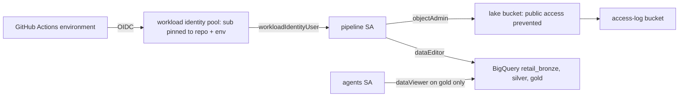

# Infrastructure: Terraform for Google Cloud

The same design on Google Cloud: a Cloud Storage lake with access logging, one BigQuery dataset per
layer, pipeline and agents service accounts, and a workload identity pool that trusts only this
repository's GitHub environment. Validated and tested offline; **never applied**.

## 1. Purpose

* Show the data layer is portable: same layers, same least privilege, same secretless CI.
* Provide what the BigQuery adapter needs.

## 2. Architecture



## 3. How it works

1. The lake bucket enforces public access prevention and uniform bucket-level access, keeps versions
   (at most five) with 7-day soft delete, and logs access to a second bucket.
2. One BigQuery dataset per layer (`retail_bronze`, `retail_silver`, `retail_gold`).
3. The pipeline service account can write the bucket and the datasets and run jobs; the agents
   service account can only read the gold dataset and run query jobs.
4. The workload identity pool provider's attribute condition requires the token subject
   `repo:<owner>/<name>:environment:<env>`, so only this repository's environment can impersonate the
   pipeline service account.

## 4. Key files

| File | Role |
|---|---|
| `infra/terraform/gcp/main.tf` | Buckets, datasets, service accounts, IAM, federation |
| `infra/terraform/gcp/variables.tf` | Inputs with validation |
| `infra/terraform/gcp/tests/plan.tftest.hcl` | Two offline plan tests |

## 5. Code excerpts

<!-- code: infra/terraform/gcp/main.tf::resource "google_iam_workload_identity_pool_provider" "github" -->
```hcl
resource "google_iam_workload_identity_pool_provider" "github" {
  workload_identity_pool_id          = google_iam_workload_identity_pool.github.workload_identity_pool_id
  workload_identity_pool_provider_id = "github-oidc"
  display_name                       = "GitHub OIDC"
  attribute_mapping = {
    "google.subject"       = "assertion.sub"
    "attribute.repository" = "assertion.repository"
    "attribute.ref"        = "assertion.ref"
  }
  attribute_condition = "assertion.sub == 'repo:${local.github_owner}/${local.github_name}:environment:${var.environment}'"

  oidc {
    issuer_uri = "https://token.actions.githubusercontent.com"
  }
}
```
<!-- /code -->

<!-- code: infra/terraform/gcp/main.tf::resource "google_bigquery_dataset_iam_member" "agents_gold" -->
```hcl
resource "google_bigquery_dataset_iam_member" "agents_gold" {
  dataset_id = google_bigquery_dataset.layer["gold"].dataset_id
  role       = "roles/bigquery.dataViewer"
  member     = "serviceAccount:${google_service_account.agents.email}"
}
```
<!-- /code -->

## 6. Configuration

`environment`, `project_id` (required), `region` (us-east4), `domain`, `github_repository`.

## 7. Commands

```bash
cd infra/terraform/gcp
terraform init -backend=false && terraform validate && terraform test
tflint --init && tflint
```

## 8. Real output

<!-- output: iac -->
```text
terraform stack  resources  data sources  variables  outputs  test runs
---------------  ---------  ------------  ---------  -------  ---------
azure            24         1             8          6        4
gcp              13         0             5          4        2
aws              18         6             5          4        2

stack  control                                          set
-----  -----------------------------------------------  ---
azure  storage shared keys off                          yes
azure  storage TLS 1.2 and HTTPS only                   yes
azure  AI Search and Log Analytics local auth off       yes
azure  Key Vault RBAC and purge protection              yes
azure  private endpoints when private_networking        yes
azure  agents read the gold container only              yes
gcp    public access prevention enforced                yes
gcp    uniform bucket-level access                      yes
gcp    federation pinned to repository and environment  yes
gcp    agents read the gold dataset only                yes
aws    public access block on every bucket              yes
aws    SSE-KMS with key rotation                        yes
aws    TLS-only bucket policy                           yes
aws    OIDC trust pinned to repository and environment  yes
aws    Athena workgroup configuration enforced          yes
bicep  storage shared keys off                          yes
bicep  AI Search local auth off                         yes
bicep  Log Analytics local auth off                     yes
bicep  Key Vault RBAC and purge protection              yes
bicep  storage TLS 1.2                                  yes

bicep: 5 files, 28 resource declarations, 4 modules
checkov skips with a written reason: 17

workflow      triggers                               read-only default  SHA-pinned actions  jobs  gated by DEPLOY_ENABLED  OIDC jobs
------------  -------------------------------------  -----------------  ------------------  ----  -----------------------  ---------
ci.yml        pull_request, push                     yes                8/8                 4     0                        0
codeql.yml    pull_request, push, schedule           yes                3/3                 1     0                        0
deploy.yml    push, workflow_dispatch                yes                10/10               3     2                        2
infra.yml     pull_request, push, workflow_dispatch  yes                15/15               6     0                        3
teardown.yml  workflow_dispatch                      yes                5/5                 1     1                        1

static read of the files only; nothing has been applied to any cloud
```
<!-- /output -->

## 9. Tests and gates

Plan tests: dev defaults (bucket never public, three datasets, agents read gold only, pool trusts only
this repository) and a bad repository name rejected. `tests/test_iac.py` checks the same properties
statically; tflint (google ruleset) and checkov run in CI.

## 10. Guardrails

* No service account keys are created anywhere.
* The federation condition pins both repository and environment.

## 11. Security and governance

Labels on every resource (workload, domain, environment, managed-by). Access logs go to a separate
bucket.

## 12. Observability

Bucket access logs; BigQuery audit logs are on by default in Cloud Logging.

## 13. Failure modes

| Failure | Effect | Handling |
|---|---|---|
| Wrong repository string | Federation trusts the wrong repository | Validated `owner/name`; test rejects bad input |
| Bucket name taken | Apply fails | Name prefixed with the project id |

## 14. Mapping to cloud services

| Here | Azure | Google Cloud | AWS |
|---|---|---|---|
| This stack | [terraform-azure.md](terraform-azure.md): ADLS Gen2, Microsoft Fabric, Entra ID | Cloud Storage, BigQuery, service accounts, workload identity federation | [terraform-aws.md](terraform-aws.md): S3, Glue, Athena, IAM |

## 15. Limitations

* Never applied. No Vertex AI, Cloud Run or Dataplex resources yet.

## 16. Interview talking points

* "The pool's attribute condition is the whole trust boundary: this repository, this environment,
  nothing else."
