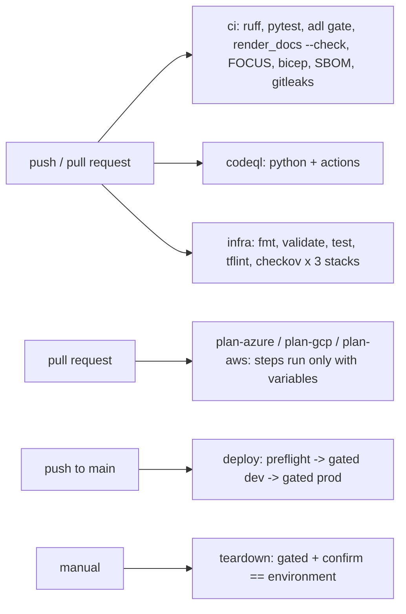

# Infrastructure: GitHub Actions workflows

Five workflows: offline CI, CodeQL, infrastructure checks, a gated deploy and a gated teardown. Every
action is pinned to a commit SHA, every workflow defaults to read-only permissions, and cloud access
is OIDC only. Deploy and teardown have never run because `DEPLOY_ENABLED` is not set.

## 1. Purpose

* Prove on every push that the code, docs, numbers and infrastructure are consistent and safe.
* Make deployment possible without storing a single cloud secret, and impossible until switched on.

## 2. Architecture



## 3. How it works

1. **ci.yml** installs the package, runs ruff (lint and format), the full test suite, the release
   gate, the docs drift check and the FOCUS export, uploads the outputs; builds Bicep with warnings as
   errors; generates an SPDX SBOM; scans the full history with gitleaks.
2. **codeql.yml** analyses Python and the workflows themselves on push, pull request and weekly.
3. **infra.yml** runs `terraform fmt -check`, `init -backend=false`, `validate` and `test` for each
   stack, tflint with each provider's ruleset, and checkov with `.checkov.yaml`. Plan jobs log in with
   OIDC only if that cloud's variables exist.
4. **deploy.yml**: `preflight` reports whether deployment is enabled and for which clouds;
   `deploy-dev` and `deploy-prod` run only if `vars.DEPLOY_ENABLED == 'true'`, use GitHub environments,
   request `id-token: write`, log in to each configured cloud with OIDC and call
   `.github/scripts/deploy.sh provision` then `smoke`. Prod needs dev first.
5. **teardown.yml** is manual, gated the same way, and requires the `confirm` input to equal the
   environment name.

## 4. Key files

| File | Role |
|---|---|
| `.github/workflows/ci.yml` | Offline CI |
| `.github/workflows/codeql.yml` | Code scanning |
| `.github/workflows/infra.yml` | IaC checks and optional plans |
| `.github/workflows/deploy.yml` | Gated deployment |
| `.github/workflows/teardown.yml` | Gated teardown |
| `.github/scripts/deploy.sh` | provision, smoke and destroy per cloud |
| `.github/dependabot.yml` | pip, actions and Terraform updates |
| `.github/CODEOWNERS` | Review ownership |

## 5. Code excerpts

<!-- code: .github/scripts/deploy.sh -->
```bash
#!/usr/bin/env bash
# Deployment steps used by .github/workflows/deploy.yml and teardown.yml. Each subcommand is
# idempotent and reads its inputs from the environment:
#   CLOUD        azure | gcp | aws
#   TARGET_ENV   dev | prod
#   AZURE_TOOL   terraform | bicep (Azure only)
#   TFSTATE_*    remote state location per cloud; GCP_PROJECT_ID; AWS_REGION
#   credentials  set by the OIDC login step of each cloud (never a secret)
#
#   deploy.sh provision   create/update the stack for $CLOUD
#   deploy.sh smoke       check the lake, the gold layer and the agents' read-only access exist
#   deploy.sh destroy     tear the environment down (teardown workflow only)
#
# Never run from this repository so far: DEPLOY_ENABLED is not set.
set -euo pipefail

CLOUD="${CLOUD:?CLOUD is required}"
ENV_NAME="${TARGET_ENV:?TARGET_ENV is required}"
STACK="infra/terraform/${CLOUD}"

tf_init() {
  case "$CLOUD" in
    azure)
      terraform -chdir="$STACK" init -input=false -backend-config="envs/${ENV_NAME}.backend.hcl" \
        -backend-config="resource_group_name=${TFSTATE_AZURE_RESOURCE_GROUP:?}" \
        -backend-config="storage_account_name=${TFSTATE_AZURE_STORAGE_ACCOUNT:?}" \
        -backend-config="container_name=tfstate" ;;
    gcp)
      terraform -chdir="$STACK" init -input=false -backend-config="envs/${ENV_NAME}.backend.hcl" \
        -backend-config="bucket=${TFSTATE_GCS_BUCKET:?}" ;;
    aws)
      terraform -chdir="$STACK" init -input=false -backend-config="envs/${ENV_NAME}.backend.hcl" \
        -backend-config="bucket=${TFSTATE_S3_BUCKET:?}" -backend-config="region=${AWS_REGION:-us-east-1}" ;;
    *) echo "unknown cloud $CLOUD"; exit 1 ;;
  esac
}

tf_vars() {
  local extra=()
  [[ "$CLOUD" == "gcp" ]] && extra+=(-var "project_id=${GCP_PROJECT_ID:?}")
  echo -var-file="envs/${ENV_NAME}.tfvars" "${extra[@]}"
}

provision() {
  if [[ "$CLOUD" == "azure" && "${AZURE_TOOL:-terraform}" == "bicep" ]]; then
    private=false
    [[ "$ENV_NAME" == "prod" ]] && private=true
    az deployment sub create --name "adl-${ENV_NAME}-${GITHUB_RUN_ID:-local}" --location eastus2 \
      --template-file infra/bicep/main.bicep --parameters environment="$ENV_NAME" privateNetworking="$private" -o none
    return
  fi
  tf_init
  # shellcheck disable=SC2046
  terraform -chdir="$STACK" apply -auto-approve -input=false $(tf_vars)
}

smoke() {
  case "$CLOUD" in
    azure)
      rg="rg-adl-retail-${ENV_NAME}-eus2-001"
      account=$(az storage account list -g "$rg" --query "[0].name" -o tsv)
      az storage container show --account-name "$account" --name gold --auth-mode login -o none
      [[ "$(az storage account show -n "$account" --query allowSharedKeyAccess -o tsv)" == "false" ]] || { echo "::error::shared keys enabled"; exit 1; }
      [[ "$(az search service list -g "$rg" --query "[0].disableLocalAuth" -o tsv)" == "true" ]] || { echo "::error::search keys enabled"; exit 1; } ;;
    gcp)
      bq show --format=none "${GCP_PROJECT_ID}:retail_gold"
      gcloud storage buckets describe "gs://${GCP_PROJECT_ID}-adl-retail-${ENV_NAME}-lake" --format="value(public_access_prevention)" | grep -q enforced ;;
    aws)
      aws glue get-database --name retail_gold >/dev/null
      aws athena get-work-group --work-group "adl-retail-${ENV_NAME}" --query "WorkGroup.Configuration.EnforceWorkGroupConfiguration" | grep -q true ;;
  esac
  echo "smoke checks passed for ${CLOUD}/${ENV_NAME}"
}

destroy() {
  if [[ "$CLOUD" == "azure" && "${AZURE_TOOL:-terraform}" == "bicep" ]]; then
    az group delete --name "rg-adl-retail-${ENV_NAME}-eus2-001" --yes
    return
  fi
  tf_init
  # shellcheck disable=SC2046
  terraform -chdir="$STACK" destroy -auto-approve -input=false $(tf_vars)
}

"$@"
```
<!-- /code -->

## 6. Configuration

Repository variables only (never secrets): `DEPLOY_ENABLED`, `DEPLOY_CLOUDS`, `AZURE_TOOL`, the
Azure, Google Cloud and AWS identity variables and the `TFSTATE_*` locations. See
[deployment.md](../deployment.md).

## 7. Commands

```bash
gh workflow run deploy.yml -f clouds='["azure"]'    # still skipped unless DEPLOY_ENABLED is true
gh workflow run teardown.yml -f environment=dev -f cloud=azure -f confirm=dev
```

## 8. Real output

<!-- output: iac -->
```text
terraform stack  resources  data sources  variables  outputs  test runs
---------------  ---------  ------------  ---------  -------  ---------
azure            24         1             8          6        4
gcp              13         0             5          4        2
aws              18         6             5          4        2

stack  control                                          set
-----  -----------------------------------------------  ---
azure  storage shared keys off                          yes
azure  storage TLS 1.2 and HTTPS only                   yes
azure  AI Search and Log Analytics local auth off       yes
azure  Key Vault RBAC and purge protection              yes
azure  private endpoints when private_networking        yes
azure  agents read the gold container only              yes
gcp    public access prevention enforced                yes
gcp    uniform bucket-level access                      yes
gcp    federation pinned to repository and environment  yes
gcp    agents read the gold dataset only                yes
aws    public access block on every bucket              yes
aws    SSE-KMS with key rotation                        yes
aws    TLS-only bucket policy                           yes
aws    OIDC trust pinned to repository and environment  yes
aws    Athena workgroup configuration enforced          yes
bicep  storage shared keys off                          yes
bicep  AI Search local auth off                         yes
bicep  Log Analytics local auth off                     yes
bicep  Key Vault RBAC and purge protection              yes
bicep  storage TLS 1.2                                  yes

bicep: 5 files, 28 resource declarations, 4 modules
checkov skips with a written reason: 17

workflow      triggers                               read-only default  SHA-pinned actions  jobs  gated by DEPLOY_ENABLED  OIDC jobs
------------  -------------------------------------  -----------------  ------------------  ----  -----------------------  ---------
ci.yml        pull_request, push                     yes                8/8                 4     0                        0
codeql.yml    pull_request, push, schedule           yes                3/3                 1     0                        0
deploy.yml    push, workflow_dispatch                yes                10/10               3     2                        2
infra.yml     pull_request, push, workflow_dispatch  yes                15/15               6     0                        3
teardown.yml  workflow_dispatch                      yes                5/5                 1     1                        1

static read of the files only; nothing has been applied to any cloud
```
<!-- /output -->

## 9. Tests and gates

`tests/test_iac.py`: every workflow pins actions to SHAs and has read-only default permissions, no
client secrets or access keys; CI runs tests, gate and drift checks; infra covers every stack; deploy
is gated and uses OIDC for every cloud; teardown needs gate and confirmation; CodeQL scans Python and
Actions; Dependabot covers every ecosystem and stack; the deploy script has every subcommand.

## 10. Guardrails

* `DEPLOY_ENABLED` off means deploy and teardown jobs are skipped, not failed.
* Prod requires dev to succeed and can carry required reviewers.
* Dependabot pull requests are reviewed by a person, never auto-merged.

## 11. Security and governance

OIDC subjects are pinned per environment in the GCP and AWS stacks; CODEOWNERS assigns every path,
including workflows, infrastructure and policy files, to the repository owner for review.

## 12. Observability

Gate report and FOCUS CSV uploaded as artifacts on every CI run; SBOM as an artifact.

## 13. Failure modes

| Failure | Effect | Handling |
|---|---|---|
| A tag-pinned action is moved | Supply-chain attack | SHA pins; Dependabot bumps with review |
| Someone adds a client secret | Long-lived credential | Test fails on secret inputs |
| Docs show stale numbers | Misleading readers | render_docs `--check` in CI |

## 14. Mapping to cloud services

| Here | Azure | Google Cloud | AWS |
|---|---|---|---|
| OIDC login | azure/login with Entra ID federated credential; deploys ADLS or Microsoft Fabric capacity | google-github-actions/auth with workload identity federation; deploys BigQuery | aws-actions/configure-aws-credentials with an IAM role; deploys S3 |
| Remote state | Storage account with Entra ID auth | GCS bucket | S3 bucket |

## 15. Limitations

* Deploy and teardown have never run.
* No Python service deployment yet; only infrastructure.

## 16. Interview talking points

* "There are zero secrets in the repository settings; every cloud login is OIDC with a pinned
  subject."
* "Deployment is wired end to end and switched off on purpose; the portfolio claims nothing that is
  not running."
