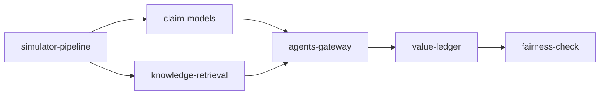

# docs/insurance

The insurance domain for the fictional Ferrowind Insurance: which queue each new claim goes to, which
payments a person reviews for leakage before they are released, and which claims go to the
subrogation unit for recovery. Built on synthetic data with the shared platform; nothing is deployed.
Each document has the same 16 sections as the other component docs, and every output block is
regenerated from the code by `scripts/render_docs.py` (CI fails if one drifts).

| File | What it does |
|---|---|
| `simulator-pipeline.md` | Simulator, bronze feeds with planted faults, silver, gold, contracts, quality, lineage, metrics |
| `claim-models.md` | Complexity, leakage and subrogation models, backtests against today's rules, triage thresholds |
| `knowledge-retrieval.md` | Corpus, graph and hybrid retrieval with its evaluation |
| `agents-gateway.md` | The claims assistant, digest-bound approval, dry run, gateway security, injection |
| `value-ledger.md` | Paired forward simulation, value ledger with intervals, KPI results, cost, FOCUS, gate |
| `fairness-check.md` | Unfair-discrimination screening across synthetic postcode proxy groups |

## Results in one table

All numbers are from `adl insurance value`, `adl insurance models` and `adl insurance fairness`: 30
paired replications of 28 days, 95% bootstrap intervals, simulated.

| Result | Value |
|---|---|
| Net value, all levers | +$274,527 per 28 days, interval $249,068 to $299,963 |
| By lever | subrogation referral +$229,425; leakage review +$23,357; queue assignment -$2,193 (interval spans zero) |
| KPI targets (set before results) | 1 of 4 met: leakage -30.4% (target -25%) met; cycle days -1.1% (-10%), reopen rate +3.3% (-15%), backlog spread -13.0% (-20%) missed |
| Models vs today's rules (AUC) | subrogation 0.962 vs 0.708; leakage 0.762 vs 0.527; complexity 0.797 vs 0.747 (barely better at equal queue sizes) |
| Fairness screen (G2/G1, band 0.80 to 1.25) | all within the band; agent fast-track ratio 0.931 vs 0.984 under current rules, a measurable shift |
| Guardrails | 14/14 access attacks stopped; 0 PII rows; 0 injected actions executed; 6 actions sent to a person, 2 rejected |

## What is built and what is planned

| Piece | Status |
|---|---|
| Simulator, bronze/silver/gold, 18 contracts, quality, lineage, metrics layer | Built |
| Complexity, leakage and subrogation models with backtests | Built |
| Knowledge corpus, graph, hybrid retrieval and eval set | Built |
| Claims assistant on the shared approval workflow, gateway identities, attack suite | Built |
| Value ledger, KPI results, cost and FOCUS export, 12 gate checks | Built |
| Unfair-discrimination screening across synthetic proxy groups | Built (screening heuristic, not a legal test) |
| MCP and A2A serving for insurance | Planned (retail only today) |
| Live execution against a claims system | Planned (dry run only) |
| Conditional fairness measures and settlement-amount outcomes | Planned |
| Cloud deployment | Written, not run (shared IaC; nothing is deployed) |

## Business model mapping (MIT CISR)

MIT CISR's four business models are described in the
[MIT Sloan article](https://mitsloan.mit.edu/ideas-made-to-matter/what-leaders-still-get-wrong-about-ai)
by Beth Stackpole; the descriptions below are my paraphrase and the mapping is my own.

| Model (paraphrased) | Ferrowind Insurance example | What the data layer provides | Status |
|---|---|---|---|
| Existing+: AI improves today's model | Adjusters, the review team and the subrogation unit spend the same capacity on the claims where it pays most | Claims data products, models, assistant with approval, value ledger, fairness monitor | Built |
| Customer Proxy: AI runs a set process for the customer | A policyholder-side assistant that files a claim, uploads photos and tracks it within limits the customer sets | The same products per claim; a customer-consented purpose would be added to the contracts | Planned (design only) |
| Modular Creator: reusable modules combined per goal | Repair, rental car and temporary housing modules assembled per claim | Contracted data products as modules; the knowledge graph links lines, causes and offices | Planned (design only) |
| Orchestrator: an ecosystem assembled by AI | Repairers, loss adjusters, other insurers and recovery agents coordinated around a claim | A2A under each partner's identity and purpose (built for retail, planned for insurance) | Planned |

Insurance starts at Existing+ for the same reason as retail and mortgage: it is where value can be
measured now, and it builds the governed products, gateway, ledger and fairness monitor the other
models depend on.
