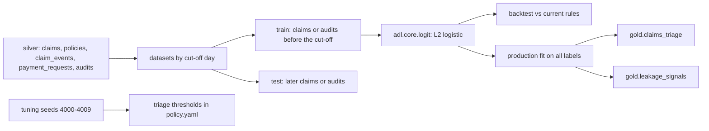

# Insurance: claim models and triage thresholds

Three logistic models on what an insurer can observe: complexity at first notice, overpayment at
payment and subrogation potential at payment. Each is backtested against the rule Ferrowind uses today.
Two clearly beat their rule; the complexity model is barely better than the routing rule, and the
results say so.

## 1. Purpose

* Route new claims by the probability they are complex, not only by the reported amount.
* Choose which payments a person reviews and which claims go to the subrogation unit, from the random
  audits, the one unbiased record of overpayments and missed recoveries.
* Publish the scores as gold products (`claims_triage`, `leakage_signals`) with a readable driver.

## 2. Architecture



## 3. How it works

1. **Complexity at first notice.** Features from the intake record only: line, cause, channel,
   estimate, injury, police report, third-party flag, photos, days from loss to report, policy tenure and
   prior claims. The label is the adjuster's complexity code at first assessment. Trained on claims
   reported on days 10 to 129 (labels observed by day 149), tested on days 140 to 165.
2. **Leakage at payment.** Features from the payment request (amount, ratio to the first estimate,
   invoices, repairer outside the network), the queue that handled the claim and intake facts. Labels
   come only from the random closed-file audits, so the model is not trained on the review team's
   biased sample. Trained on audits from days 0 to 135, tested on 136 to 179.
3. **Subrogation at payment.** Cause, police report, third-party flag, line and amount, also learned
   from the audits.
4. **Baselines.** The current routing rule (injury, commercial or above $15,000 to complex; below
   $3,000 to fast track), "review the largest payments first" and "refer what the intake desk flagged".
   Each model is compared at the rule's own volume: the same number of claims in the complex unit and
   fast track, the same number of reviews and referrals.
5. **Shared model code.** `adl.core.logit` (Newton's method on standardised features, AUC with ties)
   is the shared version for new domains; retail and mortgage keep their own code unchanged.
6. **Triage thresholds.** The policy sends a claim to the complex unit above a probability, to fast
   track below another and under an estimate cap, then applies capacity guards. The thresholds were
   chosen on tuning seeds 4000 to 4009 only, never on the 30 reported replications: a grid of complex
   0.35 to 0.85, fast track 0.08 to 0.25 and an estimate cap of $5,000 or $8,000, keeping the setting
   with the highest net value among those that did not lengthen cycle time or widen the backlog
   spread (complex 0.65, fast track 0.25, cap $5,000). No setting in the grid improved net value,
   cycle time and reopen rate together, which already showed triage would be the weak lever.

## 4. Key files

| File | Role |
|---|---|
| `src/adl/domains/insurance/models.py` | Features, datasets, the three models, backtest |
| `src/adl/core/logit.py` | Shared logistic regression, top driver, AUC |
| `src/adl/domains/insurance/policy.py` | Queue assignment with capacity guards, review and referral value |
| `config/insurance/policy.yaml` | Thresholds, capacity, planning figures, approval thresholds |

## 5. Code excerpts

<!-- code: src/adl/domains/insurance/policy.py::assign_queues -->
```python
def assign_queues(p: np.ndarray, estimate: np.ndarray, ids: np.ndarray, cfg: dict) -> np.ndarray:
    tr, pl, cap = cfg["triage"], cfg["planning"], cfg["capacity"]["adjuster_days"]
    work = np.array([pl["work"][q] for q in W.QUEUES])
    util = pl["utilisation_target"]
    q = np.where(
        p >= tr["complex_min_probability"],
        W.CX,
        np.where((p <= tr["fast_track_max_probability"]) & (estimate <= tr["fast_track_max_estimate_usd"]), W.FT, W.STD),
    )

    def load(k: int) -> np.ndarray:
        return (1 - p) * work[k, 0] + p * work[k, 1]

    ft = np.flatnonzero(q == W.FT)  # keep fast track within capacity: drop the least certain first
    for i in ft[np.lexsort((ids[ft], -p[ft]))]:
        if load(W.FT)[q == W.FT].sum() <= util * cap["fast_track"]:
            break
        q[i] = W.STD
    budget = util * cap["complex"] - (p[q == W.FT] * work[W.CX, 1]).sum()  # escalations from fast track land in the complex unit
    cx = np.flatnonzero(q == W.CX)
    for i in cx[np.lexsort((ids[cx], p[cx]))]:
        if load(W.CX)[q == W.CX].sum() <= budget:
            break
        q[i] = W.STD
    return q
```
<!-- /code -->

## 6. Configuration

`config/insurance/policy.yaml`: `triage` (complex 0.65, fast track 0.25, estimate cap $5,000, chosen on
tuning seeds), `capacity` (adjuster-days 18, 58 and 46; 10 reviews and 8 referrals a day), `planning`
(expected adjuster-days per claim, utilisation target 0.95). Train and test windows are constants in
`models.py`.

## 7. Commands

```bash
adl insurance models
```

## 8. Real output

<!-- output: insurance models -->
```text
complexity at first notice: 1206 test claims, 25.0% complex; each method fills the queues the rule fills
method                AUC    complex-unit precision  complex-unit recall  complex claims sent to fast track  Brier
--------------------  -----  ----------------------  -------------------  ---------------------------------  ------
complexity model      0.797  62.1%                   44.0%                28                                 0.1430
current routing rule  0.747  60.7%                   43.0%                27                                 0.1877
Brier for the rule is the base-rate forecast (the rule gives no probability)

leakage at payment: 264 audited test payments, 23.5% overpaid; each method reviews 57
method                      AUC    precision  overpayment dollars found
--------------------------  -----  ---------  -------------------------
leakage model (p x amount)  0.762  33.3%      76.0%
largest payment first       0.527  29.8%      75.4%

subrogation at payment: 22.7% recoverable; each method refers 34
method                   AUC    precision  recall
-----------------------  -----  ---------  ------
subrogation model        0.962  94.1%      53.3%
intake third-party flag  0.708  79.4%      45.0%

gold.claims_triage: complex 4, fast_track 17, standard 31; 8 differ from the current rule
```
<!-- /output -->

The leakage model ranks overpaid payments far better than "largest first" (AUC 0.762 against 0.527)
and is more precise, but at the review team's capacity both find about the same share of overpayment
dollars (76.0% and 75.4%), because large payments carry large overpayments. The subrogation model is
the strong one: 94.1% precision and 53.3% recall against 79.4% and 45.0% for the intake flag. The
complexity model has a better AUC and Brier score than the routing rule, but at the rule's queue sizes
it is barely more precise (62.1% against 60.7%) and sends one more complex claim to fast track (28
against 27). Most of the signal is in the estimate, injury and line, which the rule already uses.

## 9. Tests and gates

`tests/test_insurance.py`: leakage and subrogation models beat their rules on AUC and on precision or
recall; the complexity result is asserted as reported (better AUC and Brier, precision within five
points); training never sees a test label; no identity, postcode or group is a feature; the triage
product's drivers come from the driver labels; logistic regression recovers a known signal; AUC handles
ties and a single class; the top driver is named only on its side; queue assignment respects capacity
and the estimate cap; tuning and evaluation seeds do not overlap. Gate: leakage and subrogation models
beat their rules (AUC).

## 10. Guardrails

Scores route work and choose what a person checks; contracts prohibit using them to deny or reduce a
claim without a person. The capacity guards keep the policy inside today's adjuster-days.

## 11. Security and governance

Model products carry no claimant identity, postcode or proxy group. The office copilots cannot read
the estimate, the proposed payment or the expected amounts (column-level security).

## 12. Observability

Backtest tables with AUC, precision, recall and Brier; the distribution of suggested queues and how
many differ from the current rule; the top driver per claim.

## 13. Failure modes

| Failure | Effect | Handling |
|---|---|---|
| Training on reviewed payments only | Biased leakage model | Labels from random audits only |
| Label leakage across the cut-off | Optimistic backtest | Train and test windows separated; test labels observed by day 179 |
| Thresholds tuned on reported seeds | Overstated value | Separate tuning seeds, tested to be disjoint |
| Report lag as a proxy | Unequal treatment | Fairness check on the decisions the scores drive |

## 14. Mapping to cloud services

| Here | Azure | Google Cloud | AWS |
|---|---|---|---|
| Training and scoring | Microsoft Fabric notebooks or Azure Machine Learning | BigQuery ML or Vertex AI | SageMaker over S3 |
| Model registry | Azure Machine Learning registry | Vertex AI Model Registry | SageMaker Model Registry |
| Gold score tables | OneLake Delta tables | BigQuery tables | S3 tables in Glue |
| Training identity | Entra ID managed identity | Service account | IAM role |

## 15. Limitations

* Logistic models on a world I wrote; real claims need richer features (images, adjuster notes, repair
  networks) and monitoring for drift.
* The complexity model adds little over the rule here; most of the triage effect comes from the
  capacity guards and the estimate cap, not the score.
* One test window per model; no rolling-origin backtest yet.

## 16. Interview talking points

* "The leakage labels come from random audits, not from what the review team chose to check; otherwise
  the model learns the old rule."
* "My complexity model is barely better than the existing rule at the same queue sizes, and I say so.
  The subrogation model is where the value is."
