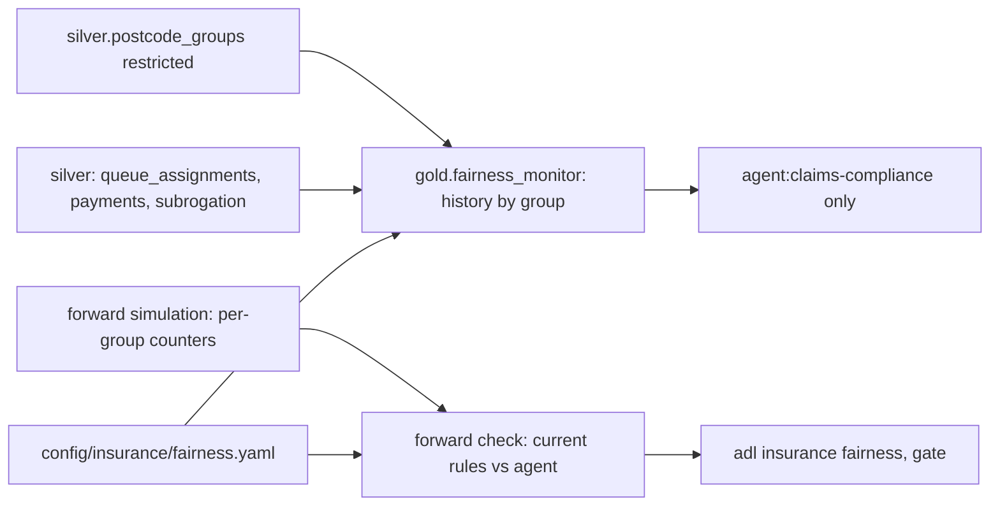

# Insurance: unfair-discrimination check across proxy groups

A screening check on claim outcomes across two synthetic postcode proxy groups. For each decision the
assistant drives (fast track, leakage review, subrogation referral) it compares group G2's selection
rate with group G1's, and it compares days from report to payment. Limits were committed before any
result. It is a screening heuristic on synthetic data, not a legal test.

## 1. Purpose

* Check that routing and review decisions do not treat claimants differently by where they live, even
  though no model sees the postcode.
* Make the check repeatable: one config, one command, results reported hit or miss with intervals.
* Show how a fairness monitor can be governed: aggregates only, one compliance identity.

## 2. Architecture



## 3. How it works

1. **Groups.** Each of 40 postcode districts is G1 or G2. The group has no effect on the true claim;
   it is correlated with reporting later and by phone. Days from loss to report is a model feature,
   which is the path by which a model could treat groups differently.
2. **Measures.** Selection rate per group: share of new claims fast-tracked (faster service), share of
   paid claims reviewed before payment (extra scrutiny), share of paid claims referred for recovery;
   and mean days from report to payment.
3. **Limits** (`config/insurance/fairness.yaml`, committed before results): the G2/G1 ratio within
   0.80 to 1.25, the four-fifths heuristic used in employment testing, applied here as a screening
   threshold; the cycle-days gap within 2 days.
4. **History.** `gold.fairness_monitor` aggregates 180 days under the current rules from restricted
   silver. Only `agent:claims-compliance` can read it, for `fairness_monitoring`.
5. **Forward.** The simulator counts each decision per group in every replication; `fairness.forward`
   computes the ratio per replication for the current rules and the agent, a 95% bootstrap interval,
   and the paired change in the ratio.

## 4. Key files

| File | Role |
|---|---|
| `src/adl/domains/insurance/fairness.py` | History and forward checks |
| `config/insurance/fairness.yaml` | Groups, reference group, limits |
| `domains/insurance/contracts/gold.fairness_monitor.yaml` | The monitor's contract |
| `src/adl/domains/insurance/world.py` | Per-group counters in the simulator |

## 5. Code excerpts

<!-- code: src/adl/domains/insurance/fairness.py::forward -->
```python
def forward(cmp: SIM.Comparison, arms: tuple[str, ...] = ("current rules", "agent")) -> list[dict]:
    cfg = load_config()
    lo_band, hi_band = cfg["selection_rate_ratio"]["min"], cfg["selection_rate_ratio"]["max"]
    out = []
    for decision in (*DECISIONS, "cycle_days"):
        base_ratio = _per_run(cmp.arms["current rules"], decision)[2]
        for arm in arms:
            g1, g2, ratio = _per_run(cmp.arms[arm], decision)
            ok = ~np.isnan(ratio)
            lo, hi = SIM.bootstrap_ci(ratio[ok]) if ok.any() else (float("nan"), float("nan"))
            row = {
                "decision": decision,
                "arm": arm,
                "g1": float(g1.mean()),
                "g2": float(g2.mean()),
                "ratio": float(np.nanmean(ratio)),
                "ratio_ci": (lo, hi),
            }
            if decision == "cycle_days":
                gap = g2 - g1
                row["gap_days"] = float(gap.mean())
                row["gap_ci"] = SIM.bootstrap_ci(gap)
                row["within_limit"] = bool(abs(gap.mean()) <= cfg["max_cycle_days_gap"])
            else:
                row["within_limit"] = bool(lo_band <= np.nanmean(ratio) <= hi_band)
                row["ci_within_band"] = bool(lo_band <= lo and hi <= hi_band)
            if arm != "current rules":
                both = ok & ~np.isnan(base_ratio)
                d = ratio[both] - base_ratio[both]
                row["ratio_change"] = float(d.mean())
                row["ratio_change_ci"] = SIM.bootstrap_ci(d)
            out.append(row)
    return out
```
<!-- /code -->

## 6. Configuration

`config/insurance/fairness.yaml`: groups G1 and G2, reference G1, ratio band 0.80 to 1.25, cycle-days
gap 2.0. The compliance identity's grant is in `config/insurance/agents.yaml`.

## 7. Commands

```bash
adl insurance fairness
```

## 8. Real output

<!-- output: insurance fairness -->
```text
screening heuristic on synthetic data, not a legal test: G2/G1 selection-rate ratio within [0.8, 1.25], cycle-days gap within 2.0 days (config/insurance/fairness.yaml, set before results)

history, current rules (gold.fairness_monitor, 180 days):
decision              G1      G2      G2/G1  G2 claims  limit
--------------------  ------  ------  -----  ---------  ------
cycle_days            8.1728  8.3664  1.024  3016       within
fast_track            0.3306  0.3320  1.004  3151       within
leakage_review        0.2160  0.2298  1.064  3016       within
subrogation_referral  0.1233  0.1240  1.006  3016       within

forward simulation, 30 replications (rates for decisions, mean days for cycle_days):
decision              arm            G1      G2      G2/G1 [95%]           change vs current rules [95%]  gap         limit
--------------------  -------------  ------  ------  --------------------  -----------------------------  ----------  ------
fast_track            current rules  0.3351  0.3293  0.984 [0.961, 1.009]  -                              -           within
fast_track            agent          0.3752  0.3487  0.931 [0.907, 0.957]  -0.053 [-0.068, -0.038]        -           within
leakage_review        current rules  0.2212  0.2139  0.970 [0.939, 1.000]  -                              -           within
leakage_review        agent          0.2185  0.2150  0.986 [0.961, 1.010]  +0.016 [-0.007, +0.040]        -           within
subrogation_referral  current rules  0.1230  0.1250  1.021 [0.978, 1.064]  -                              -           within
subrogation_referral  agent          0.1722  0.1762  1.029 [0.986, 1.074]  +0.008 [-0.047, +0.063]        -           within
cycle_days            current rules  8.6615  8.6111  0.994 [0.986, 1.003]  -                              -0.05 days  within
cycle_days            agent          8.5198  8.5816  1.007 [0.999, 1.016]  +0.013 [+0.007, +0.018]        +0.06 days  within

all limits met: history True, forward True
```
<!-- /output -->

Every ratio is inside the band, in history and in the forward simulation, and the cycle-days gap is
under a tenth of a day. One shift is measurable: the agent fast-tracks G2 claims relatively less than
G1 (ratio 0.931 against 0.984 under the current rules; change -0.053, interval -0.068 to -0.038). The
likely path is that G2 claims are reported later and by phone with fewer photos, which raises their
complexity score. The band is met, but a monitor should watch this ratio, and a review could ask whether
report lag belongs in the triage model at all.

## 9. Tests and gates

`tests/test_insurance.py`: the config is the four-fifths band with G1 as reference; the history check
covers every decision and the reference ratios are 1; forward rows have intervals around the ratio and
the limit follows the band; a constructed case outside the band and a three-day gap are flagged; only
compliance reads the monitor; no agent product carries a postcode or group. Gate: fairness results
reported (hit or miss).

## 10. Guardrails

The group is never a feature and never reaches an agent except as an aggregate to compliance. The
contract for the monitor prohibits targeting by group.

## 11. Security and governance

`silver.postcode_groups` is restricted; `gold.fairness_monitor` is granted to one identity for one
purpose. Prohibited purposes include underwriting by protected characteristic and claim denial without
human review.

## 12. Observability

Selection rates, ratios and gaps per decision and arm, with intervals; the monitor table refreshed with
every build.

## 13. Failure modes

| Failure | Effect | Handling |
|---|---|---|
| Proxy feature drives decisions | Unequal treatment | Ratio per decision, change vs current rules |
| Small groups | Noisy ratio | Bootstrap interval reported with the ratio |
| Band treated as legal clearance | False comfort | Labelled as a screening heuristic, not a legal test |

## 14. Mapping to cloud services

| Here | Azure | Google Cloud | AWS |
|---|---|---|---|
| Monitor table | Microsoft Fabric OneLake table with workspace roles | BigQuery table with policy tags | S3 table with Lake Formation grants |
| Restricted attribute | Purview sensitivity label, Fabric column security | Data Catalog policy tags | Lake Formation column filter |
| Compliance identity | Entra ID group | IAM group | IAM role |
| Model fairness tooling | Azure Machine Learning responsible AI dashboard | Vertex AI model evaluation | SageMaker Clarify |

## 15. Limitations

* Synthetic groups in a world I wrote; real fairness work needs legal advice, real protected or
  inferred attributes handled under policy, and outcome measures such as settlement amounts.
* Selection-rate ratios do not test whether claims with the same true need were treated the same
  (conditional measures are not computed here).
* Two groups only; intersectional checks are not built.

## 16. Interview talking points

* "Mortgage listed fair-lending testing as planned; insurance has a working check, with limits set
  before results and an honest label: a screening heuristic, not a legal test."
* "All ratios are inside the band, but the agent measurably fast-tracks one group less. That is the
  kind of finding a monitor exists for, even when the threshold is met."
