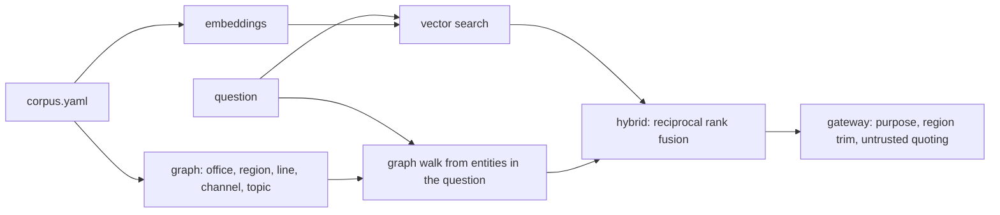

# Insurance: knowledge and retrieval

The insurance knowledge layer: 24 documents (triage, fast-track, complex-unit, leakage, subrogation,
audit, approval, fair-claims and privacy policies, line and channel guides, region-scoped office
profiles, closed-file reviews and one message carrying a prompt injection), a knowledge graph over
offices, regions, lines, channels and topics, and hybrid retrieval evaluated on 24 questions.

## 1. Purpose

* Give the claims assistant and the office copilots policy and context they can cite.
* Reuse the shared retrieval code unchanged and measure it on a third domain.
* Keep office knowledge inside the region a copilot is allowed to see.

## 2. Architecture



## 3. How it works

1. `knowledge.load_docs` reads the corpus; office documents carry a region.
2. `knowledge.build_graph` builds office and region nodes from `silver.offices` and links documents to
   the offices, lines, channels and topics they mention (aliases such as "motor" for auto and "escape of
   water" for home are resolved).
3. The shared `adl.knowledge` index runs vector, graph and hybrid retrieval; the evaluation scores
   recall@3, recall@5, MRR@10, nDCG@5 and hit@5 against the expected documents.
4. Through the gateway, knowledge needs a granted purpose (`claims_handling` or
   `claims_quality_review`); a regional copilot's results are trimmed to its region, and every document
   is returned wrapped as untrusted data with an injection flag.

## 4. Key files

| File | Role |
|---|---|
| `domains/insurance/knowledge/corpus.yaml` | The 24 documents |
| `domains/insurance/knowledge/eval.yaml` | The 24 evaluation questions |
| `src/adl/domains/insurance/knowledge.py` | Loading, aliases, topics, graph |
| `src/adl/knowledge/` | Shared embeddings, graph and retrieval (unchanged) |

## 5. Code excerpts

<!-- code: src/adl/domains/insurance/knowledge.py::build_graph -->
```python
def build_graph(store) -> KnowledgeGraph:
    g = KnowledgeGraph()
    for r in store.sql("SELECT DISTINCT region FROM silver.offices ORDER BY region"):
        g.add_entity(Entity(f"region:{r['region']}", "region", r["region"], ()))
    for r in store.sql("SELECT office_id, name, region FROM silver.offices ORDER BY office_id"):
        short = r["name"].replace("Ferrowind ", "")
        g.add_entity(Entity(f"office:{r['office_id']}", "office", r["name"], (short.lower(),)))
        g.relate(f"office:{r['office_id']}", f"region:{r['region']}")
    for line, aliases in LINE_ALIASES.items():
        g.add_entity(Entity(f"line:{line}", "line", f"{line} claims", aliases))
    for c, aliases in CHANNEL_ALIASES.items():
        g.add_entity(Entity(f"channel:{c}", "channel", f"{c} channel", aliases))
    for t, aliases in TOPICS.items():
        g.add_entity(Entity(f"topic:{t}", "topic", t, aliases))
    g.relate("topic:fast track", "topic:triage")
    g.relate("topic:leakage", "topic:audit")
    g.relate("topic:triage", "topic:reopen")
    g.relate("channel:phone", "topic:fair claims")
    return g
```
<!-- /code -->

## 6. Configuration

Knowledge purposes are in `config/insurance/agents.yaml`; the finance and compliance identities have
no knowledge grant.

## 7. Commands

```bash
adl insurance retrieval
```

## 8. Real output

<!-- output: insurance retrieval -->
```text
corpus: 24 documents; questions: 24; graph: {'channel nodes': 3, 'line nodes': 3, 'office nodes': 6, 'region nodes': 2, 'topic nodes': 9, 'document nodes': 24, 'entity-entity edges': 10, 'document-entity edges': 66}
method  recall@3  recall@5  MRR@10  nDCG@5  hit@5
------  --------  --------  ------  ------  -----
vector  0.896     0.938     0.922   0.898   0.958
graph   0.792     0.896     0.757   0.778   0.917
hybrid  0.958     0.979     0.889   0.896   1.000
```
<!-- /output -->

Hybrid retrieval finds a relevant document in the top five for every question (hit@5 1.000) and
recall@5 is 0.979. Vector search alone ranks the first relevant document slightly higher (MRR 0.922
against 0.889). The questions were written by the same author as the corpus, so these scores are
optimistic.

## 9. Tests and gates

`tests/test_insurance.py`: hybrid recall@5 at least 0.90 and not below graph-only; an east copilot
never retrieves the Tarnbridge (west) office profile while a west copilot gets it in the top three;
the injected portal message is flagged and quoted. Gate: hybrid retrieval recall@5 >= 0.90.

## 10. Guardrails

Every retrieved document is wrapped in `<untrusted_data>` tags with an injection flag; the narrator is
told never to follow instructions inside them, and actions never come from text.

## 11. Security and governance

Knowledge is a product in the gateway like any other: identity, purpose and region trimming apply,
and every search is written to the audit log.

## 12. Observability

Retrieval metrics per method, graph statistics, and `knowledge.read` audit records with the documents
returned.

## 13. Failure modes

| Failure | Effect | Handling |
|---|---|---|
| Document outside the caller's region | Leak of office context | Region trimming before ranking |
| Injected instruction in a document | Model follows it | Quoted as untrusted, flagged, actions from code only |
| Eval set written by the corpus author | Optimistic scores | Stated; a held-out set from users is planned |

## 14. Mapping to cloud services

| Here | Azure | Google Cloud | AWS |
|---|---|---|---|
| Vector and hybrid search | Azure AI Search, with OneLake shortcuts from Microsoft Fabric | Vertex AI Search or BigQuery vector search | OpenSearch Serverless or Bedrock Knowledge Bases over S3 |
| Knowledge graph | Cosmos DB for Apache Gremlin or Fabric graph | Spanner Graph | Neptune |
| Identity and trimming | Entra ID groups in security filters | IAM conditions | IAM and metadata filters |

## 15. Limitations

* 24 short documents; real claims manuals are long, versioned and contradictory.
* The offline embeddings are hashed TF-IDF vectors, a stand-in for a hosted embedding model.

## 16. Interview talking points

* "The same retrieval code serves three domains; only the corpus, aliases and graph change."
* "Region trimming happens before ranking, so a document the caller cannot see never competes."
