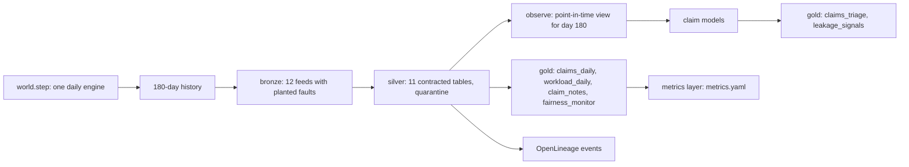

# Insurance: simulator, pipeline, contracts and metrics

The claims operation of the fictional Ferrowind Insurance, simulated day by day, landed as twelve
bronze feeds with planted faults, conformed to eleven silver tables under contracts, and published as
gold data products with quality checks, OpenLineage events and a governed metrics layer. The silver
point-in-time view is tested to equal what the simulator's policies see.

## 1. Purpose

* Give the claims models and the assistant a realistic, reproducible history: 180 days of first notice
  of loss, queue assignments, claim events, payment requests, payments, audits and subrogation.
* Keep the hidden truth (true complexity, true cost, overpayment propensity, third-party fault) out of
  every table, so a model can only learn what an insurer could observe.
* Carry a synthetic postcode proxy group so outcomes can be checked for unfair discrimination, without
  the group ever reaching a model or an agent.

## 2. Architecture



## 3. How it works

1. **One engine for history and forecast.** `world.step` plays a day: new claims are reported, the next
   morning a policy assigns each to fast track, standard or the complex unit, each queue works first in,
   first out within its adjuster-days after a minimum wait (1, 6 and 12 days), finished claims wait one
   night for payment, the policy chooses leakage reviews and subrogation referrals, and six paid claims
   are audited at random.
2. **What goes wrong today.** A complex claim sent to fast track is escalated after its first
   assessment and starts again at the back of the complex queue. A complex claim handled in standard
   closes but is more likely to be reopened. Fast-track payments leak more.
3. **The proxy group.** Each of 40 postcode districts belongs to group G1 or G2 (15 districts are G2).
   The group has no effect on true complexity, cost or leakage. It is correlated with reporting a loss
   later and by phone, which is how a model that uses report lag could end up treating groups
   differently. Only `silver.postcode_groups` (restricted) carries it.
4. **Bronze with faults.** First notice is resent by intake retries (30 duplicates, removed by
   `ingest_seq`), sandbox test claims and impossible records arrive (7, quarantined), orphan claim events
   (6) and payment requests (3) are quarantined. Claimant names, e-mails and phones are in `fnol` only.
5. **Silver** applies each contract: types, keys, ranges, accepted values and referential checks; bad
   rows go to `silver.quarantine_<table>`. Notes are redacted for contact details and claimant names and
   screened for injection patterns.
6. **Gold.** `claims_daily` (one row per day, region, line and queue, including the random audits'
   overpayments and missed recoveries), `workload_daily` (ready work per queue and the spread between
   queues), `claim_notes`, and `fairness_monitor` (selection rates per decision and group). The model
   products `claims_triage` and `leakage_signals` are written in the runtime after the models are fitted.
7. **Point-in-time view.** `pipeline.observe` rebuilds, from silver only, the claims waiting for a queue
   and for payment on the morning of day 180. A test checks every field equals the simulator's own view.

## 4. Key files

| File | Role |
|---|---|
| `src/adl/domains/insurance/world.py` | The simulated insurer, `step`, `View`, the current rules |
| `src/adl/domains/insurance/synth.py` | History, synthetic claimants, bronze feeds and planted faults |
| `src/adl/domains/insurance/pipeline.py` | Bronze, silver, gold SQL, `observe` |
| `domains/insurance/contracts/` | 11 silver and 7 gold contracts |
| `domains/insurance/metrics.yaml` | KPI definitions, including audit-scaled leakage |

## 5. Code excerpts

<!-- code: src/adl/domains/insurance/world.py::CurrentRules -->
```python
class CurrentRules(Policy):
    """How Ferrowind works today: injury, commercial or an estimate above $15,000 goes to the complex unit,
    an estimate below $3,000 to fast track, everything else to standard; review the largest proposed
    payments; refer to subrogation only the claims the intake desk flagged as third party, largest first."""

    name = "current rules"

    def decide(self, v: View) -> Decision:
        est, inj, line = v.part("new", v.estimate), v.part("new", v.injury), v.part("new", v.line)
        q = np.where((inj == 1) | (line == LINES.index("commercial")) | (est > 15000), CX, np.where(est < 3000, FT, STD))
        order = np.lexsort((v.pay, -v.proposed))
        reviews = v.pay[order[:REVIEW_CAPACITY]]
        flagged = [i for i in order if v.part("pay", v.tp_flag)[i] == 1]
        return Decision(q, reviews, v.pay[np.array(flagged[:REFERRAL_CAPACITY], int)])
```
<!-- /code -->

## 6. Configuration

Simulation constants live in `world.py` (claims per day, capacity per queue, minimum waits, review and
referral capacity and cost, recovery share, reopen cost). The seed is `synth.SEED`. Contracts and
`metrics.yaml` are configuration; code reads them.

## 7. Commands

```bash
adl insurance run
adl insurance quality
adl insurance lineage
adl insurance metrics
adl insurance value-case
```

## 8. Real output

<!-- output: insurance run -->
```text
bronze: 12 source tables, 77,711 rows
silver: 11 products, 77,125 rows, all passed: True
gold: 7 products, 3,567 rows, all passed: True
duplicate first-notice records removed (intake retries): 30
quarantined rows: 16 (claim_events 6, claims 7, payment_requests 3)
lineage events: 60
on the as-of morning: 52 new claims waiting for a queue, 47 claims waiting for payment
```
<!-- /output -->

<!-- output: insurance quality -->
```text
product                   rows   quarantined  completeness  checks  failed  result
------------------------  -----  -----------  ------------  ------  ------  ------
gold.claim_notes          24     0            100.00%       10      -       pass
gold.claims_daily         3240   0            100.00%       21      -       pass
gold.claims_triage        52     0            100.00%       17      -       pass
gold.fairness_monitor     8      0            100.00%       10      -       pass
gold.leakage_signals      47     0            100.00%       16      -       pass
gold.value_ledger         16     0            100.00%       12      -       pass
gold.workload_daily       180    0            100.00%       8       -       pass
silver.audits             1062   0            100.00%       10      -       pass
silver.claim_events       33222  6            99.98%        10      -       pass
silver.claim_notes        24     0            100.00%       12      -       pass
silver.claims             8400   7            99.92%        31      -       pass
silver.offices            6      0            100.00%       6       -       pass
silver.payment_requests   8050   3            99.96%        12      -       pass
silver.payments           8003   0            100.00%       13      -       pass
silver.policies           8400   0            100.00%       9       -       pass
silver.postcode_groups    40     0            100.00%       5       -       pass
silver.queue_assignments  8929   0            100.00%       10      -       pass
silver.subrogation        989    0            100.00%       9       -       pass
```
<!-- /output -->

<!-- output: insurance lineage -->
```text
OpenLineage events: 60 (30 runs), validation problems: 0
upstream of gold.leakage_signals (19): bronze.fnol, bronze.offices, bronze.payment_requests, bronze.policies, bronze.postcode_groups, bronze.queue_assignments, model.claim_leakage, model.claim_subrogation, silver.claims, silver.offices, silver.payment_requests, silver.policies, silver.postcode_groups, silver.queue_assignments, source.claims-system, source.office-master, source.payments-platform, source.policy-admin, source.postcode-reference
upstream of gold.fairness_monitor (20): bronze.fnol, bronze.offices, bronze.payments, bronze.policies, bronze.postcode_groups, bronze.queue_assignments, bronze.subrogation, silver.claims, silver.offices, silver.payments, silver.policies, silver.postcode_groups, silver.queue_assignments, silver.subrogation, source.claims-system, source.office-master, source.payments-platform, source.policy-admin, source.postcode-reference, source.subrogation-unit
```
<!-- /output -->

<!-- output: insurance metrics -->
```text
region  new claims  paid  cycle days  reopen rate  escalation rate  recovered   leakage (audit-scaled)
------  ----------  ----  ----------  -----------  ---------------  ----------  ----------------------
east    4385        4211  8.23        4.54%        2.76%            $1,536,193  $3,743,723
west    3963        3792  8.26        4.35%        2.62%            $1,317,392  $3,337,258

compiled: SELECT queue AS queue, sum(audit_overpayment_usd + audit_missed_recovery_usd) * sum(paid_claims) / nullif(sum(audited_claims), 0) AS leakage_usd FROM gold.claims_daily WHERE region = ? GROUP BY queue ORDER BY queue -- params ['east']
```
<!-- /output -->

<!-- output: insurance value-case -->
```text
use case: insurance-claims-triage-leakage; window 28 days; baseline measured over the 180-day history
kpi                  baseline      target change  target      why
-------------------  ------------  -------------  ----------  ---------------------------------------------------
cycle_days           8.25          -10%           7.42        claims are paid sooner after they are reported
leakage_usd          1,101,425.02  -25%           826,068.77  fewer overpayments paid and fewer recoveries missed
reopen_rate_pct      4.45          -15%           3.78        fewer claims reopened after payment
backlog_spread_days  1.82          -20%           1.46        work is spread more evenly across the three queues
leakage is scaled to 28 days; backlog spread is the 180-day mean of gold.workload_daily.spread_days
```
<!-- /output -->

Every product passes its contract, and the planted faults are caught where they should be. The leakage
metric is an estimate: the random audits' overpayments and missed recoveries, scaled up to every paid
claim. The value case was written before the simulator. Its baselines come from this history; the KPI
results in [value-ledger.md](value-ledger.md) compare the agent with the current rules over the same
simulated 28 days. That matters for backlog spread: the 180-day mean is 1.82 days, but the complex
unit's backlog grew in the last two months of history, so the simulated current rules start at 3.76.

## 9. Tests and gates

`tests/test_insurance.py`: twelve bronze feeds; the planted faults are quarantined in the expected
counts; intake retries are removed; every product passes; claims and proxy groups are restricted and
not agent-exposed; notes carry no contact details or names; lineage reaches the sources; claims_daily
has a row per day, region, line and queue; no agent product carries a postcode or group; the silver view
equals the simulator's view; hidden traits never reach bronze; metrics compile with bound parameters;
the leakage metric equals the audit scaling. Gate: every built product passes its contract; lineage
events valid.

## 10. Guardrails

Hidden traits stay in `State.ground_truth`, read only by the simulator and the evaluation harness (a
test fails if product code reads it). The proxy group is restricted silver; only the fairness monitor
aggregates it.

## 11. Security and governance

`silver.claims` and `silver.postcode_groups` are restricted and not agent-exposed. Gold contracts
prohibit claim denial without human review, underwriting by protected characteristic and sale of data.
Contact details in notes are masked before gold.

## 12. Observability

Quality results per product (rows, quarantine, completeness, failed checks), 60 OpenLineage events
with data-quality facets, and the metrics layer that every report and agent uses.

## 13. Failure modes

| Failure | Effect | Handling |
|---|---|---|
| Intake resends first notice | Claims double-counted | Deduplicated by `ingest_seq` |
| Test or impossible claims | Bad rows in KPIs | Quarantined by contract checks |
| Events for unknown claims | Orphans | Referential check, quarantined |
| Audit sample too small | Noisy leakage estimate | Labelled as an estimate; simulated truth used for value |

## 14. Mapping to cloud services

| Here | Azure | Google Cloud | AWS |
|---|---|---|---|
| Bronze, silver, gold tables | Delta tables in OneLake via Microsoft Fabric | BigQuery datasets | Iceberg or Delta tables on S3 with Glue |
| Contracts and quality | Microsoft Purview data quality, Fabric notebooks | Dataplex data quality | Glue Data Quality |
| Lineage | Purview lineage from OpenLineage | Dataplex lineage | DataZone lineage |
| Identities | Entra ID managed identities | Service accounts | IAM roles |
| Metrics layer | Fabric semantic model | BigQuery views or Looker semantic layer | Redshift views or QuickSight datasets |

## 15. Limitations

* The insurer, its rules and its faults are written by me; real claims data is messier (partial
  payments, reserves, litigation, catastrophe events).
* Offices are statistically identical apart from their share of G2 districts.
* The leakage estimate rests on about six audits a day.

## 16. Interview talking points

* "The silver view is tested to equal the simulator's view field by field, so the models and the agent
  see exactly what an insurer could see on that morning, and nothing hidden."
* "The proxy group exists only so I can audit outcomes; it is restricted silver, never a feature, and
  only an aggregate reaches one compliance identity."
