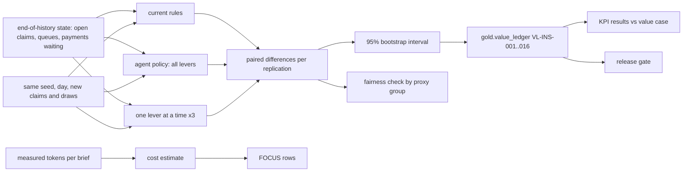

# Insurance: value ledger, cost per outcome and release gate

What the claims assistant's policy is worth against the current rules, measured by a paired forward
simulation from the real end-of-history state, with 95% intervals, per-lever attribution, KPI targets
reported hit or miss, cost per outcome in FOCUS form, and the insurance release gate.

## 1. Purpose

* Put a number with an interval on the value of each lever: queue assignment, leakage review and
  subrogation referral.
* Report the KPI targets set in the value case before any result, including the misses.
* Show the AI and platform cost next to the value, in the FinOps FOCUS format.

## 2. Architecture



## 3. How it works

1. **Replications.** 30 seeds (3000 to 3029). Each starts from the simulator's end-of-history state and
   plays days 180 to 207 once per arm with common random numbers: the same new claims and the same
   draws, so differences come from the policy.
2. **Arms.** Current rules; the agent policy with all levers; triage only, review only and referral
   only, which attribute the value.
3. **Outcomes** come from the simulator's ground truth, allowed in the evaluation harness only:
   overpayments paid, recoveries, review, referral and reopen costs, leakage (overpayments paid plus
   recoveries missed), net value (recoveries minus overpayments paid and the three costs), cycle days,
   reopen rate and backlog spread.
4. **Ledger.** For each lever and metric, both means, the mean paired change and a 95% percentile
   bootstrap interval. Written to `gold.value_ledger` and checked against its contract.
5. **KPIs.** Changes against the current rules compared with `config/insurance/value-case.yaml`,
   committed before the simulator, models or any result; a miss prints MISSED.
6. **Cost.** Tokens per brief are measured from the workflow run; one brief per office per day (6 x 28
   = 168) is priced with the assumed rates in `config/pricing.yaml` and exported as FOCUS 1.0 rows.

## 4. Key files

| File | Role |
|---|---|
| `src/adl/domains/insurance/simulate.py` | Replications, paired comparison, bootstrap, per-group counters |
| `src/adl/domains/insurance/value.py` | Value case, ledger, KPI results, cost, FOCUS |
| `src/adl/domains/insurance/report.py` | The reports and the 12 gate checks |
| `config/insurance/value-case.yaml` | KPIs and targets, written before results |

## 5. Code excerpts

<!-- code: src/adl/domains/insurance/simulate.py::play -->
```python
def play(base: W.World, start: W.State, policy: W.Policy, seed: int, name: str) -> RunResult:
    w = W.extend_world(base, seed)
    st = W.resize(start.copy(), w)
    for t in range(W.DAYS_HISTORY, W.DAYS_TOTAL):
        W.step(w, st, t, policy, seed)
    tot = st.totals
    paid = max(tot["paid"], 1)
    out = {
        "net_value_usd": tot["recoveries_usd"]
        - tot["overpayment_paid_usd"]
        - tot["review_cost_usd"]
        - tot["referral_cost_usd"]
        - tot["reopen_cost_usd"],
        "overpayment_paid_usd": tot["overpayment_paid_usd"],
        "recoveries_usd": tot["recoveries_usd"],
        "review_cost_usd": tot["review_cost_usd"],
        "referral_cost_usd": tot["referral_cost_usd"],
        "reopen_cost_usd": tot["reopen_cost_usd"],
        "leakage_usd": tot["overpayment_paid_usd"] + tot["missed_recovery_usd"],
        "cycle_days": tot["cycle_days"] / paid,
        "reopen_rate_pct": 100 * tot["reopened"] / paid,
        "backlog_spread_days": tot["backlog_spread"] / max(tot["days"], 1),
    }
    actions = {k: int(tot[k]) for k in ("assigned", "fast_tracked", "reviews", "referrals", "escalations", "paid")}
    groups = {k: float(v) for k, v in tot.items() if k.endswith(tuple(f"_{g}" for g in W.GROUPS))}
    return RunResult(name, seed, out, actions, groups)
```
<!-- /code -->

## 6. Configuration

`config/insurance/value-case.yaml` (targets: cycle days -10%, leakage -25%, reopen rate -15%, backlog
spread -20%), `config/pricing.yaml` (assumed unit rates, not quotes), `EVAL_SEEDS` in `simulate.py`.

## 7. Commands

```bash
adl insurance value
adl insurance focus --out insurance-focus.csv
adl insurance gate
adl gate               # retail, mortgage and insurance checks together
```

## 8. Real output

<!-- output: insurance value -->
```text
forward simulation: 30 replications x 28 days, common random numbers, paired 95% bootstrap intervals
ledger      lever                 metric            current rules  with agents  change     95% interval
----------  --------------------  ----------------  -------------  -----------  ---------  ----------------------
VL-INS-001  all levers            net_value         $44,439        $318,966     $274,527   [$249,068, $299,963]
VL-INS-002  all levers            overpayment_paid  $287,758       $285,122     -$2,636    [-$12,334, $7,820]
VL-INS-003  all levers            recoveries        $421,656       $710,848     $289,192   [$265,174, $313,304]
VL-INS-004  all levers            leakage           $755,447       $525,671     -$229,776  [-$251,821, -$208,525]
VL-INS-005  queue assignment      net_value         $44,439        $42,247      -$2,193    [-$25,070, $21,877]
VL-INS-006  queue assignment      overpayment_paid  $287,758       $312,070     $24,312    [$13,731, $35,575]
VL-INS-007  queue assignment      recoveries        $421,656       $445,710     $24,054    [$7,409, $42,406]
VL-INS-008  queue assignment      leakage           $755,447       $809,954     $54,507    [$38,122, $72,078]
VL-INS-009  leakage review        net_value         $44,439        $67,796      $23,357    [$19,804, $26,983]
VL-INS-010  leakage review        overpayment_paid  $287,758       $264,402     -$23,357   [-$26,983, -$19,804]
VL-INS-011  leakage review        recoveries        $421,656       $421,656     $0         [$0, $0]
VL-INS-012  leakage review        leakage           $755,447       $732,090     -$23,357   [-$26,983, -$19,804]
VL-INS-013  subrogation referral  net_value         $44,439        $273,864     $229,425   [$212,602, $246,456]
VL-INS-014  subrogation referral  overpayment_paid  $287,758       $287,758     $0         [$0, $0]
VL-INS-015  subrogation referral  recoveries        $421,656       $667,414     $245,758   [$228,716, $262,801]
VL-INS-016  subrogation referral  leakage           $755,447       $513,408     -$242,039  [-$262,736, -$222,265]

KPI targets (config/insurance/value-case.yaml), all levers vs the current rules:
kpi                  current rules  with agents  change  95% interval of the change  target  result
-------------------  -------------  -----------  ------  --------------------------  ------  ------
cycle_days           8.64           8.54         -1.1%   [-0.16, -0.03]              -10%    MISSED
leakage_usd          755,447.18     525,671.10   -30.4%  [-251,821.10, -208,524.81]  -25%    met
reopen_rate_pct      4.80           4.96         +3.3%   [+0.05, +0.25]              -15%    MISSED
backlog_spread_days  3.76           3.27         -13.0%  [-0.67, -0.29]              -20%    MISSED

activity per 28 days (mean of replications):
arm            fast_tracked  escalations  reviews  referrals  paid
-------------  ------------  -----------  -------  ---------  -------
current rules  431.6         34.6         280.0    158.6      1,282.5
agent          473.2         41.0         280.0    224.0      1,289.6
triage only    473.2         41.0         280.0    162.5      1,289.6
review only    431.6         34.6         280.0    158.6      1,282.5
referral only  431.6         34.6         280.0    224.0      1,282.5

estimated AI and platform cost for 28 days (assumed rates in config/pricing.yaml): $76
  Foundry Models: $0.12 (168 briefs)
  Azure Container Apps: $0.76 (25,200 vCPU-seconds)
  Azure AI Search: $70.00 (28 days)
  Storage: $4.67 (28 days)
  prompt 569 tokens and output 306 tokens per brief (measured), 168 briefs
cost per $1,000 of net value: $0.28; per action: $0.0420 (1,800 actions)
value after cost: $274,451 per 28 days (30-replication mean)
```
<!-- /output -->

<!-- output: insurance focus -->
```text
FOCUS 1.0 rows: 112 (29 columns), services: Azure AI Search, Azure Container Apps, Foundry Models, Storage
total EffectiveCost: $75.54; tags: {"domain": "insurance", "env": "simulation", "use-case": "insurance-claims-triage-leakage", "value-ledger": "VL-INS-001"}
```
<!-- /output -->

<!-- output: insurance gate -->
```text
check                                                  result  detail
-----------------------------------------------------  ------  --------------------------------------------------
every built product passes its contract                pass    18/18
lineage events valid                                   pass    60 events
leakage and subrogation models beat their rules (AUC)  pass    leakage 0.762 vs 0.527; subrogation 0.962 vs 0.708
hybrid retrieval recall@5 >= 0.90                      pass    0.979
every access attack stopped                            pass    14/14
no claimant PII in agent-exposed products              pass    0 rows
audit chain verifies and detects tampering             pass    14 records verified
no injected action ever executed                       pass    4 configurations
nothing above a threshold executed without a person    pass    0 violations
net value interval above zero                          pass    [$249,068, $299,963]
KPI targets reported (hit or miss)                     pass    1/4 met
fairness results reported (hit or miss)                pass    history 4/4, forward 8/8 within limits

insurance gate: PASS (12/12)
```
<!-- /output -->

All levers together add $274,527 of net value over 28 days, with a 95% interval of $249,068 to
$299,963. Almost all of it comes from subrogation referral ($229,425): the model refers claims that
are recoverable even when the intake desk did not tick the third-party box. The leakage review adds
$23,357 at the same review capacity. Queue assignment adds nothing measurable (-$2,193, interval
-$25,070 to $21,877): it sends more claims to fast track, which leaks more ($24,312 more overpayment
paid), and that cancels the benefit.

One of four targets is met. Leakage fell 30.4% against a 25% target. Cycle time fell only 1.1% against
10%, backlog spread fell 13.0% against 20%, and the reopen rate rose 3.3% where the target was a 15%
fall. The likely cause: the capacity guards keep most likely-complex claims in standard because the
complex unit is full, and complex claims handled in standard reopen more. The cost estimate is $76
for 28 days, $0.28 per $1,000 of net value.

## 9. Tests and gates

`tests/test_insurance.py`: 16 ledger rows; every change inside its interval with 30 replications; the
net-value interval above zero; the three net-value rows are the ones the dry runs link to; KPI results
follow the value case; the ledger product is written and passes its contract; the simulation is
deterministic and leaves the start state untouched; the cycle-days baseline comes from the metrics
layer; FOCUS rows sum to the estimate; every `adl insurance` step runs; the gate passes. The insurance
gate adds 12 checks to retail's 15 and mortgage's 11, so `adl gate` runs 38.

## 10. Guardrails

Targets live in config committed before results and are reported whether hit or missed; the gate checks
that they are reported, not that they are met. Triage thresholds were chosen on separate tuning seeds.

## 11. Security and governance

`gold.value_ledger` is granted to the finance identity only, for value reporting.

## 12. Observability

Ledger rows with intervals; KPI results with the interval of each change; activity per arm; cost per
action and per $1,000 of value; FOCUS rows tagged with the use case and ledger row.

## 13. Failure modes

| Failure | Effect | Handling |
|---|---|---|
| Unpaired comparison | Noise swamps the effect | Common random numbers; paired bootstrap |
| Targets edited after results | Overstated success | Targets committed first; misses printed and tested |
| Thresholds tuned on reported seeds | Overstated value | Disjoint tuning seeds |
| Simulator assumptions wrong | Value overstated | Labelled as simulated; pilot with holdout planned |

## 14. Mapping to cloud services

| Here | Azure | Google Cloud | AWS |
|---|---|---|---|
| Simulation batch | Microsoft Fabric notebook or Azure Batch | BigQuery with Cloud Run jobs | AWS Batch with results on S3 |
| Ledger table | OneLake Delta table | BigQuery table | S3 table in Glue |
| Cost export | Cost Management FOCUS export | Cloud Billing export to BigQuery | Cost and Usage Report (FOCUS) on S3 |
| Finance identity | Entra ID group with Fabric workspace role | IAM group | IAM role with Lake Formation grant |

## 15. Limitations

* The value is simulated in a world I wrote; recovery rates, overpayment shares and reopen effects are
  assumptions. A pilot with a holdout would be needed to measure real value.
* The value-case baselines (180-day history, audit-scaled leakage) differ from the simulated current
  rules over the 28-day window; KPI results compare like with like (simulation against simulation).
* The simulation assumes every proposal is approved, while the simulated team lead rejects some.

## 16. Interview talking points

* "+$274,527 net over 28 days, interval $249,068 to $299,963, and I missed three of four targets,
  including a reopen rate that got worse. The targets were committed before the simulator existed."
* "Attribution changed what I would pitch: subrogation is the business case; triage is not, at today's
  complex-unit capacity."
