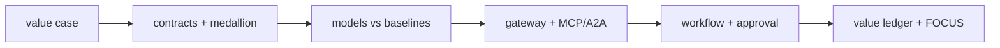

# Interview guide

How I explain this project in two minutes, ten minutes, and when asked hard questions. Every number
comes from [metrics.md](metrics.md).

## Two-minute version

"I took an MIT Sloan article on why AI projects fail to create value and built the opposite for one
decision: what a grocer should order and mark down each night. It starts with a value case and
measured baselines, then data contracts and a bronze/silver/gold lakehouse, then models that are
backtested against what store teams do today. Agents only reach data through a gateway that checks
identity, purpose, row and column scope, and audits everything; the same gateway is exposed over MCP
and A2A. A Microsoft Agent Framework workflow lets code decide the actions, the model only writes the
brief, and a store manager approves anything above a threshold. A forward simulation says the agents
add about $9,700 per 28 days for eight stores after an estimated $76 of AI and platform cost, and it
also says they miss the stockout target, which I report rather than hide. Terraform for Azure, Google
Cloud and AWS is tested in CI but nothing is deployed."

## Ten-minute walkthrough

| Step | Show | Point to make |
|---|---|---|
| Value case | `adl value-case` | Baselines are measured from gold, not assumed |
| Data | `adl run`, `adl quality` | 48 duplicates removed, 19 rows quarantined, never silently dropped |
| Insight | `adl forecast`, `adl stockout` | WAPE 31.9% vs 35.8% best baseline; AUC 0.791 but not calibrated |
| Safety | `adl access`, `adl injection` | 14/14 attacks stopped; injected actions executed: 0 |
| Action | `adl agents` | 185 actions, 41 to a person, 4 rejected |
| Value | `adl value` | +$9,678 [9,531; 9,830]; 4 of 5 targets met |
| Gate | `adl gate` | 26 checks (15 retail, 11 mortgage); CI fails on any |

## Questions I expect

| Question | Answer |
|---|---|
| Why should I trust a simulated value? | I do not ask you to trust the level; I ask you to trust the method. Same randomness for both policies, 30 replications, intervals, policy tuned on different seeds, ground truth used only for scoring. The ledger is designed to receive real A/B results. |
| Why not let the LLM decide orders? | Orders are arithmetic on a forecast with constraints; code does that reliably and testably. The model's value is explaining the plan to a busy manager. If it tries to change the plan, the brief is replaced. |
| What happens with prompt injection? | I measured it with a deliberately gullible model: with quoting off it obeys 3 of 3 injected notes, but the validator catches all three and no injected action ever executes in any configuration. |
| Why did the stockout target fail? | Better ordering recovers lost sales (-37.6%) but the share of days a shelf ends empty barely moves. Raising safety stock fixes stockouts but loses money in a simulator that does not model customers who leave; that is the next modelling step. |
| How is personal data protected? | Identifiers are split into a restricted table at silver, the rest is pseudonymised, segments need 10 members, notes are redacted, and a scan finds 0 PII rows in anything an agent can read. |
| How does this scale beyond one domain? | Everything in `src/adl/core` is domain-neutral. Mortgage was added as a second built domain on the same core (AUC 0.730 against 0.462 for the expiry rule; +$193,003 per 28 days, 1 of 4 targets met); insurance and healthcare have contracts and a registry entry. |
| Why three clouds? | To show the data layer and its controls are portable: the same storage interface, OIDC-only CI, least-privilege identities. Azure is primary. |
| What is not done? | Hosting, a live executor, Purview registration, calibrated probabilities. They are listed as planned in the README. |

## Bugs I found by measuring

* The first stockout model was barely better than the rule (AUC 0.618). Counting each delivery from
  the day after it is due and modelling risk day by day raised AUC to 0.791 and F1 from below the rule
  to 39.8% vs 25.8%.
* A north copilot filtering on a south store got an empty result instead of a denial; the row scope
  now applies to both region and store columns, so the attempt is refused and audited.
* The tuning grid preferred a lower perishable service level that earned about $830 more but recovered
  about $4,500 less in lost sales; I chose the other setting and wrote down why
  ([ADR 0004](adr/0004-policy-tuning.md)).
