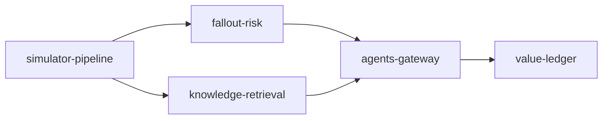

# docs/mortgage

The mortgage domain for the fictional Quillmere Home Loans: which locked applications get the loan
officers' calls and the processors' document chases, and which expiring locks are worth extending.
Built on synthetic data with the shared platform; nothing is deployed. Each document has the same 16
sections as the retail component docs, and every output block is regenerated from the code by
`scripts/render_docs.py` (CI fails if one drifts).

| File | What it does |
|---|---|
| `simulator-pipeline.md` | Simulator, bronze feeds with planted faults, silver, gold, contracts, quality, lineage, metrics |
| `fallout-risk.md` | The 14-day fallout model and its backtest against the expiry rule |
| `knowledge-retrieval.md` | Corpus, graph and hybrid retrieval with its evaluation |
| `agents-gateway.md` | The pipeline assistant, digest-bound approval, dry run, gateway security, injection |
| `value-ledger.md` | Paired forward simulation, value ledger with intervals, KPI results, cost, FOCUS, gate |

## What is built and what is planned

| Piece | Status |
|---|---|
| Simulator, bronze/silver/gold, 15 contracts, quality, lineage, metrics layer | Built |
| Fallout-risk model with backtest | Built |
| Knowledge corpus, graph, hybrid retrieval and eval set | Built |
| Assistant on the shared approval workflow, gateway identities, attack suite | Built |
| Value ledger, KPI results, cost and FOCUS export, 11 gate checks | Built |
| MCP and A2A serving for mortgage | Planned (retail only today) |
| Live execution against an origination system or dialler | Planned (dry run only) |
| Fair-lending outcome testing | Planned |
| Cloud deployment | Written, not run (shared IaC; nothing is deployed) |

## Business model mapping (MIT CISR)

MIT CISR's four business models are described in the
[MIT Sloan article](https://mitsloan.mit.edu/ideas-made-to-matter/what-leaders-still-get-wrong-about-ai)
by Beth Stackpole; the descriptions below are my paraphrase and the mapping is my own.

| Model (paraphrased) | Quillmere Home Loans example | What the data layer provides | Status |
|---|---|---|---|
| Existing+: AI improves today's model | Loan officers and processors spend the same capacity on the locks most likely to fall out | Pipeline data products, fallout risk, assistant with approval, value ledger | Built |
| Customer Proxy: AI runs a set process for the customer | A borrower-side assistant that keeps a file moving (documents, lock decisions) within limits the borrower sets | The same products per borrower; a borrower-consented purpose would be added to the contracts | Planned (design only) |
| Modular Creator: reusable modules combined per goal | Home-buying bundles: mortgage, insurance and moving services assembled per buyer | Contracted data products as modules; the knowledge graph links products and channels | Planned (design only) |
| Orchestrator: an ecosystem assembled by AI | Brokers, appraisers, title and insurance partners coordinated around a closing | A2A under each partner's identity and purpose (built for retail, planned for mortgage) | Planned |

Mortgage starts at Existing+ for the same reason retail does: it is where value can be measured now,
and it builds the governed products, gateway and ledger the other models depend on.
