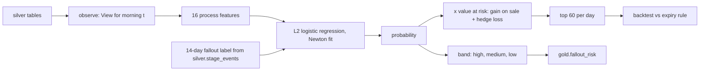

# Mortgage: fallout-risk model

The probability that an active rate lock falls out (withdrawn, expired and walked away, or denied)
within 14 days, from process signals only, compared with today's rule of calling whoever is within ten
days of lock expiry, closest first.

## 1. Purpose

* Spend the same 60 calls a day on the locks most likely to fall out and worth the most, instead of
  the locks closest to expiry.
* Explain each score with the largest driver, so a loan officer knows why the call matters.
* Keep the model out of credit: no credit attribute, protected characteristic or proxy for one is a
  feature, and the product's contract prohibits credit decisioning.

## 2. Architecture



## 3. How it works

1. **Features** (`risk.FEATURES`): days to expiry, whether expiry is within ten days, rate gap and how
   far the market sits below the lock (in basis points), documents outstanding and how fast the
   borrower returns them, days since contact and unanswered calls in the last 7 days, stage and days
   in stage, extensions, and indicators for refinance, broker, direct, FHA/VA and jumbo.
2. **Labels**: for an origin day t, a lock active that morning is labelled 1 if silver records a
   withdrawal, expiry walk-away or denial on days t..t+13.
3. **Model**: standardised features, L2-regularised logistic regression fitted by Newton's method in
   numpy. The driver shown for each lock is the feature with the largest contribution, described on
   the side of the average it actually sits ("market below the lock", "no contact for days"), or "no
   single driver" when nothing stands out.
4. **Backtest**: train on origins 30..136 (labels end on day 149), score origins 150..165 (labels end
   on day 178), so no test outcome is seen in training. Both methods pick 60 locks a day: the model by
   probability times value at risk, the rule by days to expiry within ten days.
5. **Production fit** uses every origin whose 14-day outcome is observed (30..166) and scores the
   as-of morning into `gold.fallout_risk`, with bands at 0.15 (high) and 0.05 (medium).

## 4. Key files

| File | Role |
|---|---|
| `src/adl/domains/mortgage/risk.py` | Features, drivers, model, labels, AUC, backtest |
| `src/adl/domains/mortgage/runtime.py` | Builds `gold.fallout_risk` from the production fit |
| `domains/mortgage/contracts/gold.fallout_risk.yaml` | Contract: columns, bands, purposes, prohibited uses |

## 5. Code excerpts

<!-- code: src/adl/domains/mortgage/risk.py::FalloutModel -->
```python
@dataclass
class FalloutModel:
    mean: np.ndarray
    scale: np.ndarray
    coef: np.ndarray
    intercept: float

    @classmethod
    def fit(cls, X: np.ndarray, y: np.ndarray, l2: float = 1.0, iters: int = 25) -> FalloutModel:
        mean, scale = X.mean(0), X.std(0) + 1e-9
        Z = np.column_stack([np.ones(len(X)), (X - mean) / scale])
        w = np.zeros(Z.shape[1])
        reg = np.full(Z.shape[1], l2)
        reg[0] = 0.0
        for _ in range(iters):
            p = 1 / (1 + np.exp(-Z @ w))
            g = Z.T @ (p - y) + reg * w
            H = (Z * (p * (1 - p))[:, None]).T @ Z + np.diag(reg)
            step = np.linalg.solve(H, g)
            w -= step
            if np.abs(step).max() < 1e-8:
                break
        return cls(mean, scale, w[1:], float(w[0]))

    def predict(self, X: np.ndarray) -> np.ndarray:
        return 1 / (1 + np.exp(-(self.intercept + ((X - self.mean) / self.scale) @ self.coef)))

    def drivers(self, X: np.ndarray) -> list[str]:
        """The feature that pushes each row's risk up the most (coefficient x standardised value), named only
        when the value sits on the side of the average that its label describes."""
        z = (X - self.mean) / self.scale
        names = list(FEATURES)
        keep = [names.index(k) for k in DRIVERS]
        side = np.array([DRIVERS[names[j]][1] for j in keep])
        contrib = (z * self.coef)[:, keep]
        contrib = np.where((np.sign(z[:, keep]) == side) & (contrib > 0), contrib, -np.inf)
        best = np.argmax(contrib, 1)
        return [DRIVERS[names[keep[b]]][0] if np.isfinite(contrib[i, b]) else "no single driver" for i, b in enumerate(best)]
```
<!-- /code -->

## 6. Configuration

`HORIZON` (14 days), the train, test and production origins, and the band cut-offs are constants in
`risk.py`. The daily call capacity (60) comes from `config/mortgage/policy.yaml`.

## 7. Commands

```bash
adl mortgage risk
```

## 8. Real output

<!-- output: mortgage risk -->
```text
backtest: 16 daily origins, 10,754 active locks scored, 14-day fallout rate 4.7%
each method picks the 60 locks the loan officers can call per day
method                         AUC    precision@60  recall@60  value at risk covered  Brier
-----------------------------  -----  ------------  ---------  ---------------------  ------
fallout model                  0.730  16.6%         31.2%      51.6%                  0.0429
within 10 days, closest first  0.462  3.0%          5.7%       6.9%                   0.0463
Brier for the rule is the base-rate forecast (the rule gives no probability)

gold.fallout_risk: high 58, medium 201, low 473
```
<!-- /output -->

With the same 60 calls a day, the model's picks include 16.6% of locks that went on to fall out against
3.0% for the rule, and cover 51.6% of the value at risk against 6.9%. The rule's AUC is below 0.5:
in this world fallout is driven by the market moving below the lock and by silence, not by closeness to
expiry, and locks near expiry are often nearly finished. The model's Brier score (0.0429) is a little
better than always predicting the base rate (0.0463), so the probabilities are usable for ranking and
roughly calibrated, but the fallout rate is low and most high-band locks still close.

## 9. Tests and gates

`tests/test_mortgage.py`: the model beats the rule on AUC, precision and value covered; training
never sees a test outcome; no credit or protected attribute is a feature; probabilities are in [0, 1]
and drivers come from the known list; the logistic fit recovers a known signal; AUC handles ties.
Gate: "fallout model beats the expiry rule (AUC and precision@60)".

## 10. Guardrails

The score only changes who gets a call or a chase; it never declines, prices or conditions a loan. The
brief instructions forbid comments on creditworthiness.

## 11. Security and governance

`gold.fallout_risk` carries branch and region for row-level security; the branch copilots cannot see
`value_at_risk_usd` (column denied). Prohibited purposes in the contract: credit decisioning, pricing by
protected characteristic, sale of data to third parties; the gateway refuses them for every identity.

## 12. Observability

AUC, precision and recall at capacity, value at risk covered and Brier on realised outcomes; the band
mix on each scoring day.

## 13. Failure modes

| Failure | Effect | Handling |
|---|---|---|
| Rate environment shifts | Rate-gap effect changes | Refit on recent origins; backtest each refit |
| Scores used for credit | Unlawful use | Prohibited purpose in the contract, refused by the gateway |
| A driver label misleads | Wrong conversation with the borrower | Sign-aware labels; "no single driver" fallback |

## 14. Mapping to cloud services

| Here | Azure | Google Cloud | AWS |
|---|---|---|---|
| Batch build and scoring | Microsoft Fabric notebook or Spark job | BigQuery scheduled queries or Dataproc | Glue job or SageMaker processing over S3 |
| Tables and data products | Delta tables in OneLake | BigQuery datasets | Glue tables over S3, queried by Athena |
| Agent identities | Entra ID agent identities and managed identities | Service accounts with Workload Identity Federation | IAM roles |
| Workflow and model | Microsoft Agent Framework on Azure Container Apps with Foundry Models | Vertex AI Agent Engine with Gemini | Bedrock Agents |
| Audit and lineage | Microsoft Purview and Log Analytics | Dataplex lineage and Cloud Logging | CloudTrail and DataZone lineage |

## 15. Limitations

* One synthetic history and one test window of 16 origins; the interval on AUC is not computed.
* The model is linear; interactions (for example rate gap by purpose) are only partly captured by the
  indicator features.
* Fair-lending review (disparate impact testing on outcomes) is planned, not built; the data has no
  protected attributes to test with.

## 16. Interview talking points

* "Today's rule scores below random as a predictor (AUC 0.462): the files closest to expiry are often
  the ones about to close. Same capacity, ranked by risk times value, covers 51.6% of value at risk
  instead of 6.9%."
* "My first driver labels said 'stalled in stage' for files that had just moved; a negative coefficient
  had flipped the meaning. The labels now describe the side of the average the lock is on."
