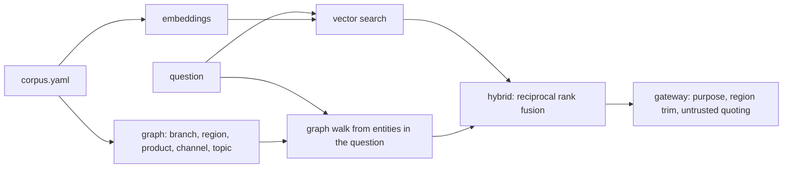

# Mortgage: knowledge and retrieval

The mortgage knowledge layer: 24 documents (lock and extension policy, product and channel playbooks,
region-scoped branch notes and one message carrying a prompt injection), a knowledge graph over
branches, regions, products, channels and topics, and hybrid retrieval evaluated on 24 questions.

## 1. Purpose

* Give the assistant and the branch copilots policy and context they can cite.
* Reuse the shared retrieval code unchanged and measure it on the new domain.
* Keep branch knowledge inside the region a copilot is allowed to see.

## 2. Architecture



## 3. How it works

1. `knowledge.load_docs` reads the corpus; branch documents carry a branch and region.
2. `knowledge.build_graph` links documents to the branches, regions, products, channels and topics
   they mention (product and channel aliases such as "FHA" and "broker" are resolved).
3. The shared `adl.knowledge` index runs vector, graph and hybrid retrieval; the evaluation scores
   recall@3, recall@5, MRR@10, nDCG@5 and hit@5 against the expected documents.
4. Through the gateway, knowledge needs a granted purpose; a regional copilot's results are trimmed to
   its region, and every document is returned wrapped as untrusted data with an injection flag.

## 4. Key files

| File | Role |
|---|---|
| `domains/mortgage/knowledge/corpus.yaml` | The 24 documents |
| `domains/mortgage/knowledge/eval.yaml` | The 24 evaluation questions |
| `src/adl/domains/mortgage/knowledge.py` | Loading, aliases, topics, graph |
| `src/adl/knowledge/` | Shared embeddings, graph and retrieval (unchanged) |

## 5. Code excerpts

<!-- code: src/adl/domains/mortgage/knowledge.py::build_graph -->
```python
def build_graph(store) -> KnowledgeGraph:
    g = KnowledgeGraph()
    for r in store.sql("SELECT DISTINCT region FROM silver.branches ORDER BY region"):
        g.add_entity(Entity(f"region:{r['region']}", "region", r["region"], ()))
    for r in store.sql("SELECT branch_id, name, region FROM silver.branches ORDER BY branch_id"):
        short = r["name"].replace("Quillmere ", "")
        g.add_entity(Entity(f"branch:{r['branch_id']}", "branch", r["name"], (short.lower(),)))
        g.relate(f"branch:{r['branch_id']}", f"region:{r['region']}")
    for r in store.sql("SELECT product FROM silver.products ORDER BY product"):
        g.add_entity(Entity(f"product:{r['product']}", "product", r["product"], PRODUCT_ALIASES.get(r["product"], ())))
    for c, aliases in CHANNEL_ALIASES.items():
        g.add_entity(Entity(f"channel:{c}", "channel", f"{c} channel", aliases))
    for t, aliases in TOPICS.items():
        g.add_entity(Entity(f"topic:{t}", "topic", t, aliases))
    g.relate("topic:extension", "topic:relock")
    g.relate("topic:extension", "topic:approval")
    g.relate("product:jumbo", "topic:extension")
    g.relate("channel:broker", "topic:rate drop")
    return g
```
<!-- /code -->

## 6. Configuration

Knowledge purposes are in `config/mortgage/agents.yaml` (`pipeline_management`, `branch_operations`);
the finance identity has no knowledge grant.

## 7. Commands

```bash
adl mortgage retrieval
```

## 8. Real output

<!-- output: mortgage retrieval -->
```text
corpus: 24 documents; questions: 24; graph: {'branch nodes': 6, 'channel nodes': 3, 'product nodes': 5, 'region nodes': 2, 'topic nodes': 8, 'document nodes': 24, 'entity-entity edges': 10, 'document-entity edges': 63}
method  recall@3  recall@5  MRR@10  nDCG@5  hit@5
------  --------  --------  ------  ------  -----
vector  0.875     0.938     0.927   0.891   1.000
graph   0.833     0.896     0.844   0.844   0.917
hybrid  0.896     0.979     0.951   0.932   1.000
```
<!-- /output -->

Hybrid retrieval finds the expected document in the top five for 97.9% of expected documents and
every question has at least one hit in the top five. The graph alone has no hit in the top five for
two of the 24 questions (hit@5 0.917).

## 9. Tests and gates

`tests/test_mortgage.py`: hybrid recall@5 at least 0.9 and not below the graph; the north copilot
never retrieves a south branch document while the south copilot gets it first; the injected message
is flagged and quoted. Gate: "hybrid retrieval recall@5 >= 0.90".

## 10. Guardrails

Every retrieved text is wrapped in `<untrusted_data>` and screened; the brief validator ignores
anything a document asks for, because actions come only from code.

## 11. Security and governance

Region trimming uses the same row scope as data products; knowledge reads are audited.

## 12. Observability

The five retrieval metrics per method; knowledge denials in the audit log.

## 13. Failure modes

| Failure | Effect | Handling |
|---|---|---|
| The graph walk finds nothing useful | Graph retrieval misses | Hybrid fusion still ranks the vector hits |
| A document carries instructions | Model could be misled | Quoting, injection flag, brief validator |
| Branch notes leak across regions | Over-sharing | Region trim at the gateway, tested |

## 14. Mapping to cloud services

| Here | Azure | Google Cloud | AWS |
|---|---|---|---|
| Batch build and scoring | Microsoft Fabric notebook or Spark job | BigQuery scheduled queries or Dataproc | Glue job or SageMaker processing over S3 |
| Tables and data products | Delta tables in OneLake | BigQuery datasets | Glue tables over S3, queried by Athena |
| Agent identities | Entra ID agent identities and managed identities | Service accounts with Workload Identity Federation | IAM roles |
| Workflow and model | Microsoft Agent Framework on Azure Container Apps with Foundry Models | Vertex AI Agent Engine with Gemini | Bedrock Agents |
| Audit and lineage | Microsoft Purview and Log Analytics | Dataplex lineage and Cloud Logging | CloudTrail and DataZone lineage |

## 15. Limitations

* 24 documents and 24 questions written by me; real corpora are larger and messier.
* The offline embeddings are hashed TF-IDF vectors, a stand-in for a hosted embedding model.

## 16. Interview talking points

* "I reused the retrieval code unchanged and only wrote the domain's aliases and topics; hybrid
  recall@5 is 0.979 on 24 questions."
* "Region trimming is the same row-scope rule as for tables, so a branch copilot cannot read another
  region's branch notes."
