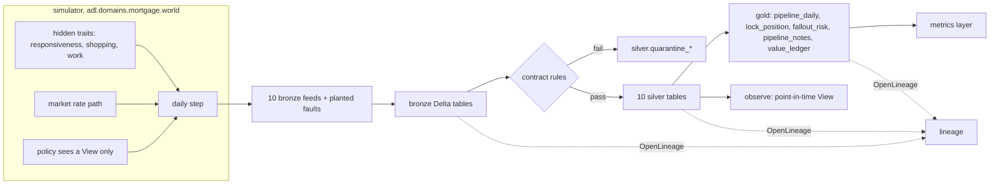

# Mortgage: simulator, pipeline, contracts and lineage

The seeded simulator of the fictional Quillmere Home Loans, the ten bronze feeds it emits with planted
faults, and the bronze, silver and gold layers built on the shared platform with contracts, quality
checks, quarantine, OpenLineage events and the metrics layer.

## 1. Purpose

* Give the mortgage domain realistic data with a known truth: borrower behaviour the models never see,
  and faults the pipeline must catch.
* Build governed data products an agent can read safely: no borrower identity outside one restricted
  silver table, and every product held to a contract.
* Prove the products describe the world exactly: the point-in-time view rebuilt from silver equals the
  simulator's own view of the same morning.

## 2. Architecture



## 3. How it works

1. **One daily engine.** `world.step` plays a day: the morning's decisions (calls, chases,
   extensions), then documents returned, processing work, stage moves and outcomes, then new locks at
   the end of the day. The 180-day history and every forward simulation use the same function, so the
   value simulation cannot drift from the history the models learned on.
2. **Hidden truth.** Each borrower has a responsiveness, a shopping propensity (higher for refinance
   and broker files) and an amount of processing work. They live only in `State.ground_truth`; a
   policy is handed a `View` of observable fields, and no product code reads the ground truth (a test
   checks this by path).
3. **Outcomes.** A lock closes when its work is done and every condition is cleared. Each day it may
   instead be withdrawn, with a hazard that rises when the market falls below the locked rate, with
   days since the last contact, and falls for five days after a reached call; denied at a small fixed
   rate; or reach expiry, where the borrower relocks at market (a relock costs the lender hedge loss
   when the market is lower) or walks away if rates have risen. The market path includes a rally
   between days 95 and 140, so the history contains a refinance-driven fallout wave.
4. **Bronze feeds.** `synth.bronze_tables` emits the loan origination system, products, branches,
   loan officers, the lock desk, stage events, conditions, the dialler, market data and pipeline
   notes. Planted faults: three sandbox test applications, the day-121 stage batch sent twice, five
   stage events for applications that do not exist, twelve dialler rows with an unknown outcome, and
   three notes carrying instructions aimed at an AI assistant.
5. **Silver.** Each table is conformed to its contract; rows that break a quarantine rule go to
   `silver.quarantine_<table>` with the reason. The resent batch is removed by keeping the first
   ingest of each (application, day, stage). Notes are redacted (names from the applications table,
   e-mail addresses and phone numbers) and screened for injection.
6. **Gold.** `pipeline_daily` (one row per day, region, product and channel, additive counts),
   `lock_position` (every active lock on the as-of morning, no identity), `fallout_risk` (see
   [fallout-risk.md](fallout-risk.md)), `pipeline_notes` and `value_ledger`. Each is checked against
   its contract when written.
7. **Point-in-time view.** `pipeline.observe(store, t)` rebuilds the policy `View` for any morning
   from silver alone, with a DuckDB parameter for the day. On the as-of morning it equals the
   simulator's view field by field, which is what lets the backtest and the agent read the lake while
   the value simulation reads the simulator.

## 4. Key files

| File | Role |
|---|---|
| `src/adl/domains/mortgage/world.py` | The simulator, hidden traits, View and the current rules |
| `src/adl/domains/mortgage/synth.py` | History and bronze feeds with planted faults and notes |
| `src/adl/domains/mortgage/pipeline.py` | Bronze, silver, gold, quarantine, observe, lineage |
| `domains/mortgage/contracts/` | 15 contracts (10 silver, 5 gold) |
| `domains/mortgage/metrics.yaml` | KPI definitions for the metrics layer |
| `src/adl/core/contracts.py`, `quality.py`, `lineage.py`, `semantic.py` | Shared platform, unchanged |

## 5. Code excerpts

The current rules every comparison is made against:

<!-- code: src/adl/domains/mortgage/world.py::CurrentRules -->
```python
class CurrentRules(Policy):
    """How Quillmere works today: call and chase whoever is within 10 days of lock expiry, closest
    first, up to capacity; extend every lock that reaches expiry unclosed (up to three times)."""

    name = "current rules"

    def decide(self, v: View) -> Decision:
        dte = v.expiry - v.t
        near = dte <= 10
        order = np.lexsort((v.idx, dte))
        calls = [i for i in order if near[i]][:CALL_CAPACITY]
        chases = [i for i in order if near[i] and v.docs_out[i] > 0][:CHASE_CAPACITY]
        extend = np.flatnonzero((dte == 0) & (v.extensions < 3))
        return Decision(v.idx[calls], v.idx[chases], v.idx[extend])
```
<!-- /code -->

Quarantine on the way into silver, driven by the contract:

<!-- code: src/adl/domains/mortgage/pipeline.py::_conform -->
```python
def _conform(b: Build, table: str, data: pa.Table) -> None:
    c = b.contracts[f"mortgage.silver.{table}"]
    s = b.store
    s.stage(f"stage_{table}", data)
    pred = row_predicate(c, b.contracts, s.qualified)
    cols = ", ".join(f'"{x}"' for x in c.columns)
    good = s.arrow(f"SELECT {cols} FROM stage_{table} WHERE {pred}")
    bad = s.arrow(f"SELECT * FROM stage_{table} WHERE NOT ({pred})")
    s.write("silver", table, good)
    if bad.num_rows:
        s.write("silver", f"quarantine_{table}", bad)
    b.quarantined[c.id] = bad.num_rows
    q = evaluate(c, s, b.contracts, bad.num_rows, AS_OF)
    b.quality[c.id] = q
    outs = [{"name": f"silver.{table}", "schema": _schema(good), "rows": good.num_rows, "dq": _dq_facet(q)}]
    if bad.num_rows:
        outs.append({"name": f"silver.quarantine_{table}", "rows": bad.num_rows})
    inputs = [f"{x.split('.')[1]}.{x.split('.')[2]}" for x in c.inputs]
    b.lineage.run(f"silver.{table}", inputs, outs)
```
<!-- /code -->

## 6. Configuration

Simulator constants are at the top of `world.py` (180 days of history, a 28-day horizon, 22
applications a day, capacity of 60 calls and 60 chases, an extension fee of 0.125% of the loan per 7
days, hedge duration 4). The seed is 11 for the history. Contracts and metrics are YAML under
`domains/mortgage/`.

## 7. Commands

```bash
adl mortgage run        # build bronze, silver and gold
adl mortgage quality    # contract checks per product
adl mortgage lineage    # OpenLineage events and upstream of fallout_risk
adl mortgage metrics    # KPIs by region through the metrics layer
adl mortgage value-case # baselines for the value case
```

## 8. Real output

<!-- output: mortgage run -->
```text
bronze: 10 source tables, 51,006 rows
silver: 10 products, 50,901 rows, all passed: True
gold: 5 products, 6,904 rows, all passed: True
duplicate stage events removed (a resent batch): 85
quarantined rows: 20 (applications 3, contacts 12, stage_events 5)
lineage events: 50
active locks on the as-of morning: 732
```
<!-- /output -->

<!-- output: mortgage quality -->
```text
product                rows   quarantined  completeness  checks  failed  result
---------------------  -----  -----------  ------------  ------  ------  ------
gold.fallout_risk      732    0            100.00%       16      -       pass
gold.lock_position     732    0            100.00%       27      -       pass
gold.pipeline_daily    5400   0            100.00%       19      -       pass
gold.pipeline_notes    24     0            100.00%       11      -       pass
gold.value_ledger      16     0            100.00%       12      -       pass
silver.applications    3907   3            99.92%        25      -       pass
silver.branches        6      0            100.00%       6       -       pass
silver.conditions      15155  0            100.00%       9       -       pass
silver.contacts        10528  12           99.89%        12      -       pass
silver.loan_officers   12     0            100.00%       5       -       pass
silver.market_rates    180    0            100.00%       6       -       pass
silver.pipeline_notes  24     0            100.00%       11      -       pass
silver.products        5      0            100.00%       6       -       pass
silver.rate_locks      5364   0            100.00%       13      -       pass
silver.stage_events    15720  5            99.97%        9       -       pass
```
<!-- /output -->

<!-- output: mortgage lineage -->
```text
OpenLineage events: 50 (25 runs), validation problems: 0
upstream of gold.fallout_risk (21): bronze.branches, bronze.conditions, bronze.contacts, bronze.los_applications, bronze.market_rates, bronze.rate_locks, bronze.stage_events, gold.lock_position, model.fallout_risk, silver.applications, silver.branches, silver.conditions, silver.contacts, silver.market_rates, silver.rate_locks, silver.stage_events, source.branch-master, source.dialler, source.loan-origination-system, source.lock-desk, source.market-data
```
<!-- /output -->

<!-- output: mortgage metrics -->
```text
region  locks  closed  pull-through  withdrawals  extension cost  lock-to-close days
------  -----  ------  ------------  -----------  --------------  ------------------
north   1889   1209    79.4%         18.1%        $353,919        33.3
south   1963   1244    77.8%         19.8%        $401,472        33.8

compiled: SELECT channel AS channel, 100.0 * sum(closed) / nullif(sum(closed) + sum(fallout), 0) AS pull_through_pct FROM gold.pipeline_daily WHERE region = ? GROUP BY channel ORDER BY channel -- params ['north']
```
<!-- /output -->

<!-- output: mortgage value-case -->
```text
use case: mortgage-lock-fallout; window 28 days; baseline measured over the 180-day history
kpi                 baseline    target change  target     why
------------------  ----------  -------------  ---------  ---------------------------------------------
pull_through_pct    78.62       +3%            80.98      more locked loans close
fallout_rate_pct    21.38       -12%           18.81      fewer withdrawals and walk-aways after a lock
extension_cost_usd  117,505.31  -20%           94,004.24  fewer extension fees absorbed by the lender
cycle_days          33.53       -5%            31.85      loans close sooner after the lock
```
<!-- /output -->

Every planted fault is caught: 3 sandbox applications, 12 unknown dialler outcomes and 5 orphan stage
events are quarantined, and 85 duplicate stage events from the resent batch are removed. The KPI
baselines come from the metrics layer over the whole history, including the rally, which is why the
historical pull-through (78.62%) is lower than the forward simulation's current-rules pull-through
(85.92%, see [value-ledger.md](value-ledger.md)): the 28-day forward window has no scripted rally.

## 9. Tests and gates

`tests/test_mortgage.py`: ten bronze feeds; quarantine counts and the exact sandbox ids; no duplicate
stage events left; every product passes; applications are restricted and not exposed; notes are
redacted with three flagged; lineage valid and reaching the sources; one `pipeline_daily` row per day,
region, product and channel; the silver view equals the simulator view; lock position matches the
active pipeline; no hidden trait reaches bronze; pull-through plus fallout is 100; metrics compile with
bound parameters. Gate: "every built product passes its contract", "lineage events valid".

## 10. Guardrails

Quarantine instead of silent drops; contracts reject unknown statuses and out-of-range values; notes
are redacted before any agent can read them; the hidden traits are kept out of every feed.

## 11. Security and governance

`silver.applications` is the only table with applicant name, e-mail and phone; it is restricted and
not a data product, so the gateway refuses it. Gold products carry region so row-level security
applies. Every gold contract except the value ledger prohibits credit decisioning, pricing by
protected characteristic and sale of data to third parties.

## 12. Observability

Row counts, quarantine counts and completeness per product; freshness lag on `lock_position`; 50
OpenLineage events with data-quality facets; upstream tracing for any product.

## 13. Failure modes

| Failure | Effect | Handling |
|---|---|---|
| A feed is resent | Double-counted stage moves | Keep the first ingest per key; the count removed is reported |
| Test records leak from a sandbox | Fake loans in the pipeline | Quarantine rule on the application id prefix |
| Dialler outcome codes change | Contacts misread | Accepted-values rule quarantines unknown outcomes |
| Silver and simulator disagree | Backtest and value simulation measure different worlds | Test that the observed view equals the simulator view |

## 14. Mapping to cloud services

| Here | Azure | Google Cloud | AWS |
|---|---|---|---|
| Batch build and scoring | Microsoft Fabric notebook or Spark job | BigQuery scheduled queries or Dataproc | Glue job or SageMaker processing over S3 |
| Tables and data products | Delta tables in OneLake | BigQuery datasets | Glue tables over S3, queried by Athena |
| Agent identities | Entra ID agent identities and managed identities | Service accounts with Workload Identity Federation | IAM roles |
| Workflow and model | Microsoft Agent Framework on Azure Container Apps with Foundry Models | Vertex AI Agent Engine with Gemini | Bedrock Agents |
| Audit and lineage | Microsoft Purview and Log Analytics | Dataplex lineage and Cloud Logging | CloudTrail and DataZone lineage |

## 15. Limitations

* Synthetic data from one seeded history; real pipelines have more stages, products and edge cases.
* Borrower behaviour is a hand-written hazard model; its parameters are assumptions, not estimates.
* Locks only; the application-to-lock funnel and pricing are not simulated.

## 16. Interview talking points

* "The same daily engine generates the history and plays the forward simulation, and the point-in-time
  view rebuilt from silver equals the simulator's view exactly. That is the check that the data
  products describe the world the value numbers are measured in."
* "Every fault I planted is counted in the output: 3 sandbox records, 12 unknown dialler outcomes,
  5 orphans and 85 resent stage events."
