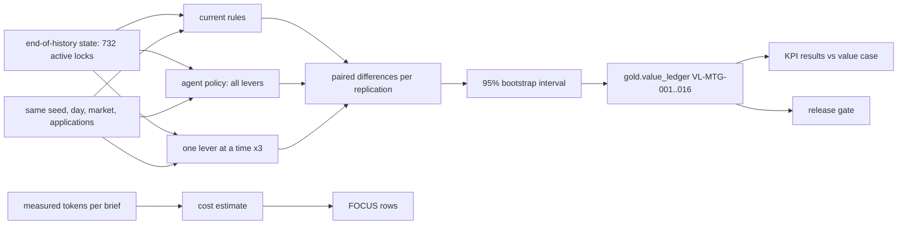

# Mortgage: value ledger, cost per outcome and release gate

What the assistant's policy is worth against the current rules, measured by a paired forward
simulation from the real end-of-history pipeline, with 95% intervals, per-lever attribution, KPI
targets reported hit or miss, cost per outcome in FOCUS form, and the mortgage release gate.

## 1. Purpose

* Put a number with an interval on the value of each lever, before anyone asks for budget.
* Report the KPI targets set in the value case before results, including the misses.
* Show the AI and platform cost next to the value, in the FinOps FOCUS format.

## 2. Architecture



## 3. How it works

1. **Replications.** 30 seeds (3000..3029). Each starts from the simulator's end-of-history state and
   plays days 180..207 once per arm with common random numbers: the same new applications, market path
   and borrower draws, so differences come from the policy.
2. **Arms.** Current rules; the agent policy with all levers; and outreach only, document chase only and
   extension only, which attribute the value to each lever.
3. **Outcomes** are measured from the simulator's ground truth, which is allowed in the evaluation
   harness only: gain on sale of closed loans, hedge loss on withdrawals and relocks below the lock,
   extension fees, outreach cost, net value, pull-through, fallout rate and lock-to-close days.
4. **Ledger.** For each lever and metric, the mean of both arms, the mean paired change and a 95%
   percentile bootstrap interval over replications. Written to `gold.value_ledger` and checked
   against its contract.
5. **KPIs.** Changes against the current rules compared with the targets in
   `config/mortgage/value-case.yaml`; a miss is printed as MISSED and counted in the gate detail.
6. **Cost.** Prompt and output tokens per brief are measured from the workflow run; one brief per loan
   officer per day (12 x 28 = 336) is priced with the assumed rates in `config/pricing.yaml` by the
   shared `adl.core.finops`, and exported as FOCUS 1.0 rows with domain and use-case tags.

## 4. Key files

| File | Role |
|---|---|
| `src/adl/domains/mortgage/simulate.py` | Replications, paired comparison, bootstrap |
| `src/adl/domains/mortgage/value.py` | Value case, ledger, KPI results, cost, FOCUS |
| `src/adl/core/finops.py` | Shared cost estimate and FOCUS rows |
| `src/adl/domains/mortgage/report.py` | The reports and the 11 gate checks |
| `config/mortgage/value-case.yaml` | KPIs and targets, written before results |

## 5. Code excerpts

<!-- code: src/adl/domains/mortgage/simulate.py::bootstrap_ci -->
```python
def bootstrap_ci(diffs: np.ndarray, n_boot: int = 2000, seed: int = 7) -> tuple[float, float]:
    rng = np.random.default_rng(seed)
    means = diffs[rng.integers(0, len(diffs), (n_boot, len(diffs)))].mean(1)
    lo, hi = np.percentile(means, [2.5, 97.5])
    return float(lo), float(hi)
```
<!-- /code -->

<!-- code: src/adl/domains/mortgage/value.py::kpi_results -->
```python
def kpi_results(cmp: SIM.Comparison) -> list[dict]:
    out = []
    for k in load_case()["kpis"]:
        m = k["metric"]
        base = cmp.mean("current rules", m)
        d, lo, hi = cmp.diff("agent", m)
        change = 100 * d / base if base else 0.0
        met = change <= k["target_change_pct"] if k["direction"] == "down" else change >= k["target_change_pct"]
        out.append(
            {
                "metric": m,
                "current_rules": base,
                "agent": base + d,
                "change_pct": change,
                "target_change_pct": k["target_change_pct"],
                "met": met,
                "ci": (lo, hi),
            }
        )
    return out
```
<!-- /code -->

## 6. Configuration

`config/mortgage/value-case.yaml` (targets: pull-through +3%, fallout -12%, extension cost -20%, cycle
time -5%), `config/pricing.yaml` (assumed unit rates, not quotes), `EVAL_SEEDS` in `simulate.py`.

## 7. Commands

```bash
adl mortgage value
adl mortgage focus --out mortgage-focus.csv
adl mortgage gate
adl gate               # retail and mortgage checks together
```

## 8. Real output

<!-- output: mortgage value -->
```text
forward simulation: 30 replications x 28 days, common random numbers, paired 95% bootstrap intervals
ledger      lever           metric          current rules  with agents  change     95% interval
----------  --------------  --------------  -------------  -----------  ---------  ---------------------
VL-MTG-001  all levers      net_value       $2,741,444     $2,934,446   $193,003   [$171,585, $214,486]
VL-MTG-002  all levers      gain_on_sale    $3,166,169     $3,252,618   $86,449    [$79,111, $94,378]
VL-MTG-003  all levers      hedge_loss      $229,467       $127,327     -$102,139  [-$122,737, -$82,015]
VL-MTG-004  all levers      extension_cost  $170,159       $158,924     -$11,234   [-$13,194, -$9,170]
VL-MTG-005  outreach        net_value       $2,741,444     $2,858,802   $117,358   [$94,898, $139,302]
VL-MTG-006  outreach        gain_on_sale    $3,166,169     $3,178,687   $12,518    [$6,106, $18,686]
VL-MTG-007  outreach        hedge_loss      $229,467       $122,442     -$107,025  [-$128,563, -$85,998]
VL-MTG-008  outreach        extension_cost  $170,159       $172,324     $2,165     [$1,173, $3,227]
VL-MTG-009  document chase  net_value       $2,741,444     $2,813,498   $72,054    [$67,004, $77,458]
VL-MTG-010  document chase  gain_on_sale    $3,166,169     $3,239,295   $73,126    [$68,100, $78,488]
VL-MTG-011  document chase  hedge_loss      $229,467       $227,908     -$1,558    [-$3,203, -$214]
VL-MTG-012  document chase  extension_cost  $170,159       $165,969     -$4,190    [-$4,866, -$3,532]
VL-MTG-013  lock extension  net_value       $2,741,444     $2,745,505   $4,062     [$2,462, $5,759]
VL-MTG-014  lock extension  gain_on_sale    $3,166,169     $3,165,364   -$805      [-$1,663, -$130]
VL-MTG-015  lock extension  hedge_loss      $229,467       $233,853     $4,386     [$2,731, $5,768]
VL-MTG-016  lock extension  extension_cost  $170,159       $160,908     -$9,250    [-$10,605, -$7,852]

KPI targets (config/mortgage/value-case.yaml), all levers vs the current rules:
kpi                 current rules  with agents  change  target  result
------------------  -------------  -----------  ------  ------  ------
pull_through_pct    85.92          88.03        +2.4%   +3%     MISSED
fallout_rate_pct    14.08          11.97        -14.9%  -12%    met
extension_cost_usd  170,158.62     158,924.42   -6.6%   -20%    MISSED
cycle_days          33.96          33.77        -0.6%   -5%     MISSED

estimated AI and platform cost for 28 days (assumed rates in config/pricing.yaml): $76
  Foundry Models: $0.22 (336 briefs)
  Azure Container Apps: $0.76 (25,200 vCPU-seconds)
  Azure AI Search: $70.00 (28 days)
  Storage: $4.67 (28 days)
  prompt 471 tokens and output 291 tokens per brief (measured), 336 briefs
cost per $1,000 of net value: $0.39; per action: $0.0206 (3,668 actions)
pull-through change: +2.10 points; value after cost: $192,927 per 28 days (30-replication mean)
```
<!-- /output -->

<!-- output: mortgage focus -->
```text
FOCUS 1.0 rows: 112 (29 columns), services: Azure AI Search, Azure Container Apps, Foundry Models, Storage
total EffectiveCost: $75.64; tags: {"domain": "mortgage", "env": "simulation", "use-case": "mortgage-lock-fallout", "value-ledger": "VL-MTG-001"}
```
<!-- /output -->

<!-- output: mortgage gate -->
```text
check                                                       result  detail
----------------------------------------------------------  ------  --------------------
every built product passes its contract                     pass    15/15
lineage events valid                                        pass    50 events
fallout model beats the expiry rule (AUC and precision@60)  pass    AUC 0.730 vs 0.462
hybrid retrieval recall@5 >= 0.90                           pass    0.979
every access attack stopped                                 pass    14/14
no borrower PII in agent-exposed products                   pass    0 rows
audit chain verifies and detects tampering                  pass    14 records verified
no injected action ever executed                            pass    4 configurations
nothing above a threshold executed without a person         pass    0 violations
net value interval above zero                               pass    [$171,585, $214,486]
KPI targets reported (hit or miss)                          pass    1/4 met

mortgage gate: PASS (11/11)
```
<!-- /output -->

All levers together add $193,003 of net value over 28 days, with a 95% interval of $171,585 to
$214,486. Most of it comes from outreach, through hedge losses avoided: calling the borrowers whose
lock sits above a falling market keeps them from withdrawing. Document chasing adds gain on sale by
closing more files inside the window. The extension lever alone is small: it saves $9,250 of fees but
pays $4,386 more hedge loss on relocks, for $4,062 net.

Only one of the four targets is met. Fallout fell 14.9% against a 12% target. Pull-through rose 2.4%
against 3%, extension cost fell 6.6% against 20% (the borrower-no-worse-off rule allows few skipped
extensions), and cycle time barely moved (-0.6% against -5%), because the policy changes who gets
attention, not how fast files are processed. The cost estimate is $76 for 28 days, $0.39 per $1,000 of
net value; the search service dominates it, not the model.

## 9. Tests and gates

`tests/test_mortgage.py`: 16 ledger rows; every change inside its interval and 30 replications; the
net-value interval above zero; KPI results follow the value case's direction and targets; the ledger
product is written and passes its contract; the simulation is deterministic and leaves the start state
untouched; the value-case baseline comes from the metrics layer; FOCUS rows sum to the estimate; every
`adl mortgage` step runs; the gate passes. The mortgage gate adds 11 checks to retail's 15, so
`adl gate` runs 26.

## 10. Guardrails

Targets live in config written before results and are reported whether hit or missed; the gate
checks that they are reported, not that they are met. The ledger never mixes simulated and observed
numbers.

## 11. Security and governance

`gold.value_ledger` is granted to the finance identity only, for value and performance reporting.

## 12. Observability

Ledger rows with intervals; KPI results; cost per action and per $1,000 of value; FOCUS rows tagged
with the use case and the ledger row.

## 13. Failure modes

| Failure | Effect | Handling |
|---|---|---|
| Unpaired comparison | Noise swamps the effect | Common random numbers; paired bootstrap |
| Targets edited after results | Overstated success | Targets in config, misses printed and tested |
| Simulator assumptions wrong | Value overstated | Labelled as simulated; pilot measurement planned |

## 14. Mapping to cloud services

| Here | Azure | Google Cloud | AWS |
|---|---|---|---|
| Batch build and scoring | Microsoft Fabric notebook or Spark job | BigQuery scheduled queries or Dataproc | Glue job or SageMaker processing over S3 |
| Tables and data products | Delta tables in OneLake | BigQuery datasets | Glue tables over S3, queried by Athena |
| Agent identities | Entra ID agent identities and managed identities | Service accounts with Workload Identity Federation | IAM roles |
| Workflow and model | Microsoft Agent Framework on Azure Container Apps with Foundry Models | Vertex AI Agent Engine with Gemini | Bedrock Agents |
| Audit and lineage | Microsoft Purview and Log Analytics | Dataplex lineage and Cloud Logging | CloudTrail and DataZone lineage |

## 15. Limitations

* The value is simulated in a world I wrote; the hazard parameters are assumptions. A pilot with a
  holdout would be needed to measure real value.
* One 28-day window from one end-of-history state; no seasonality or rate-shock scenarios.
* Costs use assumed unit rates, not quotes; loan officer time is priced as a loaded cost per call.

## 16. Interview talking points

* "+$193,003 net over 28 days with a 95% interval of $171,585 to $214,486, and I still missed three of
  four targets. I report the misses because the targets were set before the results."
* "The attribution is useful: outreach carries most of the value through hedge losses avoided; the
  extension rule is almost break-even because I only skip a fee when the borrower is no worse off."
